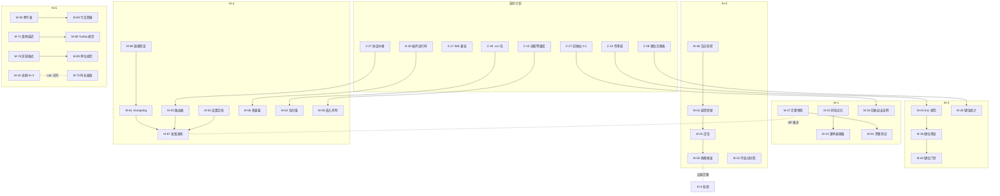
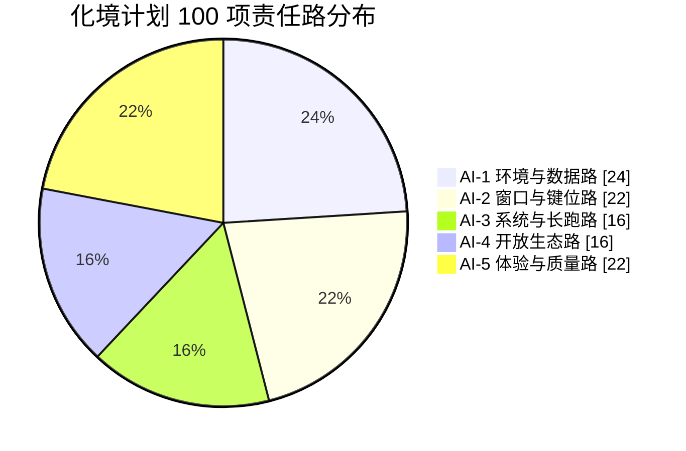
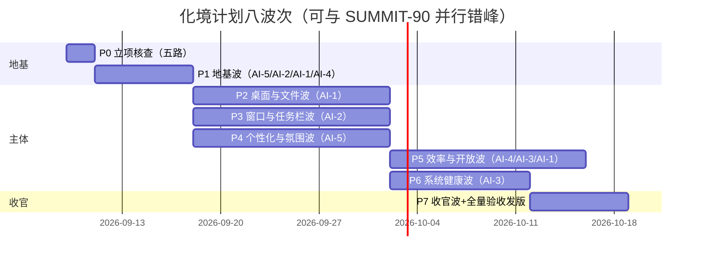

# ENGINE Version 01XHI9DN.1.5xw — AI 分工图（二十路协同总案）

> 本图将五份规划的 AI 分工图整合为 **20 个 AI 协作组**（六大方向），覆盖全部 **355 项功能**——每项功能有且只有一个责任组，并保留原计划与原责任路溯源。整合不新增任何功能、不加任何新限制：各组红线均承自原计划职责卡原文。原五份分工图全文保留在第 5 部分（协作机制、甘特时间线、交接点协议、共享文件时段表、冲突升级机制等全部原文有效）。

---

## 0. 二十路分工总原则

> 以下原则汇编自五份原分工图的总则（APEX-70 §0、ASCENT-60 §0、SUMMIT-90 §0.2、化境 §0.2、NEXT-40 继承的五路总则），原文见第 5 部分。

1. **一组一域、权责闭环**：每个功能项有且只有一个责任组（见第 2 节矩阵）；跨组依赖只允许「上游交付物 → 下游消费」，禁止跨组改他人文件领地。
2. **四大内置应用绝对禁区**：`src/apps/write|mind|code|fate/**` 等四空间相关目录全程零修改（各计划隔离声明原文保留于《功能全景》附录）；任何 diff 触碰即打回。
3. **共享文件最小触碰**：`dictionaries.ts`、`ipc.ts`、`lib.rs`、`vwm.ts`、`StartMenu.tsx`、`desktop.css`、`tools.css` 等按第 5 部分各计划共享文件协议执行——改前 `rg` 核对、最小 diff、改后跑 `node tools/audit.cjs`、zh i18n 块每批前后双复核。
4. **诚实验收**：未实测不勾 ✅（沿承 B-30/ai2 验收纪律）；真机依赖项挂待验清单。
5. **批次闸门**：每批收口必须过各计划实施步骤的验证基线与 DoD，闸门不过不得开下一批。
6. **默认即现状**：所有新行为默认关闭或默认等于现状；拿不准的默认最保守档。
7. **零出站与不越权**：除 M-57（唯一出站，四道闸）与 V-81 winget（逐次显式确认）外零自动出站；不越权杀进程、不改系统设置（写回需显式确认与回滚）。

## 1. 二十路总览与代号

| 组 | 名称 | 所属方向 | 项数 | 覆盖编号 | 原计划责任路溯源 |
|---|---|---|---|---|---|
| AI-01 | 窗口手感组 | 方向一·窗口与桌面 | 16 | Z-36…Z-42、M-01…M-09 | APEX-70×7、SUMMIT-90×9 |
| AI-02 | 窗口编排组 | 方向一·窗口与桌面 | 17 | U-14、N-01…N-06、V-21…V-30 | ASCENT-60×1、NEXT-40×6、化境×10 |
| AI-03 | 任务栏与托盘组 | 方向一·窗口与桌面 | 16 | U-15、M-10…M-18、V-15…V-20 | ASCENT-60×1、SUMMIT-90×9、化境×6 |
| AI-04 | 桌面与开始菜单组 | 方向一·窗口与桌面 | 22 | U-13、N-07…N-12、V-01…V-14、V-96 | ASCENT-60×1、NEXT-40×6、化境×15 |
| AI-05 | 键位纪律组 | 方向二·输入与效率 | 17 | Z-08…Z-14、M-28…M-36、V-94 | APEX-70×7、SUMMIT-90×9、化境×1 |
| AI-06 | 输入手感组 | 方向二·输入与效率 | 12 | U-58、U-59、V-61…V-70 | ASCENT-60×2、化境×10 |
| AI-07 | 效率中枢组 | 方向二·输入与效率 | 16 | N-13…N-18、V-41…V-50 | NEXT-40×6、化境×10 |
| AI-08 | 基础工具组 | 方向二·输入与效率 | 11 | Z-22…Z-28、U-17、U-18、V-97、V-98 | APEX-70×7、ASCENT-60×2、化境×2 |
| AI-09 | 文件操作组 | 方向三·文件与数据 | 16 | Z-29…Z-35、M-19…M-27 | APEX-70×7、SUMMIT-90×9 |
| AI-10 | 文件管理与数据安全组 | 方向三·文件与数据 | 24 | U-16、U-25…U-36、N-31、V-31…V-40 | ASCENT-60×13、NEXT-40×1、化境×10 |
| AI-11 | 系统集成与硬件组 | 方向四·系统与稳定 | 23 | U-43…U-48、N-19…N-25、V-51…V-60 | ASCENT-60×6、NEXT-40×7、化境×10 |
| AI-12 | 兼容纵深组 | 方向四·系统与稳定 | 16 | Z-15…Z-21、M-37…M-45 | APEX-70×7、SUMMIT-90×9 |
| AI-13 | 性能与长跑组 | 方向四·系统与稳定 | 24 | Z-57…Z-63、U-19…U-24、N-35、N-36、M-46…M-54 | APEX-70×7、ASCENT-60×6、NEXT-40×2、SUMMIT-90×9 |
| AI-14 | 开放接口组 | 方向五·开放生态 | 16 | Z-50…Z-56、U-37…U-39、U-42、N-26…N-30 | APEX-70×7、ASCENT-60×4、NEXT-40×5 |
| AI-15 | 开放工具组 | 方向五·开放生态 | 19 | M-55…M-63、V-81…V-90 | SUMMIT-90×9、化境×10 |
| AI-16 | 启动与声音通知组 | 方向六·体验与品质 | 16 | Z-43…Z-49、U-01…U-06、U-51、U-52、N-32 | APEX-70×7、ASCENT-60×8、NEXT-40×1 |
| AI-17 | 视觉语言组 | 方向六·体验与品质 | 24 | Z-01…Z-07、Z-64…Z-70、U-07…U-12、U-55…U-57、U-60 | APEX-70×14、ASCENT-60×10 |
| AI-18 | 氛围与个性化组 | 方向六·体验与品质 | 24 | U-49、U-50、U-53、U-54、N-33、M-64…M-72、V-71…V-80 | ASCENT-60×4、NEXT-40×1、SUMMIT-90×9、化境×10 |
| AI-19 | 无障碍与本地化组 | 方向六·体验与品质 | 8 | U-40、U-41、M-73…M-78 | ASCENT-60×2、SUMMIT-90×6 |
| AI-20 | 质量门禁与收官组 | 方向六·体验与品质 | 18 | M-79…M-90、V-91…V-93、V-95、V-99、V-100 | SUMMIT-90×12、化境×6 |
| — | **合计** | 六大方向 | **355** | — | — |

## 2. 完整分工矩阵（355 项 × 责任组）

> 「功能域」列对应《功能全景》十五域；「原批次/波次」为该计划施工体系内的批次归属。协作项按原计划口径在「原责任路」列注明。

| 编号 | 功能 | 功能域 | 责任组 | 原计划 | 原责任路 | 原批次/波次 |
|---|---|---|---|---|---|---|
| Z-01 | 官方图标网格对齐工程（Icon Grid Fidelity） | 域12·视觉、个性化与氛围 | AI-17·视觉语言组 | APEX-70 | APEX·AI-1 视觉一致性路 | PB-0 |
| Z-02 | Fluent 控件规格复刻（Control Metrics） | 域12·视觉、个性化与氛围 | AI-17·视觉语言组 | APEX-70 | APEX·AI-1 视觉一致性路 | PB-1 |
| Z-03 | Segoe UI Variable 字体链（Typography Chain） | 域12·视觉、个性化与氛围 | AI-17·视觉语言组 | APEX-70 | APEX·AI-1 视觉一致性路 | PB-1 |
| Z-04 | 2K/4K 清晰度管线（Hi-DPI Clarity Pipeline） | 域12·视觉、个性化与氛围 | AI-17·视觉语言组 | APEX-70 | APEX·AI-1 视觉一致性路 | PB-1 |
| Z-05 | 焦点环与选择态规范（Focus & Selection States） | 域12·视觉、个性化与氛围 | AI-17·视觉语言组 | APEX-70 | APEX·AI-1 视觉一致性路 | PB-1 |
| Z-06 | 系统光标接管与对齐（Cursor Alignment） | 域12·视觉、个性化与氛围 | AI-17·视觉语言组 | APEX-70 | APEX·AI-1 视觉一致性路 | PB-1 |
| Z-07 | 文案规范对齐（UI Copy Style Guide） | 域12·视觉、个性化与氛围 | AI-17·视觉语言组 | APEX-70 | APEX·AI-1 视觉一致性路 | PB-1 |
| Z-08 | 全局键位注册表与冲突仲裁（Keymap Registry & Arbitration） | 域5·键盘与输入手感 | AI-05·键位纪律组 | APEX-70 | APEX·AI-2 键盘与窗口路 | PB-0 |
| Z-09 | 系统组合键让位协议（System Combo Yield Protocol） | 域5·键盘与输入手感 | AI-05·键位纪律组 | APEX-70 | APEX·AI-2 键盘与窗口路 | PB-2 |
| Z-10 | 三级作用域分层（Scope Layering） | 域5·键盘与输入手感 | AI-05·键位纪律组 | APEX-70 | APEX·AI-2 键盘与窗口路 | PB-2 |
| Z-11 | 全键盘导航网格（Full Keyboard Grid） | 域5·键盘与输入手感 | AI-05·键位纪律组 | APEX-70 | APEX·AI-2 键盘与窗口路 | PB-2 |
| Z-12 | 上下文键位速查浮层（Contextual Keymap Overlay） | 域5·键盘与输入手感 | AI-05·键位纪律组 | APEX-70 | APEX·AI-2 键盘与窗口路 | PB-2 |
| Z-13 | 命令提示条（Command Hint Bar） | 域5·键盘与输入手感 | AI-05·键位纪律组 | APEX-70 | APEX·AI-2 键盘与窗口路 | PB-2 |
| Z-14 | 键位方案管理（Keymap Profiles） | 域5·键盘与输入手感 | AI-05·键位纪律组 | APEX-70 | APEX·AI-2 键盘与窗口路 | PB-2 |
| Z-15 | 应用适配等级库（App Compat Matrix） | 域9·兼容性防线 | AI-12·兼容纵深组 | APEX-70 | APEX·AI-3 兼容与性能路 | PB-3 |
| Z-16 | 遗留协议兼容 Shim（Legacy Protocol Shim） | 域9·兼容性防线 | AI-12·兼容纵深组 | APEX-70 | APEX·AI-3 兼容与性能路 | PB-3 |
| Z-17 | IME 深度兼容（IME Compatibility） | 域9·兼容性防线 | AI-12·兼容纵深组 | APEX-70 | APEX·AI-3 兼容与性能路 | PB-3 |
| Z-18 | 全屏与独占模式协议（Fullscreen & Exclusive Protocol） | 域9·兼容性防线 | AI-12·兼容纵深组 | APEX-70 | APEX·AI-3 兼容与性能路 | PB-3 |
| Z-19 | 多屏混合 DPI 兼容（Mixed-DPI Handling） | 域9·兼容性防线 | AI-12·兼容纵深组 | APEX-70 | APEX·AI-3 兼容与性能路 | PB-3 |
| Z-20 | 远程与虚拟宿主模式（Remote & VM Host Profile） | 域9·兼容性防线 | AI-12·兼容纵深组 | APEX-70 | APEX·AI-3 兼容与性能路 | PB-3 |
| Z-21 | 慢速设备模式（Slow Device Mode） | 域9·兼容性防线 | AI-12·兼容纵深组 | APEX-70 | APEX·AI-3 兼容与性能路 | PB-3 |
| Z-22 | 时钟中心（Clock Hub） | 域7·效率与工具中枢 | AI-08·基础工具组 | APEX-70 | APEX·AI-4 基础工具与文件路 | PB-4 |
| Z-23 | 天气信息卡（Weather Card） | 域7·效率与工具中枢 | AI-08·基础工具组 | APEX-70 | APEX·AI-4 基础工具与文件路 | PB-4 |
| Z-24 | 字符与 Emoji 面板（Chars & Emoji Panel） | 域7·效率与工具中枢 | AI-08·基础工具组 | APEX-70 | APEX·AI-4 基础工具与文件路 | PB-4 |
| Z-25 | 放大镜与取色器（Magnifier & Color Picker） | 域7·效率与工具中枢 | AI-08·基础工具组 | APEX-70 | APEX·AI-4 基础工具与文件路 | PB-4 |
| Z-26 | 换算中心（Converter Hub） | 域7·效率与工具中枢 | AI-08·基础工具组 | APEX-70 | APEX·AI-4 基础工具与文件路 | PB-4 |
| Z-27 | 系统信息面板（System Info Panel） | 域7·效率与工具中枢 | AI-08·基础工具组 | APEX-70 | APEX·AI-4 基础工具与文件路 | PB-4 |
| Z-28 | 运行对话框（Run Dialog） | 域7·效率与工具中枢 | AI-08·基础工具组 | APEX-70 | APEX·AI-4 基础工具与文件路 | PB-4 |
| Z-29 | 预览格式扩展（Preview Formats +） | 域6·文件与数据能力 | AI-09·文件操作组 | APEX-70 | APEX·AI-4 基础工具与文件路 | PB-5 |
| Z-30 | 打开方式管理面板（Open-With Manager） | 域6·文件与数据能力 | AI-09·文件操作组 | APEX-70 | APEX·AI-4 基础工具与文件路 | PB-5 |
| Z-31 | 位置侧栏与快速跳转（Places Sidebar） | 域6·文件与数据能力 | AI-09·文件操作组 | APEX-70 | APEX·AI-4 基础工具与文件路 | PB-5 |
| Z-32 | 批量重命名工具（Batch Rename） | 域6·文件与数据能力 | AI-09·文件操作组 | APEX-70 | APEX·AI-4 基础工具与文件路 | PB-5 |
| Z-33 | 重复文件报告器（Duplicate Reporter） | 域6·文件与数据能力 | AI-09·文件操作组 | APEX-70 | APEX·AI-4 基础工具与文件路 | PB-5 |
| Z-34 | 空间分析器（Space Analyzer） | 域6·文件与数据能力 | AI-09·文件操作组 | APEX-70 | APEX·AI-4 基础工具与文件路 | PB-5 |
| Z-35 | 发送到菜单（SendTo Extensions） | 域6·文件与数据能力 | AI-09·文件操作组 | APEX-70 | APEX·AI-4 基础工具与文件路 | PB-5 |
| Z-36 | 窗口不透明度与置顶微控（Opacity & Topmost Fine Control） | 域2·窗口与空间管理 | AI-01·窗口手感组 | APEX-70 | APEX·AI-2 键盘与窗口路 | PB-6 |
| Z-37 | 窗口几何记忆（Geometry Memory） | 域2·窗口与空间管理 | AI-01·窗口手感组 | APEX-70 | APEX·AI-2 键盘与窗口路 | PB-6 |
| Z-38 | 滚轮窗口行为（Wheel Behaviors） | 域2·窗口与空间管理 | AI-01·窗口手感组 | APEX-70 | APEX·AI-2 键盘与窗口路 | PB-6 |
| Z-39 | 标题栏自定义（Titlebar Options） | 域2·窗口与空间管理 | AI-01·窗口手感组 | APEX-70 | APEX·AI-2 键盘与窗口路 | PB-6 |
| Z-40 | 窗口布局快照（Layout Snapshots） | 域2·窗口与空间管理 | AI-01·窗口手感组 | APEX-70 | APEX·AI-2 键盘与窗口路 | PB-6 |
| Z-41 | 鼠标手势最小集（Minimal Gestures） | 域2·窗口与空间管理 | AI-01·窗口手感组 | APEX-70 | APEX·AI-2 键盘与窗口路 | PB-6 |
| Z-42 | 虚拟桌面切换增强（Desktop Switcher +） | 域2·窗口与空间管理 | AI-01·窗口手感组 | APEX-70 | APEX·AI-2 键盘与窗口路 | PB-6 |
| Z-43 | 逐应用音量记忆（Per-App Volume Memory） | 域13·声音与通知 | AI-16·启动与声音通知组 | APEX-70 | APEX·AI-5 声音通知与开放路 | PB-7 |
| Z-44 | 勿扰日程（DND Schedule） | 域13·声音与通知 | AI-16·启动与声音通知组 | APEX-70 | APEX·AI-5 声音通知与开放路 | PB-7 |
| Z-45 | 系统声音方案（Sound Schemes） | 域13·声音与通知 | AI-16·启动与声音通知组 | APEX-70 | APEX·AI-5 声音通知与开放路 | PB-7 |
| Z-46 | 音频设备快切（Audio Device Quick Switch） | 域13·声音与通知 | AI-16·启动与声音通知组 | APEX-70 | APEX·AI-5 声音通知与开放路 | PB-7 |
| Z-47 | 通知存档与搜索（Notification Archive） | 域13·声音与通知 | AI-16·启动与声音通知组 | APEX-70 | APEX·AI-5 声音通知与开放路 | PB-7 |
| Z-48 | 麦克风使用指示（Mic Usage Indicator） | 域13·声音与通知 | AI-16·启动与声音通知组 | APEX-70 | APEX·AI-5 声音通知与开放路 | PB-7 |
| Z-49 | 提醒中心（Reminder Hub） | 域13·声音与通知 | AI-16·启动与声音通知组 | APEX-70 | APEX·AI-5 声音通知与开放路 | PB-7 |
| Z-50 | 主题令牌开放规范（Theme Token Spec） | 域11·开放生态 | AI-14·开放接口组 | APEX-70 | APEX·AI-5 声音通知与开放路 | PB-8 |
| Z-51 | 用户数据开放导出（User Data Export） | 域11·开放生态 | AI-14·开放接口组 | APEX-70 | APEX·AI-5 声音通知与开放路 | PB-8 |
| Z-52 | 本地事件流接口（Local Event Stream） | 域11·开放生态 | AI-14·开放接口组 | APEX-70 | APEX·AI-5 声音通知与开放路 | PB-8 |
| Z-53 | 本地只读状态 API（Read-only Status API） | 域11·开放生态 | AI-14·开放接口组 | APEX-70 | APEX·AI-5 声音通知与开放路 | PB-8 |
| Z-54 | 布局与配置分享格式（Config Share Format） | 域11·开放生态 | AI-14·开放接口组 | APEX-70 | APEX·AI-5 声音通知与开放路 | PB-8 |
| Z-55 | 开放数据连接器（Data Connectors） | 域11·开放生态 | AI-14·开放接口组 | APEX-70 | APEX·AI-5 声音通知与开放路 | PB-8 |
| Z-56 | 扩展兼容性承诺与版本矩阵（Ecosystem Compatibility Matrix） | 域11·开放生态 | AI-14·开放接口组 | APEX-70 | APEX·AI-5 声音通知与开放路 | PB-8 |
| Z-57 | 安全模式启动（Safe Boot Mode） | 域15·工程质量、性能与收官 | AI-13·性能与长跑组 | APEX-70 | APEX·AI-3 兼容与性能路 | PB-9 |
| Z-58 | UI 线程健康面板（UI Thread Health Panel） | 域15·工程质量、性能与收官 | AI-13·性能与长跑组 | APEX-70 | APEX·AI-3 兼容与性能路 | PB-9 |
| Z-59 | 空闲渲染冻结（Idle Render Freeze） | 域15·工程质量、性能与收官 | AI-13·性能与长跑组 | APEX-70 | APEX·AI-3 兼容与性能路 | PB-9 |
| Z-60 | 内存压力自适应（Memory Pressure Adaptation） | 域15·工程质量、性能与收官 | AI-13·性能与长跑组 | APEX-70 | APEX·AI-3 兼容与性能路 | PB-9 |
| Z-61 | 增量更新通道（Update Channels & Delta） | 域15·工程质量、性能与收官 | AI-13·性能与长跑组 | APEX-70 | APEX·AI-3 兼容与性能路 | PB-9 |
| Z-62 | 本地统计面板（Local Usage Stats） | 域15·工程质量、性能与收官 | AI-13·性能与长跑组 | APEX-70 | APEX·AI-3 兼容与性能路 | PB-9 |
| Z-63 | 回归基线扩展（Regression Baseline +） | 域15·工程质量、性能与收官 | AI-13·性能与长跑组 | APEX-70 | APEX·AI-3 兼容与性能路（AI-6 门禁联署） | PB-9 |
| Z-64 | CJK 排版精修（CJK Typography） | 域12·视觉、个性化与氛围 | AI-17·视觉语言组 | APEX-70 | APEX·AI-1 视觉一致性路 | PB-10 |
| Z-65 | 拖动清晰度策略（Drag Clarity） | 域12·视觉、个性化与氛围 | AI-17·视觉语言组 | APEX-70 | APEX·AI-1 视觉一致性路 | PB-10 |
| Z-66 | 图标加载零闪烁（Icon Zero-Flicker） | 域12·视觉、个性化与氛围 | AI-17·视觉语言组 | APEX-70 | APEX·AI-1 视觉一致性路 | PB-10 |
| Z-67 | 滚动与动效一致性（Scroll & Motion Consistency） | 域12·视觉、个性化与氛围 | AI-17·视觉语言组 | APEX-70 | APEX·AI-1 视觉一致性路 | PB-10 |
| Z-68 | 主题切换零闪白（Theme Cross-Fade） | 域12·视觉、个性化与氛围 | AI-17·视觉语言组 | APEX-70 | APEX·AI-1 视觉一致性路 | PB-10 |
| Z-69 | 边缘热区自定义（Edge Hotspots） | 域12·视觉、个性化与氛围 | AI-17·视觉语言组 | APEX-70 | APEX·AI-1 视觉一致性路 | PB-10 |
| Z-70 | 帮助中心（Help Center） | 域12·视觉、个性化与氛围 | AI-17·视觉语言组 | APEX-70 | APEX·AI-1 视觉一致性路（全路供稿） | PB-10 |
| U-01 | 启动剧场（Boot Cinema） | 域1·启动与品牌剧场 | AI-16·启动与声音通知组 | ASCENT-60 | ASCENT·AI-5 启动与氛围路 | AB-1 |
| U-02 | 大气字标与字形资产（Wordmark & Glyph Assets） | 域1·启动与品牌剧场 | AI-16·启动与声音通知组 | ASCENT-60 | ASCENT·AI-5 启动与氛围路 | AB-1 |
| U-03 | 胶囊进度条（Capsule Progress） | 域1·启动与品牌剧场 | AI-16·启动与声音通知组 | ASCENT-60 | ASCENT·AI-5 启动与氛围路 | AB-1 |
| U-04 | 文件流带（File Stream Ribbon） | 域1·启动与品牌剧场 | AI-16·启动与声音通知组 | ASCENT-60 | ASCENT·AI-5 启动与氛围路 | AB-1 |
| U-05 | 启动交响（Boot Symphony） | 域1·启动与品牌剧场 | AI-16·启动与声音通知组 | ASCENT-60 | ASCENT·AI-5 启动与氛围路 | AB-1 |
| U-06 | 仪式编排器（Ceremony Director） | 域1·启动与品牌剧场 | AI-16·启动与声音通知组 | ASCENT-60 | ASCENT·AI-5 启动与氛围路 | AB-1 |
| U-07 | 设计令牌 2.0 与裸色值清零（Tokens 2.0 & De-bare-value） | 域12·视觉、个性化与氛围 | AI-17·视觉语言组 | ASCENT-60 | ASCENT·AI-6 视觉品质路 | AB-0 |
| U-08 | 材质引擎（Material Engine） | 域12·视觉、个性化与氛围 | AI-17·视觉语言组 | ASCENT-60 | ASCENT·AI-6 视觉品质路 | AB-2 |
| U-09 | 光影系统（Light & Shadow Language） | 域12·视觉、个性化与氛围 | AI-17·视觉语言组 | ASCENT-60 | ASCENT·AI-6 视觉品质路 | AB-2 |
| U-10 | 图标语言 2.0（Icon Language 2.0） | 域12·视觉、个性化与氛围 | AI-17·视觉语言组 | ASCENT-60 | ASCENT·AI-6 视觉品质路 | AB-2 |
| U-11 | 微交互精修（Micro-interaction Polish） | 域12·视觉、个性化与氛围 | AI-17·视觉语言组 | ASCENT-60 | ASCENT·AI-6 视觉品质路 | AB-3 |
| U-12 | 布局响应式重构（Responsive Reflow） | 域12·视觉、个性化与氛围 | AI-17·视觉语言组 | ASCENT-60 | ASCENT·AI-6 视觉品质路 | AB-3 |
| U-13 | 桌面 Profiles（Desktop Profiles） | 域3·桌面与图标表达 | AI-04·桌面与开始菜单组 | ASCENT-60 | ASCENT·AI-2 桌面窗口路 | AB-4 |
| U-14 | 智能窗口吸附 2.0（Smart Snap 2.0） | 域2·窗口与空间管理 | AI-02·窗口编排组 | ASCENT-60 | ASCENT·AI-2 桌面窗口路 | AB-4 |
| U-15 | 任务栏进化（Taskbar Evolution） | 域4·任务栏与开始菜单 | AI-03·任务栏与托盘组 | ASCENT-60 | ASCENT·AI-2 桌面窗口路 | AB-4 |
| U-16 | 文件管理器 2.0（Explorer 2.0） | 域6·文件与数据能力 | AI-10·文件管理与数据安全组 | ASCENT-60 | ASCENT·AI-2 桌面窗口路 | AB-5 |
| U-17 | 全局拖放总线（Global Drop Bus） | 域7·效率与工具中枢 | AI-08·基础工具组 | ASCENT-60 | ASCENT·AI-2 桌面窗口路 | AB-4 |
| U-18 | 迷你应用框架（Mini Apps Framework） | 域7·效率与工具中枢 | AI-08·基础工具组 | ASCENT-60 | ASCENT·AI-2 桌面窗口路 | AB-11 |
| U-19 | 启动加速流水线（Boot Pipeline Acceleration） | 域15·工程质量、性能与收官 | AI-13·性能与长跑组 | ASCENT-60 | ASCENT·AI-3 系统硬件路 | AB-7 |
| U-20 | 内存守护（Memory Warden） | 域15·工程质量、性能与收官 | AI-13·性能与长跑组 | ASCENT-60 | ASCENT·AI-3 系统硬件路 | AB-7 |
| U-21 | 渲染帧预算器（Frame Budget Governor） | 域15·工程质量、性能与收官 | AI-13·性能与长跑组 | ASCENT-60 | ASCENT·AI-3 系统硬件路 | AB-7 |
| U-22 | IO 治理（IO Governance） | 域15·工程质量、性能与收官 | AI-13·性能与长跑组 | ASCENT-60 | ASCENT·AI-3 系统硬件路 | AB-6 |
| U-23 | 崩溃叙事（Crash Narratives） | 域15·工程质量、性能与收官 | AI-13·性能与长跑组 | ASCENT-60 | ASCENT·AI-3 系统硬件路 | AB-7 |
| U-24 | 基准与回归门禁（Bench 2.0 & Perf Gate） | 域15·工程质量、性能与收官 | AI-13·性能与长跑组 | ASCENT-60 | ASCENT·AI-3 系统硬件路 | AB-7 |
| U-25 | 版本时光机（Version Time Machine） | 域6·文件与数据能力 | AI-10·文件管理与数据安全组 | ASCENT-60 | ASCENT·AI-1 数据安全路 | AB-5 |
| U-26 | 全局文件标签系统（Global File Tags） | 域6·文件与数据能力 | AI-10·文件管理与数据安全组 | ASCENT-60 | ASCENT·AI-1 数据安全路 | AB-5 |
| U-27 | 回收站 2.0（Recycle Bin 2.0） | 域6·文件与数据能力 | AI-10·文件管理与数据安全组 | ASCENT-60 | ASCENT·AI-1 数据安全路 | AB-5 |
| U-28 | 传输指挥台（Transfer Command Center） | 域6·文件与数据能力 | AI-10·文件管理与数据安全组 | ASCENT-60 | ASCENT·AI-1 数据安全路 | AB-6 |
| U-29 | 存档柜（Archive Vault） | 域6·文件与数据能力 | AI-10·文件管理与数据安全组 | ASCENT-60 | ASCENT·AI-1 数据安全路 | AB-6 |
| U-30 | 数据血缘（Data Lineage） | 域6·文件与数据能力 | AI-10·文件管理与数据安全组 | ASCENT-60 | ASCENT·AI-1 数据安全路 | AB-6 |
| U-31 | 隐私仪表盘（Privacy Dashboard） | 域10·安全与隐私 | AI-10·文件管理与数据安全组 | ASCENT-60 | ASCENT·AI-1 数据安全路 | AB-8 |
| U-32 | 应用防火墙 2.0（App Firewall 2.0） | 域10·安全与隐私 | AI-10·文件管理与数据安全组 | ASCENT-60 | ASCENT·AI-1 数据安全路 | AB-8 |
| U-33 | 诱饵文件系统（Canary Files） | 域10·安全与隐私 | AI-10·文件管理与数据安全组 | ASCENT-60 | ASCENT·AI-1 数据安全路 | AB-8 |
| U-34 | 紧急擦拭（Panic Protocol） | 域10·安全与隐私 | AI-10·文件管理与数据安全组 | ASCENT-60 | ASCENT·AI-1 数据安全路 | AB-8 |
| U-35 | 信任链中心（Trust Chain Center） | 域10·安全与隐私 | AI-10·文件管理与数据安全组 | ASCENT-60 | ASCENT·AI-1 数据安全路 | AB-8 |
| U-36 | 隐身会话（Incognito Sessions） | 域10·安全与隐私 | AI-10·文件管理与数据安全组 | ASCENT-60 | ASCENT·AI-1 数据安全路 | AB-8 |
| U-37 | 协议中枢（Deep Link Hub） | 域11·开放生态 | AI-14·开放接口组 | ASCENT-60 | ASCENT·AI-4 开放生态路 | AB-9 |
| U-38 | 脚本安全屋（Script Safehouse） | 域11·开放生态 | AI-14·开放接口组 | ASCENT-60 | ASCENT·AI-4 开放生态路 | AB-9 |
| U-39 | 资源包格式（.vxs Packs） | 域11·开放生态 | AI-14·开放接口组 | ASCENT-60 | ASCENT·AI-4 开放生态路 | AB-9 |
| U-40 | 无障碍 2.0（Accessibility 2.0） | 域14·无障碍与本地化 | AI-19·无障碍与本地化组 | ASCENT-60 | ASCENT·AI-4 开放生态路 | AB-9 |
| U-41 | 多语言中心 2.0（i18n Center 2.0） | 域14·无障碍与本地化 | AI-19·无障碍与本地化组 | ASCENT-60 | ASCENT·AI-4 开放生态路 | AB-9 |
| U-42 | 诊断导出包（Diagnostic Bundle） | 域11·开放生态 | AI-14·开放接口组 | ASCENT-60 | ASCENT·AI-4 开放生态路 | AB-9 |
| U-43 | 多显示器编排 2.0（Multi-Monitor 2.0） | 域8·系统集成与硬件 | AI-11·系统集成与硬件组 | ASCENT-60 | ASCENT·AI-3 系统硬件路 | AB-10 |
| U-44 | 外设快捷层（Peripheral Shortcut Layer） | 域8·系统集成与硬件 | AI-11·系统集成与硬件组 | ASCENT-60 | ASCENT·AI-3 系统硬件路 | AB-10 |
| U-45 | 音频路由器（Audio Router） | 域8·系统集成与硬件 | AI-11·系统集成与硬件组 | ASCENT-60 | ASCENT·AI-3 系统硬件路 | AB-10 |
| U-46 | 色彩与时辰（Color & Circadian） | 域8·系统集成与硬件 | AI-11·系统集成与硬件组 | ASCENT-60 | ASCENT·AI-3 系统硬件路 | AB-10 |
| U-47 | 无线中心（Wireless Center） | 域8·系统集成与硬件 | AI-11·系统集成与硬件组 | ASCENT-60 | ASCENT·AI-3 系统硬件路 | AB-10 |
| U-48 | 性能模式切换器（Performance Modes） | 域8·系统集成与硬件 | AI-11·系统集成与硬件组 | ASCENT-60 | ASCENT·AI-3 系统硬件路 | AB-10 |
| U-49 | 氛围音景引擎（Soundscape Engine） | 域12·视觉、个性化与氛围 | AI-18·氛围与个性化组 | ASCENT-60 | ASCENT·AI-5 启动与氛围路 | AB-11 |
| U-50 | 焦点舱 2.0（Focus Cabin 2.0） | 域12·视觉、个性化与氛围 | AI-18·氛围与个性化组 | ASCENT-60 | ASCENT·AI-5 启动与氛围路 | AB-11 |
| U-51 | 通知交互进化（Notification Interactivity） | 域13·声音与通知 | AI-16·启动与声音通知组 | ASCENT-60 | ASCENT·AI-5 主责（AI-4 协作） | AB-11 |
| U-52 | 声景反馈系统（Sonic Feedback System） | 域13·声音与通知 | AI-16·启动与声音通知组 | ASCENT-60 | ASCENT·AI-5 启动与氛围路 | AB-11 |
| U-53 | 环境辉光（Ambient Glow） | 域12·视觉、个性化与氛围 | AI-18·氛围与个性化组 | ASCENT-60 | ASCENT·AI-5 启动与氛围路 | AB-11 |
| U-54 | 节律助手（Rhythm Assistant） | 域12·视觉、个性化与氛围 | AI-18·氛围与个性化组 | ASCENT-60 | ASCENT·AI-5 启动与氛围路 | AB-11 |
| U-55 | 空状态设计系统（Empty States） | 域12·视觉、个性化与氛围 | AI-17·视觉语言组 | ASCENT-60 | ASCENT·AI-6 视觉品质路 | AB-3 |
| U-56 | 错误叙事 2.0（Error Narratives） | 域12·视觉、个性化与氛围 | AI-17·视觉语言组 | ASCENT-60 | ASCENT·AI-6 视觉品质路 | AB-3 |
| U-57 | 引导体系（Onboarding System） | 域12·视觉、个性化与氛围 | AI-17·视觉语言组 | ASCENT-60 | ASCENT·AI-6 视觉品质路 | AB-11 |
| U-58 | 键盘全景（Keyboard Everywhere） | 域5·键盘与输入手感 | AI-06·输入手感组 | ASCENT-60 | ASCENT·AI-6 视觉品质路 | AB-11 |
| U-59 | 触控支持基础（Touch Foundations） | 域5·键盘与输入手感 | AI-06·输入手感组 | ASCENT-60 | ASCENT·AI-6 视觉品质路 | AB-11 |
| U-60 | 品质关卡（Quality Gates） | 域15·工程质量、性能与收官 | AI-17·视觉语言组 | ASCENT-60 | ASCENT·AI-6 视觉品质路 | AB-12 |
| N-01 | 窗口时间机器（Window Timeline） | 域2·窗口与空间管理 | AI-02·窗口编排组 | NEXT-40 | NEXT·AI-2 窗口路 | Wave 1 |
| N-02 | 舞台管理器（Window Stage Manager） | 域2·窗口与空间管理 | AI-02·窗口编排组 | NEXT-40 | NEXT·AI-2 窗口路 | Wave 1 |
| N-03 | 窗口规则引擎（Window Rules Engine） | 域2·窗口与空间管理 | AI-02·窗口编排组 | NEXT-40 | NEXT·AI-2 窗口路 | Wave 1 |
| N-04 | 任意窗口画中画（Universal PiP） | 域2·窗口与空间管理 | AI-02·窗口编排组 | NEXT-40 | NEXT·AI-2 窗口路 | Wave 1 |
| N-05 | 工作区场景（Workspace Scenes） | 域2·窗口与空间管理 | AI-02·窗口编排组 | NEXT-40 | NEXT·AI-2 窗口路 | Wave 1 |
| N-06 | 动效编排系统（Motion Orchestrator） | 域2·窗口与空间管理 | AI-02·窗口编排组 | NEXT-40 | NEXT·AI-2 窗口路 | Wave 1 |
| N-07 | 壁纸工坊 2.0（Wallpaper Studio） | 域3·桌面与图标表达 | AI-04·桌面与开始菜单组 | NEXT-40 | NEXT·AI-5 体验路 | Wave 1 |
| N-08 | 主题工坊（Theme Studio） | 域3·桌面与图标表达 | AI-04·桌面与开始菜单组 | NEXT-40 | NEXT·AI-5 体验路 | Wave 1 |
| N-09 | 桌面小组件系统（Widget Board + SDK） | 域3·桌面与图标表达 | AI-04·桌面与开始菜单组 | NEXT-40 | NEXT·AI-5 体验路 | Wave 1 |
| N-10 | 锁屏与仪式屏（Lock Screen） | 域3·桌面与图标表达 | AI-04·桌面与开始菜单组 | NEXT-40 | NEXT·AI-5 体验路 | Wave 1 |
| N-11 | 实况场景组件（Living Scene Widgets） | 域3·桌面与图标表达 | AI-04·桌面与开始菜单组 | NEXT-40 | NEXT·AI-5 体验路 | Wave 1 |
| N-12 | 图标包系统（Icon Pack System） | 域3·桌面与图标表达 | AI-04·桌面与开始菜单组 | NEXT-40 | NEXT·AI-5 体验路 | Wave 1 |
| N-13 | 命令面板（Command Palette） | 域7·效率与工具中枢 | AI-07·效率中枢组 | NEXT-40 | NEXT·AI-6 效率路 | Wave 2 |
| N-14 | 统一搜索 2.0（Unified Search） | 域7·效率与工具中枢 | AI-07·效率中枢组 | NEXT-40 | NEXT·AI-6 效率路 | Wave 2 |
| N-15 | 剪贴板历史中心（Clipboard History） | 域7·效率与工具中枢 | AI-07·效率中枢组 | NEXT-40 | NEXT·AI-6 效率路 | Wave 2 |
| N-16 | 截图标注与贴图（Snip & Pin） | 域7·效率与工具中枢 | AI-07·效率中枢组 | NEXT-40 | NEXT·AI-6 效率路 | Wave 2 |
| N-17 | 快捷键中心（Shortcuts Hub） | 域7·效率与工具中枢 | AI-07·效率中枢组 | NEXT-40 | NEXT·AI-6 效率路 | Wave 2 |
| N-18 | 自动化宏引擎（Macro Engine） | 域7·效率与工具中枢 | AI-07·效率中枢组 | NEXT-40 | NEXT·AI-6 效率路 | Wave 2 |
| N-19 | 性能 HUD 悬浮窗（Perf HUD） | 域8·系统集成与硬件 | AI-11·系统集成与硬件组 | NEXT-40 | NEXT·AI-3 系统路 | Wave 2 |
| N-20 | 电源与电池管家（Power Manager） | 域8·系统集成与硬件 | AI-11·系统集成与硬件组 | NEXT-40 | NEXT·AI-3 系统路 | Wave 2 |
| N-21 | 网络指挥台（Network Command Center） | 域8·系统集成与硬件 | AI-11·系统集成与硬件组 | NEXT-40 | NEXT·AI-3 系统路 | Wave 2 |
| N-22 | 存储健康仪表盘（Storage Health） | 域8·系统集成与硬件 | AI-11·系统集成与硬件组 | NEXT-40 | NEXT·AI-3 系统路 | Wave 2 |
| N-23 | 设备与外设中心（Device Center） | 域8·系统集成与硬件 | AI-11·系统集成与硬件组 | NEXT-40 | NEXT·AI-3 系统路 | Wave 3 |
| N-24 | 预测性启动预热（Predictive Launch） | 域8·系统集成与硬件 | AI-11·系统集成与硬件组 | NEXT-40 | NEXT·AI-3 系统路 | Wave 2 |
| N-25 | 健康自愈中心（Self-Healing Center） | 域8·系统集成与硬件 | AI-11·系统集成与硬件组 | NEXT-40 | NEXT·AI-3 系统路 | Wave 2 |
| N-26 | 插件运行时 2.0（Plugin Runtime 2.0） | 域11·开放生态 | AI-14·开放接口组 | NEXT-40 | NEXT·AI-4 智能路 | Wave 3 |
| N-27 | 插件市场（Marketplace & Registry） | 域11·开放生态 | AI-14·开放接口组 | NEXT-40 | NEXT·AI-4 智能路 | Wave 3 |
| N-28 | 开放 IPC API 网关（Open API Gateway） | 域11·开放生态 | AI-14·开放接口组 | NEXT-40 | NEXT·AI-4 智能路 | Wave 3 |
| N-29 | variable-cli（命令行控制台） | 域11·开放生态 | AI-14·开放接口组 | NEXT-40 | NEXT·AI-4 智能路 | Wave 3 |
| N-30 | 浏览器伴侣扩展（Browser Companion） | 域11·开放生态 | AI-14·开放接口组 | NEXT-40 | NEXT·AI-4 智能路 | Wave 3 |
| N-31 | 本地使用洞察（Local Insights）（AI-1） | 域6·文件与数据能力 | AI-10·文件管理与数据安全组 | NEXT-40 | NEXT·AI-1 容器路 | Wave 3 |
| N-32 | 智能通知整理（Smart Notifications）（AI-4） | 域13·声音与通知 | AI-16·启动与声音通知组 | NEXT-40 | NEXT·AI-4 智能路 | Wave 3 |
| N-33 | 情绪引擎（Mood Engine）（AI-4） | 域12·视觉、个性化与氛围 | AI-18·氛围与个性化组 | NEXT-40 | NEXT·AI-4 智能路 | Wave 3 |
| N-35 | 多环境分身（Multi-Instance Sandbox） | 域15·工程质量、性能与收官 | AI-13·性能与长跑组 | NEXT-40 | NEXT·AI-1 容器路 | Wave 4 |
| N-36 | 跨设备接力（Session Relay） | 域15·工程质量、性能与收官 | AI-13·性能与长跑组 | NEXT-40 | NEXT·AI-1 容器路 | Wave 4 |
| M-01 | 摇一摇最小化（Aero Shake） | 域2·窗口与空间管理 | AI-01·窗口手感组 | SUMMIT-90 | SUMMIT·AI-2 窗口与键位路 | P1 |
| M-02 | 窗口卷帘（Roll-Up） | 域2·窗口与空间管理 | AI-01·窗口手感组 | SUMMIT-90 | SUMMIT·AI-2 窗口与键位路 | P1 |
| M-03 | 最小化窗口抽屉（Minimized Drawer） | 域2·窗口与空间管理 | AI-01·窗口手感组 | SUMMIT-90 | SUMMIT·AI-2 窗口与键位路 | P1 |
| M-04 | 窗口体检与无响应标记（Window Health） | 域2·窗口与空间管理 | AI-01·窗口手感组 | SUMMIT-90 | SUMMIT·AI-2 窗口与键位路 | P0 |
| M-05 | 跨屏摆渡走廊（Monitor Ferry） | 域2·窗口与空间管理 | AI-01·窗口手感组 | SUMMIT-90 | SUMMIT·AI-2 主责（AI-3 DPI 后端协作） | P2 |
| M-06 | 窗口挂起与恢复（Suspend / Resume） | 域2·窗口与空间管理 | AI-01·窗口手感组 | SUMMIT-90 | SUMMIT·AI-2 窗口与键位路 | P2 |
| M-07 | 对齐参考线（Alignment Guides） | 域2·窗口与空间管理 | AI-01·窗口手感组 | SUMMIT-90 | SUMMIT·AI-2 窗口与键位路 | P1 |
| M-08 | 精炼 Alt+Tab（Alt+Tab Refinement） | 域2·窗口与空间管理 | AI-01·窗口手感组 | SUMMIT-90 | SUMMIT·AI-2 窗口与键位路 | P1 |
| M-09 | 悬停聚焦（X-Mouse，可选） | 域2·窗口与空间管理 | AI-01·窗口手感组 | SUMMIT-90 | SUMMIT·AI-2 窗口与键位路 | P2 |
| M-10 | 跳转列表（Jump Lists） | 域4·任务栏与开始菜单 | AI-03·任务栏与托盘组 | SUMMIT-90 | SUMMIT·AI-2 窗口与键位路 | P1 |
| M-11 | 托盘收纳抽屉（Tray Overflow Drawer） | 域4·任务栏与开始菜单 | AI-03·任务栏与托盘组 | SUMMIT-90 | SUMMIT·AI-2 窗口与键位路 | P1 |
| M-12 | 时钟多时区与细节（Clock Details） | 域4·任务栏与开始菜单 | AI-03·任务栏与托盘组 | SUMMIT-90 | SUMMIT·AI-5 体验与质量路 | P1 |
| M-13 | 任务栏等待态规范（Launch Pending State） | 域4·任务栏与开始菜单 | AI-03·任务栏与托盘组 | SUMMIT-90 | SUMMIT·AI-2 窗口与键位路 | P1 |
| M-14 | 托盘 IM 未读聚合（IM Unread Aggregate） | 域4·任务栏与开始菜单 | AI-03·任务栏与托盘组 | SUMMIT-90 | SUMMIT·AI-2 窗口与键位路 | P1 |
| M-15 | 任务栏空区菜单定制（Taskbar Blank Menu） | 域4·任务栏与开始菜单 | AI-03·任务栏与托盘组 | SUMMIT-90 | SUMMIT·AI-1 注册表机制（AI-5 编辑器 UI） | P1 |
| M-16 | 任务栏时钟的媒体呼吸（Media Breathing，可选） | 域4·任务栏与开始菜单 | AI-03·任务栏与托盘组 | SUMMIT-90 | SUMMIT·AI-5 体验与质量路 | P1 |
| M-17 | 任务栏便签速贴（Quick Sticky） | 域4·任务栏与开始菜单 | AI-03·任务栏与托盘组 | SUMMIT-90 | SUMMIT·AI-5 体验与质量路 | P1 |
| M-18 | 外设音量滚轮规范（Volume Wheel Etiquette） | 域4·任务栏与开始菜单 | AI-03·任务栏与托盘组 | SUMMIT-90 | SUMMIT·AI-3 系统与长跑路 | P1 |
| M-19 | 右键菜单自定义编辑器（Context Menu Editor） | 域6·文件与数据能力 | AI-09·文件操作组 | SUMMIT-90 | SUMMIT·AI-1 环境与数据路 | P1 |
| M-20 | 同名操作选择记忆（Conflict Choice Memory） | 域6·文件与数据能力 | AI-09·文件操作组 | SUMMIT-90 | SUMMIT·AI-1 环境与数据路 | P0 |
| M-21 | 校验和工具（Checksum Utility） | 域6·文件与数据能力 | AI-09·文件操作组 | SUMMIT-90 | SUMMIT·AI-1 环境与数据路 | P0 |
| M-22 | 空格快速预览（Quick Look） | 域6·文件与数据能力 | AI-09·文件操作组 | SUMMIT-90 | SUMMIT·AI-1 环境与数据路 | P1 |
| M-23 | 压缩包目录浏览（Zip Browse-Only） | 域6·文件与数据能力 | AI-09·文件操作组 | SUMMIT-90 | SUMMIT·AI-1 环境与数据路 | P1 |
| M-24 | 目录置顶书签条（Places Pins） | 域6·文件与数据能力 | AI-09·文件操作组 | SUMMIT-90 | SUMMIT·AI-1 环境与数据路 | P1 |
| M-25 | 文件锁定侦探（File Lock Detective） | 域6·文件与数据能力 | AI-09·文件操作组 | SUMMIT-90 | SUMMIT·AI-3 后端（AI-1 前端消费） | P2 |
| M-26 | 环境回收站安全网（Delete Safety Net） | 域6·文件与数据能力 | AI-09·文件操作组 | SUMMIT-90 | SUMMIT·AI-1 环境与数据路 | P1 |
| M-27 | 目录监控哨兵（Folder Sentinel） | 域6·文件与数据能力 | AI-09·文件操作组 | SUMMIT-90 | SUMMIT·AI-3 后端（AI-1 前端消费） | P2 |
| M-28 | 键位使用统计（Keymap Telemetry，本地） | 域5·键盘与输入手感 | AI-05·键位纪律组 | SUMMIT-90 | SUMMIT·AI-2 窗口与键位路 | P2 |
| M-29 | 长按加速曲线（Key Repeat Profiling） | 域5·键盘与输入手感 | AI-05·键位纪律组 | SUMMIT-90 | SUMMIT·AI-2 窗口与键位路 | P1 |
| M-30 | 鼠标侧键可编程（XButton Programming） | 域5·键盘与输入手感 | AI-05·键位纪律组 | SUMMIT-90 | SUMMIT·AI-2 窗口与键位路 | P2 |
| M-31 | 启动槽可视化分配（Launch Slots Editor） | 域5·键盘与输入手感 | AI-05·键位纪律组 | SUMMIT-90 | SUMMIT·AI-2 数据层（AI-5 UI 协作） | P1 |
| M-32 | 每窗口输入法状态（Per-Window IME State） | 域5·键盘与输入手感 | AI-05·键位纪律组 | SUMMIT-90 | SUMMIT·AI-2 窗口与键位路 | P2 |
| M-33 | 按键回显（Key Cast Overlay） | 域5·键盘与输入手感 | AI-05·键位纪律组 | SUMMIT-90 | SUMMIT·AI-5 体验与质量路 | P1 |
| M-34 | Esc 层级语义规范（Esc Semantics） | 域5·键盘与输入手感 | AI-05·键位纪律组 | SUMMIT-90 | SUMMIT·AI-2 窗口与键位路 | P0 |
| M-35 | 滚轮语义全局规范（Wheel Semantics） | 域5·键盘与输入手感 | AI-05·键位纪律组 | SUMMIT-90 | SUMMIT·AI-2 窗口与键位路 | P1 |
| M-36 | 键位变更影响预览（Keymap Change Preview） | 域5·键盘与输入手感 | AI-05·键位纪律组 | SUMMIT-90 | SUMMIT·AI-2 窗口与键位路 | P0 |
| M-37 | 图标缓存校验与自愈（Icon Cache Integrity） | 域9·兼容性防线 | AI-12·兼容纵深组 | SUMMIT-90 | SUMMIT·AI-3 系统与长跑路 | P1 |
| M-38 | UWP 应用识别增强（UWP Awareness） | 域9·兼容性防线 | AI-12·兼容纵深组 | SUMMIT-90 | SUMMIT·AI-3 系统与长跑路 | P1 |
| M-39 | 提权应用协作提示（Elevation Etiquette） | 域9·兼容性防线 | AI-12·兼容纵深组 | SUMMIT-90 | SUMMIT·AI-3 系统与长跑路 | P1 |
| M-40 | 高刷自适应时长（High-Refresh Timing） | 域9·兼容性防线 | AI-12·兼容纵深组 | SUMMIT-90 | SUMMIT·AI-3 系统与长跑路 | P1 |
| M-41 | 外设驱动软件共存协议（Peripheral Driver Coexistence） | 域9·兼容性防线 | AI-12·兼容纵深组 | SUMMIT-90 | SUMMIT·AI-3 系统与长跑路 | P1 |
| M-42 | 多实例应用任务栏区分（Instance Badging） | 域9·兼容性防线 | AI-12·兼容纵深组 | SUMMIT-90 | SUMMIT·AI-2 窗口与键位路 | P1 |
| M-43 | 便携路径漂移自愈（Portable Path Healing） | 域9·兼容性防线 | AI-12·兼容纵深组 | SUMMIT-90 | SUMMIT·AI-1 环境与数据路 | P1 |
| M-44 | 嵌入应用崩溃善后（Embed Crash Aftercare） | 域9·兼容性防线 | AI-12·兼容纵深组 | SUMMIT-90 | SUMMIT·AI-2 窗口与键位路 | P0 |
| M-45 | 输入设备热插拔稳定（Input Hot-Plug Stability） | 域9·兼容性防线 | AI-12·兼容纵深组 | SUMMIT-90 | SUMMIT·AI-3 系统与长跑路 | P1 |
| M-46 | 日志轮转与配额（Log Rotation Quota） | 域15·工程质量、性能与收官 | AI-13·性能与长跑组 | SUMMIT-90 | SUMMIT·AI-3 系统与长跑路 | P0 |
| M-47 | 设置迁移预检（Settings Migration Preflight） | 域15·工程质量、性能与收官 | AI-13·性能与长跑组 | SUMMIT-90 | SUMMIT·AI-1 环境与数据路 | P0 |
| M-48 | 数据库紧凑会话（DB Compaction Session） | 域15·工程质量、性能与收官 | AI-13·性能与长跑组 | SUMMIT-90 | SUMMIT·AI-1 环境与数据路 | P0 |
| M-49 | 图标缓存 LRU 治理（Icon Cache LRU） | 域15·工程质量、性能与收官 | AI-13·性能与长跑组 | SUMMIT-90 | SUMMIT·AI-3 系统与长跑路 | P1 |
| M-50 | 事件风暴削峰（Event Storm Shedding） | 域15·工程质量、性能与收官 | AI-13·性能与长跑组 | SUMMIT-90 | SUMMIT·AI-3 框架（AI-5 五源迁移） | P2 |
| M-51 | 长跑浸泡测试基建（Soak Test Harness） | 域15·工程质量、性能与收官 | AI-13·性能与长跑组 | SUMMIT-90 | SUMMIT·AI-3 系统与长跑路 | P2 |
| M-52 | 冷启动 A/B 对照（Boot A/B Comparator） | 域15·工程质量、性能与收官 | AI-13·性能与长跑组 | SUMMIT-90 | SUMMIT·AI-3 系统与长跑路 | P0 |
| M-53 | 崩溃转储收集与符号化（Crash Dump Pipeline） | 域15·工程质量、性能与收官 | AI-13·性能与长跑组 | SUMMIT-90 | SUMMIT·AI-3 系统与长跑路 | P0 |
| M-54 | 资源公平调度（Resource Fairness） | 域15·工程质量、性能与收官 | AI-13·性能与长跑组 | SUMMIT-90 | SUMMIT·AI-3 系统与长跑路 | P1 |
| M-55 | 路由注册公开表（Route Registry Spec） | 域11·开放生态 | AI-15·开放工具组 | SUMMIT-90 | SUMMIT·AI-4 开放生态路 | P1 |
| M-56 | 设置项自动文档（Settings Auto-Doc） | 域11·开放生态 | AI-15·开放工具组 | SUMMIT-90 | SUMMIT·AI-4 开放生态路 | P1 |
| M-57 | 本地出站桥（Local Webhook Bridge，opt-in） | 域11·开放生态 | AI-15·开放工具组 | SUMMIT-90 | SUMMIT·AI-4 开放生态路 | P2 |
| M-58 | 插件开发热重载（Plugin Dev Reload） | 域11·开放生态 | AI-15·开放工具组 | SUMMIT-90 | SUMMIT·AI-4 开放生态路 | P2 |
| M-59 | 第三方嵌入声明协议（Embed Manifest Protocol） | 域11·开放生态 | AI-15·开放工具组 | SUMMIT-90 | SUMMIT·AI-4 开放生态路 | P1 |
| M-60 | 测试钩子规范（Test Hooks Standard） | 域11·开放生态 | AI-15·开放工具组 | SUMMIT-90 | SUMMIT·AI-4 开放生态路 | P1 |
| M-61 | 变更日志自动化（Changelog Automation） | 域11·开放生态 | AI-15·开放工具组 | SUMMIT-90 | SUMMIT·AI-4 开放生态路 | P0 |
| M-62 | 社区翻译工作台格式（i18n Crowd Format） | 域11·开放生态 | AI-15·开放工具组 | SUMMIT-90 | SUMMIT·AI-4 开放生态路 | P1 |
| M-63 | 资源包安全扫描（Pack Safety Scan） | 域11·开放生态 | AI-15·开放工具组 | SUMMIT-90 | SUMMIT·AI-4 开放生态路 | P1 |
| M-64 | 壁纸主色主题采样（Wallpaper Accent Sampling） | 域12·视觉、个性化与氛围 | AI-18·氛围与个性化组 | SUMMIT-90 | SUMMIT·AI-5 体验与质量路 | P1 |
| M-65 | 昼夜壁纸组（Day-Around Wallpaper Set） | 域12·视觉、个性化与氛围 | AI-18·氛围与个性化组 | SUMMIT-90 | SUMMIT·AI-5 体验与质量路 | P1 |
| M-66 | 音量淡变防爆音（Volume Fade Guard） | 域12·视觉、个性化与氛围 | AI-18·氛围与个性化组 | SUMMIT-90 | SUMMIT·AI-3 系统与长跑路 | P1 |
| M-67 | 桌面纯净模式（Pure Mode） | 域12·视觉、个性化与氛围 | AI-18·氛围与个性化组 | SUMMIT-90 | SUMMIT·AI-5 体验与质量路 | P1 |
| M-68 | 屏保时钟（Screensaver Clock） | 域12·视觉、个性化与氛围 | AI-18·氛围与个性化组 | SUMMIT-90 | SUMMIT·AI-5 体验与质量路 | P1 |
| M-69 | 今日简报卡（Daily Briefing Card） | 域12·视觉、个性化与氛围 | AI-18·氛围与个性化组 | SUMMIT-90 | SUMMIT·AI-5 体验与质量路 | P2 |
| M-70 | 壁纸快捷操作（Wallpaper Context Actions） | 域12·视觉、个性化与氛围 | AI-18·氛围与个性化组 | SUMMIT-90 | SUMMIT·AI-5 体验与质量路 | P1 |
| M-71 | 悬停延迟全局面板（Hover Latency Controls） | 域12·视觉、个性化与氛围 | AI-18·氛围与个性化组 | SUMMIT-90 | SUMMIT·AI-5 体验与质量路 | P1 |
| M-72 | 环境氛围会话恢复（Ambient Session Restore） | 域12·视觉、个性化与氛围 | AI-18·氛围与个性化组 | SUMMIT-90 | SUMMIT·AI-5 体验与质量路 | P1 |
| M-73 | 系统辅助功能桥（Accessibility Bridge） | 域14·无障碍与本地化 | AI-19·无障碍与本地化组 | SUMMIT-90 | SUMMIT·AI-5 体验与质量路 | P2 |
| M-74 | 系统高对比度跟随（HC System Follow） | 域14·无障碍与本地化 | AI-19·无障碍与本地化组 | SUMMIT-90 | SUMMIT·AI-5 体验与质量路 | P1 |
| M-75 | 动效时长缩放（Motion Duration Scale） | 域14·无障碍与本地化 | AI-19·无障碍与本地化组 | SUMMIT-90 | SUMMIT·AI-5 体验与质量路 | P1 |
| M-76 | 屏幕阅读器标注审计（ARIA Audit） | 域14·无障碍与本地化 | AI-19·无障碍与本地化组 | SUMMIT-90 | SUMMIT·AI-5 体验与质量路 | P2 |
| M-77 | 简繁转换用户词表（S2T User Lexicon） | 域14·无障碍与本地化 | AI-19·无障碍与本地化组 | SUMMIT-90 | SUMMIT·AI-5 体验与质量路 | P1 |
| M-78 | 区域格式跟随（Locale Format Follow） | 域14·无障碍与本地化 | AI-19·无障碍与本地化组 | SUMMIT-90 | SUMMIT·AI-5 体验与质量路 | P2 |
| M-79 | 前端错误聚合看板（FE Error Board） | 域15·工程质量、性能与收官 | AI-20·质量门禁与收官组 | SUMMIT-90 | SUMMIT·AI-5 体验与质量路 | P2 |
| M-80 | IPC 调用追踪（IPC Trace View） | 域15·工程质量、性能与收官 | AI-20·质量门禁与收官组 | SUMMIT-90 | SUMMIT·AI-4 开放生态路 | P2 |
| M-81 | 设置漂移测试基建（Settings Drift Tests） | 域15·工程质量、性能与收官 | AI-20·质量门禁与收官组 | SUMMIT-90 | SUMMIT·AI-1 环境与数据路 | P2 |
| M-82 | 视觉回归多主题矩阵（Visual Matrix Regression） | 域15·工程质量、性能与收官 | AI-20·质量门禁与收官组 | SUMMIT-90 | SUMMIT·AI-3 基础设施（AI-5 HC 标定） | P2 |
| M-83 | 键位审计 CI 门禁（Keymap CI Gate） | 域15·工程质量、性能与收官 | AI-20·质量门禁与收官组 | SUMMIT-90 | SUMMIT·AI-2 窗口与键位路 | P2 |
| M-84 | 性能影响声明（Perf Impact Statement） | 域15·工程质量、性能与收官 | AI-20·质量门禁与收官组 | SUMMIT-90 | SUMMIT·AI-3 系统与长跑路 | P2 |
| M-85 | 依赖审计自动化（Dependency Audit Automation） | 域15·工程质量、性能与收官 | AI-20·质量门禁与收官组 | SUMMIT-90 | SUMMIT·AI-3 系统与长跑路 | P2 |
| M-86 | 文档链接检查（Doc Link Checker） | 域15·工程质量、性能与收官 | AI-20·质量门禁与收官组 | SUMMIT-90 | SUMMIT·AI-4 开放生态路 | P0 |
| M-87 | 发版演练脚本（Release Rehearsal） | 域15·工程质量、性能与收官 | AI-20·质量门禁与收官组 | SUMMIT-90 | SUMMIT·AI-4 开放生态路 | P2 |
| M-88 | 全局 Tooltip 规范（Tooltip Standard） | 域15·工程质量、性能与收官 | AI-20·质量门禁与收官组 | SUMMIT-90 | SUMMIT·AI-5 体验与质量路 | P0 |
| M-89 | 单位与数字规范（Units & Numbers Standard） | 域15·工程质量、性能与收官 | AI-20·质量门禁与收官组 | SUMMIT-90 | SUMMIT·AI-5 体验与质量路 | P0 |
| M-90 | 跨午夜会话正确性（Midnight Rollover Correctness） | 域15·工程质量、性能与收官 | AI-20·质量门禁与收官组 | SUMMIT-90 | SUMMIT·AI-5 体验与质量路 | P0 |
| V-01 | 桌面图标排列系统 | 域3·桌面与图标表达 | AI-04·桌面与开始菜单组 | 化境 | 化境·AI-1 环境与数据路 | P2 |
| V-02 | 系统桌面图标管理 | 域3·桌面与图标表达 | AI-04·桌面与开始菜单组 | 化境 | 化境·AI-1 环境与数据路 | P2 |
| V-03 | 桌面图标锁定 | 域3·桌面与图标表达 | AI-04·桌面与开始菜单组 | 化境 | 化境·AI-1 环境与数据路 | P2 |
| V-04 | 桌面双击空白动作 | 域3·桌面与图标表达 | AI-04·桌面与开始菜单组 | 化境 | 化境·AI-1 环境与数据路 | P2 |
| V-05 | 图标标签可读性自适应 | 域3·桌面与图标表达 | AI-04·桌面与开始菜单组 | 化境 | 化境·AI-1（渲染协作 AI-5） | P2 |
| V-06 | 桌面图标密度档位 | 域3·桌面与图标表达 | AI-04·桌面与开始菜单组 | 化境 | 化境·AI-1 环境与数据路 | P2 |
| V-07 | 桌面敲字定位图标 | 域3·桌面与图标表达 | AI-04·桌面与开始菜单组 | 化境 | 化境·AI-1 环境与数据路 | P2 |
| V-08 | 回收站图标状态徽标 | 域3·桌面与图标表达 | AI-04·桌面与开始菜单组 | 化境 | 化境·AI-1 环境与数据路 | P2 |
| V-09 | 新建菜单模板中心 | 域3·桌面与图标表达 | AI-04·桌面与开始菜单组 | 化境 | 化境·AI-1 环境与数据路 | P2 |
| V-10 | 图标让位 FLIP 微动效 | 域3·桌面与图标表达 | AI-04·桌面与开始菜单组 | 化境 | 化境·AI-1（渲染协作 AI-5） | P2 |
| V-11 | 开始菜单字母索引条 | 域4·任务栏与开始菜单 | AI-04·桌面与开始菜单组 | 化境 | 化境·AI-5 体验与质量路 | P4 |
| V-12 | 「最近添加」与「高频使用」自动分组 | 域4·任务栏与开始菜单 | AI-04·桌面与开始菜单组 | 化境 | 化境·AI-5 体验与质量路 | P4 |
| V-13 | 固定应用文件夹 | 域4·任务栏与开始菜单 | AI-04·桌面与开始菜单组 | 化境 | 化境·AI-5 体验与质量路 | P4 |
| V-14 | 开始菜单右键高级操作 | 域4·任务栏与开始菜单 | AI-04·桌面与开始菜单组 | 化境 | 化境·AI-5 体验与质量路 | P4 |
| V-15 | 任务栏图标中键新开实例 | 域4·任务栏与开始菜单 | AI-03·任务栏与托盘组 | 化境 | 化境·AI-2 窗口与键位路 | P3 |
| V-16 | 拖到任务栏图标打开 | 域4·任务栏与开始菜单 | AI-03·任务栏与托盘组 | 化境 | 化境·AI-2 窗口与键位路 | P3 |
| V-17 | 任务栏溢出折叠区 | 域4·任务栏与开始菜单 | AI-03·任务栏与托盘组 | 化境 | 化境·AI-2 窗口与键位路 | P3 |
| V-18 | 运行指示样式三选 | 域4·任务栏与开始菜单 | AI-03·任务栏与托盘组 | 化境 | 化境·AI-2 窗口与键位路 | P3 |
| V-19 | 关机前会话清单 | 域4·任务栏与开始菜单 | AI-03·任务栏与托盘组 | 化境 | 化境·AI-2 窗口与键位路 | P3 |
| V-20 | 电源菜单增强 | 域4·任务栏与开始菜单 | AI-03·任务栏与托盘组 | 化境 | 化境·AI-2 窗口与键位路 | P3 |
| V-21 | 经典系统菜单复刻 | 域2·窗口与空间管理 | AI-02·窗口编排组 | 化境 | 化境·AI-2 窗口与键位路 | P3 |
| V-22 | 失联窗口救援 | 域2·窗口与空间管理 | AI-02·窗口编排组 | 化境 | 化境·AI-2 窗口与键位路 | P1 |
| V-23 | 调整大小实时几何提示 | 域2·窗口与空间管理 | AI-02·窗口编排组 | 化境 | 化境·AI-2 窗口与键位路 | P3 |
| V-24 | 窗口多选编组操作 | 域2·窗口与空间管理 | AI-02·窗口编排组 | 化境 | 化境·AI-2 窗口与键位路 | P3 |
| V-25 | 焦点历史回溯 | 域2·窗口与空间管理 | AI-02·窗口编排组 | 化境 | 化境·AI-2 窗口与键位路 | P3 |
| V-26 | 窗口位置互换 | 域2·窗口与空间管理 | AI-02·窗口编排组 | 化境 | 化境·AI-2 窗口与键位路 | P3 |
| V-27 | 嵌入窗口焦点联动 | 域2·窗口与空间管理 | AI-02·窗口编排组 | 化境 | 化境·AI-2 窗口与键位路 | P3 |
| V-28 | 窗口分布小地图 | 域2·窗口与空间管理 | AI-02·窗口编排组 | 化境 | 化境·AI-2 窗口与键位路 | P3 |
| V-29 | 窗口色带标记 | 域2·窗口与空间管理 | AI-02·窗口编排组 | 化境 | 化境·AI-2 窗口与键位路 | P3 |
| V-30 | 拖拽中断与回弹 | 域2·窗口与空间管理 | AI-02·窗口编排组 | 化境 | 化境·AI-2 窗口与键位路 | P3 |
| V-31 | 文件夹视图记忆 | 域6·文件与数据能力 | AI-10·文件管理与数据安全组 | 化境 | 化境·AI-1 环境与数据路 | P1 |
| V-32 | 即时过滤与命中高亮 | 域6·文件与数据能力 | AI-10·文件管理与数据安全组 | 化境 | 化境·AI-1 环境与数据路 | P1 |
| V-33 | 复制为路径常驻 | 域6·文件与数据能力 | AI-10·文件管理与数据安全组 | 化境 | 化境·AI-1 环境与数据路 | P2 |
| V-34 | 拖拽计数徽标与落点确认 | 域6·文件与数据能力 | AI-10·文件管理与数据安全组 | 化境 | 化境·AI-1 环境与数据路 | P2 |
| V-35 | 两文件属性对比 | 域6·文件与数据能力 | AI-10·文件管理与数据安全组 | 化境 | 化境·AI-1 环境与数据路 | P2 |
| V-36 | 长路径与特殊名防呆 | 域6·文件与数据能力 | AI-10·文件管理与数据安全组 | 化境 | 化境·AI-1 环境与数据路 | P2 |
| V-37 | 按类型智能选取 | 域6·文件与数据能力 | AI-10·文件管理与数据安全组 | 化境 | 化境·AI-1 环境与数据路 | P2 |
| V-38 | 预览锁定 | 域6·文件与数据能力 | AI-10·文件管理与数据安全组 | 化境 | 化境·AI-1 环境与数据路 | P2 |
| V-39 | 地址栏模糊跳转 | 域6·文件与数据能力 | AI-10·文件管理与数据安全组 | 化境 | 化境·AI-1 环境与数据路 | P2 |
| V-40 | 压缩包提取向导 | 域6·文件与数据能力 | AI-10·文件管理与数据安全组 | 化境 | 化境·AI-1 环境与数据路 | P2 |
| V-41 | 内联计算 | 域7·效率与工具中枢 | AI-07·效率中枢组 | 化境 | 化境·AI-4 开放生态路 | P5 |
| V-42 | 屏幕取字 OCR | 域7·效率与工具中枢 | AI-07·效率中枢组 | 化境 | 化境·AI-4 开放生态路 | P5 |
| V-43 | 二维码速递 | 域7·效率与工具中枢 | AI-07·效率中枢组 | 化境 | 化境·AI-4 开放生态路 | P5 |
| V-44 | 纯文本净化粘贴 | 域7·效率与工具中枢 | AI-07·效率中枢组 | 化境 | 化境·AI-4 开放生态路 | P5 |
| V-45 | 命令面板宏收藏 | 域7·效率与工具中枢 | AI-07·效率中枢组 | 化境 | 化境·AI-4 开放生态路 | P5 |
| V-46 | 全局速记 | 域7·效率与工具中枢 | AI-07·效率中枢组 | 化境 | 化境·AI-4 开放生态路 | P5 |
| V-47 | 搜索历史隐私开关 | 域7·效率与工具中枢 | AI-07·效率中枢组 | 化境 | 化境·AI-4 开放生态路 | P5 |
| V-48 | 运行框自动补全 | 域7·效率与工具中枢 | AI-07·效率中枢组 | 化境 | 化境·AI-4 开放生态路 | P5 |
| V-49 | 时间戳速插 | 域7·效率与工具中枢 | AI-07·效率中枢组 | 化境 | 化境·AI-4 开放生态路 | P5 |
| V-50 | 键位速查表导出 | 域7·效率与工具中枢 | AI-07·效率中枢组 | 化境 | 化境·AI-4 开放生态路 | P1 |
| V-51 | 亮度音量微步进 | 域8·系统集成与硬件 | AI-11·系统集成与硬件组 | 化境 | 化境·AI-3 系统与长跑路 | P6 |
| V-52 | 系统可靠性时间线 | 域8·系统集成与硬件 | AI-11·系统集成与硬件组 | 化境 | 化境·AI-3 系统与长跑路 | P6 |
| V-53 | 端口占用侦探 | 域8·系统集成与硬件 | AI-11·系统集成与硬件组 | 化境 | 化境·AI-3 系统与长跑路 | P6 |
| V-54 | 临时保持唤醒 | 域8·系统集成与硬件 | AI-11·系统集成与硬件组 | 化境 | 化境·AI-3 系统与长跑路 | P6 |
| V-55 | 大文件雷达 | 域8·系统集成与硬件 | AI-11·系统集成与硬件组 | 化境 | 化境·AI-3 系统与长跑路 | P6 |
| V-56 | 环境运行时长与重启建议 | 域8·系统集成与硬件 | AI-11·系统集成与硬件组 | 化境 | 化境·AI-3 系统与长跑路 | P6 |
| V-57 | 进程优先级预设 | 域8·系统集成与硬件 | AI-11·系统集成与硬件组 | 化境 | 化境·AI-3 系统与长跑路 | P6 |
| V-58 | 更新闲时下载 | 域8·系统集成与硬件 | AI-11·系统集成与硬件组 | 化境 | 化境·AI-3 系统与长跑路 | P6 |
| V-59 | 断电恢复自检 | 域8·系统集成与硬件 | AI-11·系统集成与硬件组 | 化境 | 化境·AI-3 系统与长跑路 | P6 |
| V-60 | 启动项耗时归因 | 域8·系统集成与硬件 | AI-11·系统集成与硬件组 | 化境 | 化境·AI-3 系统与长跑路 | P6 |
| V-61 | 鼠标手感面板 | 域5·键盘与输入手感 | AI-06·输入手感组 | 化境 | 化境·AI-2 窗口与键位路 | P3 |
| V-62 | 指针方案管理 | 域5·键盘与输入手感 | AI-06·输入手感组 | 化境 | 化境·AI-5 体验与质量路 | P4 |
| V-63 | 指针轨迹 | 域5·键盘与输入手感 | AI-06·输入手感组 | 化境 | 化境·AI-5 体验与质量路 | P4 |
| V-64 | 点击涟漪反馈 | 域5·键盘与输入手感 | AI-06·输入手感组 | 化境 | 化境·AI-5 体验与质量路 | P4 |
| V-65 | 大写锁定全局提示 | 域5·键盘与输入手感 | AI-06·输入手感组 | 化境 | 化境·AI-2 窗口与键位路 | P3 |
| V-66 | 按键重映射 | 域5·键盘与输入手感 | AI-06·输入手感组 | 化境 | 化境·AI-2 窗口与键位路 | P3 |
| V-67 | 触控板自然滚动方向 | 域5·键盘与输入手感 | AI-06·输入手感组 | 化境 | 化境·AI-2 窗口与键位路 | P3 |
| V-68 | 打字音效可选 | 域5·键盘与输入手感 | AI-06·输入手感组 | 化境 | 化境·AI-5 体验与质量路 | P4 |
| V-69 | 指针精确模式 | 域5·键盘与输入手感 | AI-06·输入手感组 | 化境 | 化境·AI-5 体验与质量路 | P4 |
| V-70 | 拖拽阈值与防手滑 | 域5·键盘与输入手感 | AI-06·输入手感组 | 化境 | 化境·AI-2 窗口与键位路 | P3 |
| V-71 | 本地壁纸精选轮换 | 域12·视觉、个性化与氛围 | AI-18·氛围与个性化组 | 化境 | 化境·AI-5 体验与质量路 | P4 |
| V-72 | 壁纸饱和度与明度调节 | 域12·视觉、个性化与氛围 | AI-18·氛围与个性化组 | 化境 | 化境·AI-5 体验与质量路 | P4 |
| V-73 | 农历节气与节日 | 域12·视觉、个性化与氛围 | AI-18·氛围与个性化组 | 化境 | 化境·AI-5 体验与质量路 | P4 |
| V-74 | 界面密度档位 | 域12·视觉、个性化与氛围 | AI-18·氛围与个性化组 | 化境 | 化境·AI-5 体验与质量路 | P1 |
| V-75 | 界面几何风格 | 域12·视觉、个性化与氛围 | AI-18·氛围与个性化组 | 化境 | 化境·AI-5 体验与质量路 | P1 |
| V-76 | 界面字体偏好 | 域12·视觉、个性化与氛围 | AI-18·氛围与个性化组 | 化境 | 化境·AI-5 体验与质量路 | P1 |
| V-77 | 焦点环样式选择 | 域12·视觉、个性化与氛围 | AI-18·氛围与个性化组 | 化境 | 化境·AI-5 体验与质量路 | P4 |
| V-78 | 全局 UI 图标尺寸档位 | 域12·视觉、个性化与氛围 | AI-18·氛围与个性化组 | 化境 | 化境·AI-5 体验与质量路 | P1 |
| V-79 | 系统模式与应用模式深浅分离 | 域12·视觉、个性化与氛围 | AI-18·氛围与个性化组 | 化境 | 化境·AI-5 体验与质量路 | P4 |
| V-80 | 强调色对比度守护 | 域12·视觉、个性化与氛围 | AI-18·氛围与个性化组 | 化境 | 化境·AI-5 体验与质量路 | P4 |
| V-81 | 开放安装器 | 域11·开放生态 | AI-15·开放工具组 | 化境 | 化境·AI-4 开放生态路 | P5 |
| V-82 | 环境变量编辑器 | 域11·开放生态 | AI-15·开放工具组 | 化境 | 化境·AI-4 开放生态路 | P5 |
| V-83 | 计划任务工坊 | 域11·开放生态 | AI-15·开放工具组 | 化境 | 化境·AI-4 开放生态路 | P5 |
| V-84 | 文件关联快照与还原 | 域11·开放生态 | AI-15·开放工具组 | 化境 | 化境·AI-4 开放生态路 | P5 |
| V-85 | 卸载善后报告 | 域11·开放生态 | AI-15·开放工具组 | 化境 | 化境·AI-1 环境与数据路 | P5 |
| V-86 | 启动项延迟编排 | 域11·开放生态 | AI-15·开放工具组 | 化境 | 化境·AI-3 系统与长跑路 | P5/P6 |
| V-87 | 服务依赖图 | 域11·开放生态 | AI-15·开放工具组 | 化境 | 化境·AI-3 系统与长跑路 | P5/P6 |
| V-88 | CLI 交互式教程 | 域11·开放生态 | AI-15·开放工具组 | 化境 | 化境·AI-4 开放生态路 | P5 |
| V-89 | 配置对比工具 | 域11·开放生态 | AI-15·开放工具组 | 化境 | 化境·AI-3 系统与长跑路 | P5 |
| V-90 | 沙盒试用面板 | 域11·开放生态 | AI-15·开放工具组 | 化境 | 化境·AI-4 开放生态路 | P5 |
| V-91 | 演示模式 | 域15·工程质量、性能与收官 | AI-20·质量门禁与收官组 | 化境 | 化境·AI-3 系统与长跑路 | P6 |
| V-92 | 关机倒计时取消 | 域15·工程质量、性能与收官 | AI-20·质量门禁与收官组 | 化境 | 化境·AI-3 系统与长跑路 | P6 |
| V-93 | Windows 偏好搬家向导 | 域15·工程质量、性能与收官 | AI-20·质量门禁与收官组 | 化境 | 化境·AI-1 环境与数据路 | P7 |
| V-94 | 键位体检医生 | 域5·键盘与输入手感 | AI-05·键位纪律组 | 化境 | 化境·AI-2 窗口与键位路 | P3 |
| V-95 | 卸载器数据抉择 | 域15·工程质量、性能与收官 | AI-20·质量门禁与收官组 | 化境 | 化境·AI-3 系统与长跑路 | P6 |
| V-96 | 桌面归档建议 | 域3·桌面与图标表达 | AI-04·桌面与开始菜单组 | 化境 | 化境·AI-5 体验与质量路 | P2 |
| V-97 | 右键打印 | 域7·效率与工具中枢 | AI-08·基础工具组 | 化境 | 化境·AI-1 环境与数据路 | P7 |
| V-98 | 打印队列查看器 | 域7·效率与工具中枢 | AI-08·基础工具组 | 化境 | 化境·AI-1 环境与数据路 | P7 |
| V-99 | 依赖诚实声明页 v2 | 域15·工程质量、性能与收官 | AI-20·质量门禁与收官组 | 化境 | 化境·AI-5 体验与质量路 | P7 |
| V-100 | 收官毕业页 | 域15·工程质量、性能与收官 | AI-20·质量门禁与收官组 | 化境 | 化境·AI-5 体验与质量路 | P7 |

## 3. 六大方向与每组职责卡

> 每组职责卡 = 使命 + 领地 + 红线（承原计划）+ 交付物。红线全部承自原计划职责卡/纪律原文，未新增任何限制。

### 方向一·窗口与桌面（共 71 项）

#### AI-01 窗口手感组（16 项｜Z-36…Z-42、M-01…M-09）

- **使命**：小而美的经典窗口手感——用了三年的老 Windows 用户闭着眼也能顺（承 APEX 域 F「窗口体验微调」/ SUMMIT 域 W「窗口手感新维度」）。
- **领地**：vwm.ts、VirtualWindowFrame.tsx、snap.tsx、winman.rs、embed.rs 增量（承 APEX AI-2 / SUMMIT AI-2 领地）。
- **红线（承原计划）**：任何窗口行为改动默认值必须是最保守档（APEX AI-2 红线）；M-06 窗口挂起的「环境退出前自动恢复」是红线测试（SUMMIT AI-2 纪律）；vwm.ts 是回滚冲突重灾区——每批最小 diff、批间 rg 复核；双击 Esc 切环境契约回归挂每批门禁。
- **交付物**：窗口手感九件套（摇一摇/卷帘/抽屉/体检/摆渡/挂起/参考线/Alt+Tab/悬停聚焦）+ 窗口微调七件套（不透明度/几何记忆/滚轮/标题栏/布局快照/手势/虚拟桌面）及验收记录。

#### AI-02 窗口编排组（17 项｜U-14、N-01…N-06、V-21…V-30）

- **使命**：窗口进阶编排与工作流——时间机器、舞台管理器、场景切换、失联救援、编组互换（承 NEXT 域 A / ASCENT U-14 / 化境 域 C）。
- **领地**：vwm.ts 窗口域、WintabSwitcher.tsx、窗口动效编排、失联救援几何模块（承 NEXT AI-2 / ASCENT AI-2 / 化境 AI-2 领地）。
- **红线（承原计划）**：N-05 场景聚合 N-01/N-02 产物，必须最后收口（NEXT 顺序约束）；V-27 嵌入窗口焦点联动绝不改系统焦点语义（化境纪律）；窗口微调不越入规则引擎地盘（APEX AI-2 边界）；V-22 几何体检模块是后续五项地基，先行（化境顺序）。
- **交付物**：窗口时间机器、舞台管理器、规则引擎、画中画、工作区场景、动效编排、智能吸附 2.0、经典系统菜单、多选编组、位置互换、小地图、拖拽回弹。

#### AI-03 任务栏与托盘组（16 项｜U-15、M-10…M-18、V-15…V-20）

- **使命**：任务栏从「能显示」到「会干活」；开始菜单像个用了十年的菜单（承 ASCENT U-15 / SUMMIT 域 T / 化境 域 B 任务栏部分）。
- **领地**：src/system/taskbar/** 主体（承 ASCENT AI-2 / SUMMIT AI-2 / 化境 AI-2 领地）。
- **红线（承原计划）**：JumpList 只读四大应用既有接口（ASCENT AI-2 红线）；M-16 媒体呼吸是全计划唯一新动效——reduce-motion 降级 + 默认关 + 幅度周期写死三重闸（SUMMIT AI-5 纪律）；任务栏图标中键/拖拽打开等新交互默认等于现状（化境铁律）。
- **交付物**：任务栏进化、跳转列表、托盘收纳抽屉、等待态规范、IM 未读聚合、空区菜单、便签速贴、音量滚轮规范、中键新开实例、拖到图标打开、溢出折叠区、运行指示三选、关机前会话清单、电源菜单增强。

#### AI-04 桌面与开始菜单组（22 项｜U-13、N-07…N-12、V-01…V-14、V-96）

- **使命**：桌面回到 Win10 的可控度再多一分安全感；桌面表达与艺术（壁纸/主题/小组件/锁屏/图标包工坊）（承化境 域 A+B / NEXT 域 B / ASCENT U-13）。
- **领地**：desktop_icons.rs（新）、src/system/desktop/** 数据层、壁纸/主题/小组件/锁屏/图标包工坊（承化境 AI-1 / NEXT AI-5 / ASCENT AI-2 领地）。
- **红线（承原计划）**：桌面图标渲染层与 AI-17 协作——数据与逻辑归本组、视觉归 AI-17（化境 V-05/V-10 口径）；N-07 壁纸工坊先行（N-10/N-11 依赖其引擎，NEXT 顺序约束）；N-12 图标包最后落地（换包节流避让 UI 落定期）；V-08 只读消费回收站数据源，绝不写（化境协作口径）。
- **交付物**：桌面图标系统十件（排列/系统图标/锁定/双击空白/标签自适应/密度档/敲字定位/回收站徽标/新建模板/FLIP 让位）、开始菜单四件（字母索引/最近高频/固定文件夹/右键高级）、桌面 Profiles、壁纸工坊 2.0、主题工坊、小组件系统、锁屏仪式屏、实况组件、图标包、桌面归档建议。

### 方向二·输入与效率（共 56 项）

#### AI-05 键位纪律组（17 项｜Z-08…Z-14、M-28…M-36、V-94）

- **使命**：键位零冲突、全键盘可达、键鼠输入的细水长流（承 APEX 域 B「键盘纪律」/ SUMMIT 域 K / 化境 V-94）。
- **领地**：src/lib/keymap/**、kbdhook.rs、热键链（承 APEX AI-2 / SUMMIT AI-2 / 化境 AI-2 领地）。
- **红线（承原计划）**：任何新键位未经 Z-08 注册表仲裁不得注册（APEX 铁律）；注册表落地前新键位只允许 ctrl+alt+ 空闲槽与裸功能键（SUMMIT/化境铁律）；双击 Esc 切环境是既有全局契约，任何改造必须带专项回归（SUMMIT AI-2 纪律）；Z-08 API 在 PB-0 评审后冻结（APEX C-1 契约）。
- **交付物**：键位注册表与仲裁、系统组合键让位协议、三级作用域、全键盘导航网格、速查浮层、命令提示条、键位方案管理、使用统计、长按曲线、侧键编程、启动槽、每窗口 IME、按键回显、Esc 规范、滚轮语义、变更预览、键位体检医生。

#### AI-06 输入手感组（12 项｜U-58、U-59、V-61…V-70）

- **使命**：键鼠手感向顶级外设软件看齐；键盘全景可达；触控基础（承化境 域 G 主体 / ASCENT U-58/U-59）。
- **领地**：手感面板、指针方案与轨迹、点击反馈、触控板（承化境 AI-2/AI-5 / ASCENT AI-6 领地）。
- **红线（承原计划）**：V-61 鼠标参数写回系统须显式确认与回滚（化境不越权口径）；V-66 按键重映射等全局钩子对四大空间「生效但不改其代码」（化境禁区 1）；触控分支与 AI-11 手势引擎共享（ASCENT U-59 协作口径）。
- **交付物**：鼠标手感面板、指针方案管理、指针轨迹、点击涟漪、CapsLock 全局提示、按键重映射、触控板自然滚动、打字音效、指针精确模式、拖拽阈值防手滑、键盘全景、触控基础。

#### AI-07 效率中枢组（16 项｜N-13…N-18、V-41…V-50）

- **使命**：键盘流用户的一秒钟都不浪费——命令、搜索、剪贴板、截图、宏、计算、取字、传物（承 NEXT 域 C / 化境 域 E）。
- **领地**：命令面板、统一搜索、剪贴板历史、截图标注、宏引擎、calc/ocr 模块（承 NEXT AI-6 / 化境 AI-4 领地）。
- **红线（承原计划）**：P-1 命令注册表先于一切（NEXT 基座纪律）；N-17 快捷键中心是根级迁移，排在面板/搜索/剪贴板稳定后、宏引擎之前（NEXT 顺序约束）；V-42 OCR、V-43 二维码全部本地实现（化境零出站红线）；V-46 全局速记以 Z-08 为硬前置，未落地则键位暂缓、功能先行（化境依赖铁律）。
- **交付物**：命令面板、统一搜索 2.0、剪贴板历史、截图标注贴图、快捷键中心、宏引擎、内联计算、屏幕取字 OCR、二维码速递、净化粘贴、宏收藏、全局速记、搜索隐私开关、运行框补全、时间戳速插、键位速查导出。

#### AI-08 基础工具组（11 项｜Z-22…Z-28、U-17、U-18、V-97、V-98）

- **使命**：桌面环境「该有」的工具补齐；全局拖放总线；迷你应用框架；打印双件（承 APEX 域 D / ASCENT U-17/U-18 / 化境 V-97/V-98）。
- **领地**：src/system/tools/**、src/lib/dnd/、打印模块（承 APEX AI-4 / ASCENT AI-2 / 化境 AI-1 领地）。
- **红线（承原计划）**：与 Explorer 2.0（U-16）边界——外围工具可以、主体重构不行（APEX AI-4 边界）；拖放总线对四大应用仅作普通 Drop 目标，不改其内部（ASCENT AI-2 红线）；新工具后端命令进 shell/ 需 rg 核对 mod.rs 现状（APEX AI-4 边界）。
- **交付物**：时钟中心、天气卡、字符与 Emoji 面板、放大镜与取色器、换算中心、系统信息面板、运行对话框、全局拖放总线、迷你应用框架、右键打印、打印队列查看器。

### 方向三·文件与数据（共 40 项）

#### AI-09 文件操作组（16 项｜Z-29…Z-35、M-19…M-27）

- **使命**：文件操作只增不删、高频动作少一步稳一步（承 APEX 域 E / SUMMIT 域 F）。
- **领地**：src/system/explorer/** 增量、fileops 模块（承 APEX AI-4 / SUMMIT AI-1 领地）。
- **红线（承原计划）**：任何文件操作只读优先；写操作必须显式确认 + 可撤销；绝不静默删除（APEX AI-4 红线）；M-25/M-27 后端（Restart Manager / ReadDirectoryChangesW）与 AI-11 共建、AI-11 审阅合入（SUMMIT 协作口径）；M-26 等回收站 2.0（U-27）交付后开工（SUMMIT 前置）。
- **交付物**：预览格式扩展、打开方式面板、位置侧栏、批量重命名、重复文件报告器、空间分析器、发送到、右键菜单编辑器、同名选择记忆、校验和、快速预览、Zip 浏览、书签条、锁定侦探、回收站安全网、目录哨兵。

#### AI-10 文件管理与数据安全组（24 项｜U-16、U-25…U-36、N-31、V-31…V-40）

- **使命**：文件管理器 2.0；数据有版本、有标签、有来去、有保护；本地使用洞察；安全隐私六件套（承 ASCENT AI-1 数据安全路 / 化境 AI-1 / NEXT AI-1）。
- **领地**：src-tauri/src/shell/{versions,privacy,trust,panic}.rs、src/features/{versions,privacy}/、explorer 2.0（承 ASCENT AI-1 / 化境 AI-1 / NEXT AI-1 领地）。
- **红线（承原计划）**：血缘与审计数据绝不出网；隐身会话焚毁残留必须可验证为 0；诱饵模板零真实信息（ASCENT AI-1 红线）；V-85 删除走回收站体系、扫描白名单与 AI-11 只读探针规范对齐（化境协作口径）；N-31 洞察的数据分片基座 P-3 先行（NEXT 顺序约束）。
- **交付物**：Explorer 2.0、文件夹视图记忆、即时过滤、复制路径、拖拽徽标、属性对比、长路径防呆、智能选取、预览锁定、模糊跳转、提取向导、版本时光机、全局文件标签、回收站 2.0、传输指挥台、存档柜、数据血缘、本地使用洞察、隐私仪表盘、应用防火墙 2.0、诱饵文件、紧急擦拭、信任链中心、隐身会话。

### 方向四·系统与稳定（共 63 项）

#### AI-11 系统集成与硬件组（23 项｜U-43…U-48、N-19…N-25、V-51…V-60）

- **使命**：环境跑得快、稳、省，与宿主硬件和平共处；系统里发生了什么一眼可见、只读诚实（承 ASCENT 域 H / NEXT 域 D / 化境 域 F）。
- **领地**：iogov/memward/circadian/monitor/periph/wireless 模块、sysprobe.rs（新，只读探针）、winpower.rs（承 ASCENT AI-3 / NEXT AI-3 / 化境 AI-3 领地）。
- **红线（承原计划）**：一切硬件 API 只读或合法用户级调用；gamma/电源类改动退出必须还原宿主状态（ASCENT AI-3 红线）；boot phase 协议字段先冻结后动（ASCENT 纪律）；N-20 节流信号契约 Wave 1 末先冻结（NEXT 约束）；V-53/55 只读探针与白名单规范（化境纪律）。
- **交付物**：性能 HUD、电源管家、网络指挥台、存储健康、预测预热、自愈中心、多显示器 2.0、外设快捷层、音频路由器、色彩与时辰、无线中心、性能模式、亮度音量微步进、可靠性时间线、端口侦探、临时唤醒、大文件雷达、重启建议、优先级预设、闲时更新、断电自检、启动归因。

#### AI-12 兼容纵深组（16 项｜Z-15…Z-21、M-37…M-45）

- **使命**：什么机器、什么应用、什么外设都相安无事（承 APEX 域 C / SUMMIT 域 C）。
- **领地**：app-compat/matrix.json、launcher.rs 缓存/识别段（承 APEX AI-3 / SUMMIT AI-3 领地）。
- **红线（承原计划）**：兼容库（Z-15）纯数据无执行（APEX AI-3 边界）；降级只降不升、可手动覆盖；安全模式不得修改用户配置（APEX AI-3 红线）；实测依赖真机的项按诚实口径登记待验，不虚标（APEX AI-3 边界）；全屏检测统一接口 Z-18 输出、AI-01/AI-17 消费（APEX C-3 契约）。
- **交付物**：应用适配等级库、协议 Shim、IME 深度兼容、全屏独占协议、混合 DPI、远程虚拟宿主、慢速设备模式、图标缓存自愈、UWP 识别、提权提示、高刷自适应、驱动共存、实例角标、路径漂移自愈、崩溃善后、热插拔稳定。

#### AI-13 性能与长跑组（24 项｜Z-57…Z-63、U-19…U-24、N-35、N-36、M-46…M-54）

- **使命**：性能与质量的地下管网；挂机一周不出事的长跑底座；多环境分身与跨设备接力（承 APEX 域 I / ASCENT 域 P / SUMMIT 域 S / NEXT 域 G）。
- **领地**：bench 工具链、日志设施、崩溃转储、Job Object 配额、容器/分身基建（承 APEX AI-3 / ASCENT AI-3 / SUMMIT AI-3 / NEXT AI-1 领地）。
- **红线（承原计划）**：bench 归档当日不覆盖既有归档（项目既有教训）；N-35 分身接管互斥压测是全项目最高风险项，预留双倍缓冲（NEXT 约束）；boot phase 协议字段 AB-1 前冻结（ASCENT 纪律）；内存压力事件广播形状与降档映射表先约（ASCENT 交接点）。
- **交付物**：安全模式、UI 线程健康、空闲冻结、内存压力自适应、增量更新通道、本地统计、回归基线、启动加速、内存守护、帧预算器、IO 治理、崩溃叙事、Bench 2.0、日志轮转、迁移预检、DB 紧凑、图标 LRU、事件削峰、浸泡测试、冷启动对照、崩溃转储、资源公平调度、多环境分身、跨设备接力。

### 方向五·开放生态（共 35 项）

#### AI-14 开放接口组（16 项｜Z-50…Z-56、U-37…U-39、U-42、N-26…N-30）

- **使命**：让用户和三方生态能安全地接入——协议、脚本、资源包、插件运行时、API 网关、CLI、浏览器伴侣（承 APEX 域 H / ASCENT 域 E / NEXT 域 E）。
- **领地**：deeplink/diag/pack/safehouse 模块、插件运行时与市场（承 APEX AI-5 / ASCENT AI-4 / NEXT AI-4 领地）。
- **红线（承原计划）**：开放接口只读 + 回环 + 默认关（APEX AI-5 红线）；HKCU 协议注册仅便携部署态且退出退订；safehouse 越权 100% 拒绝并有测试断言（ASCENT AI-4 红线）；N-28 网关先于 N-27 市场（NEXT 顺序约束）；主题校验器 Z-50 与 AI-17 令牌规范对接（APEX C-5 契约）。
- **交付物**：主题令牌规范、数据开放导出、事件流接口、只读状态 API、配置分享格式、数据连接器、兼容矩阵、协议中枢、脚本安全屋、.vxs 资源包、诊断导出包、插件运行时 2.0、插件市场、开放 IPC 网关、variable-cli、浏览器伴侣。

#### AI-15 开放工具组（19 项｜M-55…M-63、V-81…V-90）

- **使命**：生态开放、文档自动化、贡献工作流；开放性比肩顶级作品的工具面（承 SUMMIT 域 O / 化境 域 I）。
- **领地**：tools/gen-*.cjs 生成器家族、release.ps1、winget/envvars/tasksched/assoc 模块（承 SUMMIT AI-4 / 化境 AI-4 领地）。
- **红线（承原计划）**：M-57 出站桥是全计划唯一出站功能——逐次 netconsent 或会话白名单 + 内网优先 + 公网二次确认 + 抓包验收零未确认出站，四道闸缺一不可（SUMMIT AI-4 纪律）；V-83 计划任务白名单硬编码（化境禁区 5）；生成器产物必须可再生成，过期即 CI 红（SUMMIT AI-4 纪律）；V-81 winget 网络行为逐次显式确认（化境红线）。
- **交付物**：路由注册公开表、设置自动文档、Webhook 桥、插件热重载、嵌入声明协议、测试钩子、changelog 自动化、社区翻译格式、包安全扫描、开放安装器、环境变量编辑器、计划任务工坊、文件关联快照、CLI 教程、沙盒试用面板。

### 方向六·体验与品质（共 90 项）

#### AI-16 启动与声音通知组（16 项｜Z-43…Z-49、U-01…U-06、U-51、U-52、N-32）

- **使命**：5 秒启动剧场 + 声音通知的可靠与可控 + 通知交互进化与智能整理（承 ASCENT 域 S / APEX 域 G / N-32）。
- **领地**：src/system/boot/、wordmark 资产、sounds/soundscape、通知存档（承 ASCENT AI-5 / APEX AI-5 / NEXT AI-4 领地）。
- **红线（承原计划）**：进度真实性铁律（无预设时间线）绝对不可破；剧场组件禁止 emoji 与裸色值；bootSoundMode 永远尊重静音（ASCENT AI-5 红线）；事件流/状态 API 默认关闭是安全底线（APEX AI-5 红线）；导出不转码不丢件（APEX AI-5 红线）。
- **交付物**：启动剧场六件套（剧场/字标/胶囊/流带/交响/编排器）、逐应用音量记忆、勿扰日程、声音方案、音频快切、通知存档与搜索、麦克风指示、提醒中心、通知交互进化、智能通知整理。

#### AI-17 视觉语言组（24 项｜Z-01…Z-07、Z-64…Z-70、U-07…U-12、U-55…U-57、U-60）

- **使命**：视觉与 Windows 11 无法区分；从「有 tokens」到「有语言」；不弄巧成拙的最后一毫米（承 APEX 域 A+J / ASCENT 域 V+X 视觉部分）。
- **领地**：tokens.css、material/interactions.css、iconRegistry、EmptyState/ErrorBoundary 词典侧、audit.cjs 视觉段（承 APEX AI-1 / ASCENT AI-6 领地）。
- **红线（承原计划）**：任何视觉改动不得降低现有清晰度；Z-64 不得触碰 src/apps/ 排版（APEX AI-1 红线）；audit 门禁只紧不松（阈值单调收紧）；high-contrast 对比度 4.5:1 硬指标（ASCENT AI-6 红线）；迁移文件按批 commit 禁大爆炸（ASCENT AI-6 红线）；tokens.css 迁移期独占写权限（ASCENT 时段表）。
- **交付物**：图标网格对齐、控件规格复刻、字体链、清晰度管线、焦点环规范、光标对齐、文案规范、Tokens 2.0 与裸色清零、材质引擎、光影系统、图标语言 2.0、微交互精修、响应式重构、空状态系统、错误叙事 2.0、引导体系、品质关卡、CJK 排版、拖动清晰度、图标零闪烁、滚动动效一致、主题零闪白、边缘热区、帮助中心。

#### AI-18 氛围与个性化组（24 项｜U-49、U-50、U-53、U-54、N-33、M-64…M-72、V-71…V-80）

- **使命**：氛围是减法不是加法；个性化做减法，默认与现状分毫不差（承 SUMMIT 域 A / 化境 域 H / ASCENT 域 A 氛围部分 / N-33）。
- **领地**：src/system/wallpaper/** 增量、tokens.css 档位层、focus/rhythm、glow（承 SUMMIT AI-5 / 化境 AI-5 / ASCENT AI-5 领地）。
- **红线（承原计划）**：本组是「不弄巧成拙」的第一责任组——每个氛围项的默认值评审 =「一年后还会喜欢吗」（SUMMIT AI-5 纪律）；所有新行为默认关闭或等于现状；动效克制 ≤260ms、氛围类全部 opt-in（化境铁律）；省内存降档映射与 AI-11 联动（ASCENT 交接点）；壁纸资产 <15MB 预算（化境前置）。
- **交付物**：壁纸主色采样、昼夜壁纸组、音量淡变防爆、纯净模式、屏保时钟、今日简报、壁纸快捷操作、悬停延迟面板、氛围会话恢复、氛围音景引擎、焦点舱 2.0、环境辉光、节律助手、情绪引擎、壁纸精选轮换、饱和度明度调节、农历节气、密度档位、几何风格、字体偏好、焦点环样式、图标尺寸档位、深浅分离、对比度守护。

#### AI-19 无障碍与本地化组（8 项｜U-40、U-41、M-73…M-78）

- **使命**：让更多人能用、用得舒服——无障碍 2.0 与本地化（承 ASCENT U-40/U-41 / SUMMIT 域 U）。
- **领地**：a11y 设施、s2t 用户词表、format.ts、i18n 工作台（承 ASCENT AI-4 / SUMMIT AI-5 领地）。
- **红线（承原计划）**：焦点环规范与 AI-17 对齐（ASCENT U-40 协作口径）；M-74 HC 跟随联动既有 F-7 HC 主题（SUMMIT 前置）；M-75 动效时长缩放与 M-40 高刷 calc 公式对齐后一次落地（SUMMIT 交接点 5）；M-77 简繁词表基于已落地 s2t.ts（SUMMIT 前置）。
- **交付物**：无障碍 2.0、i18n 中心 2.0、系统辅助功能桥、HC 系统跟随、动效时长缩放、ARIA 审计、简繁用户词表、区域格式跟随。

#### AI-20 质量门禁与收官组（18 项｜M-79…M-90、V-91…V-93、V-95、V-99、V-100）

- **使命**：每一次发版都比上一版更可信；最后十针把成熟度缝合成艺术品（承 SUMMIT 域 Q+X 轮值 / 化境 域 J 收官）。
- **领地**：错误聚合看板、IPC 追踪、视觉回归矩阵、CI 门禁、发版演练、NSIS 卸载、毕业页（承 SUMMIT AI-3/AI-4/AI-5 轮值 / 化境收官领地）。
- **红线（承原计划）**：M-83 键位 CI 门禁在全库键位收编完成后上门禁才有意义（SUMMIT 顺序约束）；M-87 发版演练聚合所有生成器（SUMMIT 顺序约束）；V-95 卸载脚本改完必须本地完整构建安装包验证（化境纪律）；V-91 演示模式退出钩子恢复为红线测试（化境纪律）；视觉矩阵基础设施归本组、HC 标定归 AI-19 协作（SUMMIT M-82 口径）。
- **交付物**：FE 错误看板、IPC 追踪、设置漂移测试、视觉回归矩阵、键位 CI 门禁、性能影响声明、依赖审计自动化、文档链接检查、发版演练、Tooltip 规范、单位数字规范、跨午夜正确性、演示模式、关机倒计时取消、Windows 偏好搬家、卸载器数据抉择、依赖诚实声明 v2、收官毕业页。

## 4. 施工节奏：五阶段总排布

> 二十路贯穿五个阶段；每组在每阶段的任务量见下表（项数）。阶段内批次顺序以各计划实施步骤原文为准（本文件第 5 部分与《实施步骤》各部分）。

| 组 | 名称 | 阶段一 NEXT | 阶段二 ASCENT | 阶段三 APEX | 阶段四 SUMMIT | 阶段五 化境 | 合计 |
|---|---|---|---|---|---|---|---|
| AI-01 | 窗口手感组 | 0 | 0 | 7 | 9 | 0 | 16 |
| AI-02 | 窗口编排组 | 6 | 1 | 0 | 0 | 10 | 17 |
| AI-03 | 任务栏与托盘组 | 0 | 1 | 0 | 9 | 6 | 16 |
| AI-04 | 桌面与开始菜单组 | 6 | 1 | 0 | 0 | 15 | 22 |
| AI-05 | 键位纪律组 | 0 | 0 | 7 | 9 | 1 | 17 |
| AI-06 | 输入手感组 | 0 | 2 | 0 | 0 | 10 | 12 |
| AI-07 | 效率中枢组 | 6 | 0 | 0 | 0 | 10 | 16 |
| AI-08 | 基础工具组 | 0 | 2 | 7 | 0 | 2 | 11 |
| AI-09 | 文件操作组 | 0 | 0 | 7 | 9 | 0 | 16 |
| AI-10 | 文件管理与数据安全组 | 1 | 13 | 0 | 0 | 10 | 24 |
| AI-11 | 系统集成与硬件组 | 7 | 6 | 0 | 0 | 10 | 23 |
| AI-12 | 兼容纵深组 | 0 | 0 | 7 | 9 | 0 | 16 |
| AI-13 | 性能与长跑组 | 2 | 6 | 7 | 9 | 0 | 24 |
| AI-14 | 开放接口组 | 5 | 4 | 7 | 0 | 0 | 16 |
| AI-15 | 开放工具组 | 0 | 0 | 0 | 9 | 10 | 19 |
| AI-16 | 启动与声音通知组 | 1 | 8 | 7 | 0 | 0 | 16 |
| AI-17 | 视觉语言组 | 0 | 10 | 14 | 0 | 0 | 24 |
| AI-18 | 氛围与个性化组 | 1 | 4 | 0 | 9 | 10 | 24 |
| AI-19 | 无障碍与本地化组 | 0 | 2 | 0 | 6 | 0 | 8 |
| AI-20 | 质量门禁与收官组 | 0 | 0 | 0 | 12 | 6 | 18 |
| — | **合计** | 35 | 60 | 70 | 90 | 100 | **355** |

## 5. 原五计划分工图（原文全量保留）

> 以下五份原文逐字保留：各计划的分工矩阵、时间线甘特、职责卡、交接点协议、共享文件时段表、冲突升级机制、会师点清单等协作机制**全部继续有效**，作为二十路方案的底层协议与历史溯源。原文中的「AI-1…AI-7」为各计划当时口径，与本文件二十路编号的对应见第 2 节矩阵「原责任路」列。

### 5.1 第一份原稿：NEXT-40（第二曲线）AI 分工图 · 原文全量

# NEXT-40 AI 分工图：六路并行调度总案

> 版本：v1.1 ｜ 日期：2026-09-08（v1.1：随功能全景 v1.1 移除 N-34 与域 H N-37…N-40，撤销 AI-7 空间路扩编，六路共担 35 项）
> 性质：**调度文档**——只管「谁、按什么顺序、何时完成、怎么协作」。
> 功能定义见 [NEXT-40-功能全景.md](file:///d:/2/13/-Un-Real-0d23d9ux-Engine-main/docs/NEXT-40-功能全景.md)；每批施工八步法与回滚见 [NEXT-40-实施步骤.md](file:///d:/2/13/-Un-Real-0d23d9ux-Engine-main/docs/NEXT-40-实施步骤.md)。
> 总则继承 [AI五路分工计划.md](file:///d:/2/13/-Un-Real-0d23d9ux-Engine-main/docs/AI五路分工计划.md) 第 0 节（批次自检十步/防 BUG 十二条/优化五军规/IPC 契约/冲突裁决），本文只写增量。

---

## 1. 从五路到六路

既有五路（AI-1 容器 / AI-2 窗口 / AI-3 引导 / AI-4 智能 / AI-5 体验）已完成 1.0 阶段代码级收口。NEXT-40 v1.1 共 35 项功能 + 4 公共基座批，扩编一路：

- **AI-6 效率路（新）**：承接效率中枢域 C（命令面板/搜索/剪贴板/截图/快捷键/宏）——这是与既有五路域界完全不重叠的新域，扩编不产生接管冲突。

**边界口径**：四大功能空间（写作/思维导图/PVCCE/FTPE）与既有焚毁体系维持 1.0 现状，本计划不含对内置软件空间本体的改造，故不设空间路。

**降级方案**：若并行资源只有五路，AI-6 并入 AI-4（同属工具生态心智），见第 7 节映射表；批次顺序不变，仅总工期 +1 个 Wave。

### 1.1 六路总览

| 路 | 代号 | 域 | 批数 | 负责功能 |
| --- | --- | --- | --- | --- |
| AI-1 | 容器路 | 存储 · 数据 · 分身 · 接力 | 3 | N-31 洞察、N-35 分身、N-36 接力 |
| AI-2 | 窗口路 | 窗口与空间进化 | 6 | N-01…N-06 |
| AI-3 | 系统路 | 系统集成与硬件 | 7 | N-19…N-25 |
| AI-4 | 智能路 | 开放生态 + 智能数据 | 6 | N-26…N-30、N-32、N-33 |
| AI-5 | 体验路 | 桌面表达与艺术 | 6 | N-07…N-12 |
| AI-6 | 效率路（新） | 效率中枢 | 6 | N-13…N-18 |

另有两个**公共基座批**（P-1 命令注册表 / P-2 动效编排器 / P-3 数据分片 / P-4 账本框架，合为 Wave 0 的两批）由 AI-6（P-1）与 AI-5（P-2）、AI-1（P-3/P-4）分担——因为它们分别是这三路本体的先行切片，谁用谁先建，避免交接损耗。

---

## 2. 分工总图

```
                     ┌────────────────────────────────────────────────┐
                     │          NEXT-40 v1.1 六路分工总图              │
                     │    （35 功能 = 4 基座批 + 35 功能批）           │
                     └────────────────────────────────────────────────┘

  Wave 0（公共基座，2 周）
  ══════════════════════════════════════════════════════════════════
    AI-6: P-1 命令注册表骨架 ──┐
    AI-5: P-2 动效编排器内核 ──┼──▶ 全域依赖（此后所有功能必须走两者）
    AI-1: P-3 数据分片框架 ────┤
    AI-1: P-4 权限账本框架 ────┘

  Wave 1（窗口+体验主力，5 周）        Wave 2（效率+系统主力，5 周）
  ════════════════════════════════    ═════════════════════════════════
    AI-2 窗口路:                        AI-6 效率路:
      N-01 时间机器 ─┐                    N-13 命令面板收口
      N-02 舞台管理 ─┤(N-05 依赖)          N-14 统一搜索 2.0
      N-03 规则引擎 ─┤                    N-15 剪贴板历史
      N-04 画中画   ─┼─▶ N-05 场景         N-16 截图标注贴图
      N-06 动效编排 ─┘   (聚合收口)         N-17 快捷键中心 ★
                                           N-18 宏引擎
    AI-5 体验路:
      N-07 壁纸工坊 2.0                  AI-3 系统路:
      N-08 主题工坊                        N-19 性能 HUD
      N-09 小组件系统 ◀──(与 AI-4 联调)     N-20 电源管家
      N-10 锁屏仪式屏                      N-21 网络指挥台
      N-11 实况组件                        N-22 存储健康
      N-12 图标包系统                      N-24 预测预热 ★
                                           N-25 自愈中心
                                         （N-23 外设中心 → Wave 3）

  Wave 3（生态+智能数据，4 周）         Wave 4（容器收口，3 周）
  ════════════════════════════════    ═════════════════════════════════
    AI-4 智能路:                        AI-1 容器路:
      N-26 插件运行时 2.0 ★                 N-35 多环境分身 ★
      N-28 API 网关 ★                       N-36 跨设备接力
      N-27 插件市场
      N-29 variable-cli
      N-30 浏览器伴侣
      N-32 通知整理、N-33 情绪引擎

    AI-1 容器路:
      N-31 本地洞察

    AI-3 补位:
      N-23 外设中心

  Wave 5（收口，2 周）
  ══════════════════════════════
    全路证据汇总 ──▶ AI-5 主持 B-31 总验收矩阵 ──▶ README 四十一章 + 发布物三件套
```

> ★ = 该路关键批次（联调枢纽或根级改造），安排在路的 Wave 中段并预留缓冲。

---

## 3. 六路批次线（每路串行，不许跳批）

### AI-1 容器路（3 批 + 2 基座批）
```
P-3 → P-4 → N-31 洞察 → N-35 分身 → N-36 接力
```
顺序约束：P-3 是 N-31 的分片基座；N-35 分身是根级改造（single_instance 命名锁），必须在 N-36 接力前完成（接力依赖实例身份）；N-35 的接管互斥压测是全项目最高风险项，预留双倍缓冲。

### AI-2 窗口路（6 批）
```
N-01 时间机器 → N-02 舞台 → N-03 规则引擎 → N-04 PiP → N-06 动效收口 → N-05 场景（聚合收口）
```
顺序约束：N-05 场景聚合 N-01 快照与 N-02 组，必须最后；N-03 规则的动作适配层依赖 N-01/02/04 的命令面稳定，故排其后；N-06 收口在窗口域迁移完成后（窗口动效是存量最大域）。

### AI-3 系统路（7 批，跨 Wave 2-3）
```
N-19 HUD → N-20 电源 → N-21 网络 → N-22 存储 → N-24 预热 → N-25 自愈 → N-23 外设
```
顺序约束：N-20 电源的节流信号是 N-07/N-09 降级联动的对端（Wave 1 末先冻结事件契约、Wave 2 中实现）；N-24 预热的反馈环依赖 N-31 数据格式（Wave 2 末 AI-1 冻结）；N-23 外设放 Wave 3 是为了给 N-21/N-22 的真机验证让出资源窗口；N-25 自愈收口全系统域（它要能修复 N-19-N-24 的产物）。

### AI-4 智能路（6 批）
```
N-26 插件运行时 → N-28 API 网关 → N-27 市场 → N-29 CLI → N-30 浏览器伴侣 → N-32 通知整理 → N-33 情绪引擎
```
顺序约束：N-26 先行（市场与管理它的运行时都依赖权限模型）；N-28 网关先于 N-27 市场（市场的远程源校验复用网关 token 体系）；N-29 CLI 与 N-30 伴侣都是网关消费者，排在后面吃自己的狗粮；N-32/N-33 在 Wave 3 末（N-33 的输入信号 N-05/N-07/N-11 已在 Wave 1 齐备，N-32 的学习信号复用 N-31 数据）。

### AI-5 体验路（6 批 + 1 基座批）
```
P-2 动效内核 → N-07 壁纸工坊 → N-08 主题工坊 → N-09 小组件 → N-10 锁屏 → N-11 实况组件 → N-12 图标包
```
顺序约束：N-07 先行（N-10/N-11 都用它的引擎）；N-08 其次（N-11 季节轮转作用于主题 token）；N-09 组件的沙箱技术复用 N-07 Web 引擎（同批内核抽公共）；N-12 图标包最后（换包节流要避让前面所有 UI 落定期）。

### AI-6 效率路（6 批 + 1 基座批）
```
P-1 命令注册表 → N-13 面板收口 → N-14 统一搜索 → N-15 剪贴板 → N-16 截图 → N-17 快捷键中心 → N-18 宏引擎
```
顺序约束：P-1 先于一切（全域命令注册纪律的基座）；N-17 快捷键中心是**根级迁移**（热键绑定收敛到注册表），排在面板/搜索/剪贴板稳定后、宏引擎（宏触发器依赖热键注册表）之前；N-18 最后（动作库=命令注册表全量+触发器=五类事件源全齐）。

---

## 4. Wave 调度表（全局时钟）

| Wave | AI-1 容器 | AI-2 窗口 | AI-3 系统 | AI-4 智能 | AI-5 体验 | AI-6 效率 | 浪末演示物 |
| --- | --- | --- | --- | --- | --- | --- | --- |
| **0**（2 周） | P-3、P-4 | — | — | — | P-2 | P-1 | 命令注册表+动效编排器+数据分片三基座可用 |
| **1**（5 周） | — | N-01…06 | （冻结 N-20 节流契约） | （N-09 联调 widget 契约） | N-07…12 | — | 窗口时间机器+场景一键切换+壁纸工坊成品 |
| **2**（5 周） | （N-31 数据格式冻结） | 兼容回归 | N-19/20/21/22/24/25 | — | 域内精修 | N-13…18 | Ctrl+K 面板+全盘搜索+宏引擎+自愈中心 |
| **3**（4 周） | N-31 洞察 | — | N-23 外设 | N-26/27/28/29/30、N-32/33 | — | — | 插件平台+CLI+浏览器伴侣全链路 |
| **4**（3 周） | N-35/36 | — | — | — | — | — | 多分身+跨设备接力 |
| **5**（2 周） | 证据汇总 | 证据汇总 | 证据汇总 | 证据汇总 | **B-31 收口主持** | 证据汇总 | 35 项验收矩阵全绿+README 新章+三件套 |

> 各路域内串行、路间并行；总计 39 批（4 基座+35 功能）≈ 125–145 个工作日。表中加粗为跨路联调主持方。

---

## 5. 跨路联调点（提前一个 Wave 冻结进 project_memory.md）

| # | 联调点 | 双方 | 契约内容 | 冻结时点 |
| --- | --- | --- | --- | --- |
| L1 | P-2 编排器 × 全域 | AI-5 / 全体 | orchestrate() API、spring 参数模型、帧预算降级语义 | Wave 0 末 |
| L2 | P-1 命令注册表 × 全域 | AI-6 / 全体 | Command 声明类型、注册纪律（收口前必须注册）、i18n key 规范 | Wave 0 末 |
| L3 | N-03 规则 × embed/snap | AI-2 内部 | 动作→IPC 适配映射、L4/管理员不可放宽白名单 | Wave 1 中 |
| L4 | N-09 组件 × N-26 插件 | AI-5 / AI-4 | widget-manifest 与插件 Manifest v2 权限字段合并 | Wave 1 中 |
| L5 | N-20 节流信号 × N-07/N-09 | AI-3 / AI-5 | 低电/恢复事件与各引擎降级动作表 | Wave 1 末 |
| L6 | N-05 场景 × N-32 通知策略 | AI-2 / AI-4 | 场景行为包的通知覆盖字段 | Wave 1 末 |
| L7 | N-24 预热 × N-31 洞察 | AI-3 / AI-1 | 四维频次表 schema 与反馈环事件 | Wave 2 中 |
| L8 | N-17 快捷键注册表 × kbdhook | AI-6 / AI-2/3 | 迁移期新旧并存协议、行为快照对照测试集 | Wave 2 中 |
| L9 | N-28 网关 × N-29/N-30/N-36 | AI-4 / AI-6/AI-1 | token/scope 语义、WS 事件频道命名、127.0.0.1 边界 | Wave 3 前 |
| L10 | N-35 分身 × 全部数据域 | AI-1 / 全体 | 实例隔离边界清单（互斥锁名/IPC 命名空间/data 根/热键集） | Wave 4 前 |

联调纪律（继承五路总则第 3 条）：跨路调用只走 IPC 契约 + `commands_e2e.rs` 契约测试；契约文件冲突以实施文档为准；代码冲突后到者 rebase；决策记录进 `project_memory.md`。

---

## 6. 共享文件分域看守表（防回滚冲突）

沿用 project_memory 全部教训，NEXT-40 期间对高频冲突文件实行**域看守**（改动前 `rg` 核对、最小化编辑、改后立即 audit+tsc）：

| 共享文件 | 看守路 | 其他路改动流程 |
| --- | --- | --- |
| `src/lib/ipc.ts` | AI-6（命令注册枢纽） | 各路新增 IPC 时在批次分支内改，收口时由看守路合并；冲突以「新增段不重叠」原则手工裁决 |
| `src/i18n/dictionaries.ts` | AI-5 | 同上；zh 块历史回滚高发，改后必须 `rg` 复核（bnd*/dress*/sm* 先例） |
| `src-tauri/src/lib.rs` | AI-1 | 模块注册收口合并制；`cargo check` 绿 ≠ `cargo test` 可编译，收口前必须 `cargo test --no-run` |
| `src/system/windows/vwm.ts` | AI-2 | N-01/02/04/05 集中区，域内自管 |
| `kbdhook.rs` / 热键链 | AI-6（N-17 期间）/ AI-2 | N-17 迁移期间 AI-6 独占，其余路热键需求走注册表 API 不碰底层 |
| `global.css` / `desktop.css` / `tools.css` | AI-5 | 动效 token 区（P-2 迁移期）AI-5 独占 |
| `Cargo.toml` | AI-1 | feature 名必须先 `cargo check` 验证（无效 feature 名教训） |
| `docs/NEXT-40-*.md` 三件套 | AI-5 | 规划文档变更收口合并制；本仓存在并发写回滚现象，改后立即 commit |

---

## 7. 五路降级映射（资源不足时的合路方案）

| 新路 | 并入 | 调整说明 |
| --- | --- | --- |
| AI-6 效率路 → | AI-4 智能路 | 效率中枢与生态同属「工具与开放」心智；P-1 命令注册表仍由 AI-4 先建（不变）；AI-4 批次线变为 P-1 → N-13/14/15/16/17/18 → N-26/27/28/29/30 → N-32/33，总工期 +1 Wave |

---

## 8. 各路 DoD（批次完成定义，在五路总则之上的增量）

1. **命令注册项**：功能全部用户动作已进 P-1 注册表（audit 校验通过）；
2. **动效单源项**：新增动效零裸 animation（motion-lint 通过）；
3. **降级用例项**：功能文档声称的每条「如实降级」都有注入用例且通过；
4. **性能门项**：该功能文档的性能验收值 bench 归档（docs/bench/ 当日不覆盖既有归档）；
5. **账本项**：涉网/涉 API 能力的调用全部可在账本页对账；
6. **数据版本项**：新数据格式带版本号与迁移器；
7. 其余（测试三绿/证据归档/教训记录）沿用主计划 25.1 十步。

## 9. 全局收口（B-31，AI-5 主持）

1. `docs/acceptance/b31-NEXT40验收矩阵.md`：35 项 × 五列（代码/测试/bench/降级用例/真机），未实测不打 ✅；
2. README 增四十一章 + 21.5 诚实声明表增补（锁屏边界/VPN 边界/接力边界/分身接管边界）；
3. `五路进度总览.md` 升级为六路版；
4. 发布物三件套（NSIS/便携/1TB 胶囊）更新 NEXT-40 能力清单；
5. 本调度表归档，NEXT-40 宣布收官，四条红线（隐私/诚实/安全/性能）逐条复核签字。

---

*阅读顺序：先 [NEXT-40-功能全景.md](file:///d:/2/13/-Un-Real-0d23d9ux-Engine-main/docs/NEXT-40-功能全景.md)（做什么）→ 再 [NEXT-40-实施步骤.md](file:///d:/2/13/-Un-Real-0d23d9ux-Engine-main/docs/NEXT-40-实施步骤.md)（怎么做）→ 本文档（谁与何时）。*

---

### 5.2 第二份原稿：ASCENT-60（登顶计划）AI 分工图 · 原文全量

# ASCENT-60 — AI 分工图（七路协同的完整作战序列）

**版本**：`1.1ascent.vxe`
**姊妹篇**：[`ASCENT-60-功能全景.md`](ASCENT-60-功能全景.md)（做什么）、[`ASCENT-60-实施步骤.md`](ASCENT-60-实施步骤.md)（怎么做）。
**前置**：本文假设读者已读功能全景 60 项与实施步骤的 AB-0…AB-12 批次结构。

---

## 0. 分工总原则

1. **一路一域、域内闭环**：每条 AI 路对自己的域拥有代码所有权（写、测、验收、回滚）；跨域只读。
2. **四大内置应用冻结**（思维导图 / 写作空间 / 行为树 / 代码分析）：任何路的任何任务触碰 `src/apps/` 对应子域即**退回重设计**（功能全景附 C 红线）。AI-7 空间路在本计划内**不承担开发任务**，仅做交叉评审。
3. **共享文件最小触碰**：ipc.ts / ipc.rs / lib.rs / dictionaries.ts / vwm.ts / desktop.css 走「改前 rg 核实 → 最小 diff → 改后复验 → commit 附清单」四步（实施步骤 0.2 守则）。
4. **诚实验收**：未实测不勾选（继承 B-30 / AI-2 验收纪律）；真机依赖项挂 `docs/acceptance/ascent-硬件真机清单.md`。
5. **批次闸门**：每批收口必须过实施步骤 0.1 验证基线 + 15 节 DoD，闸门不过不得开下一批。

---

## 1. 七路总览与代号

| 路 | 代号 | 本计划承担域 | 项数 | 既有专长延续 |
| --- | --- | --- | --- | --- |
| AI-1 数据安全路 | 「Vault 卫士」 | 域 N（U-25…U-30）+ 域 K（U-31…U-36） | 12 | 容器/数据/焚毁/Vault |
| AI-2 桌面窗口路 | 「舞台监督」 | 域 F（U-13…U-18）+ U-43 协作 | 6+1 | VWM/嵌入/窗口 |
| AI-3 系统硬件路 | 「引擎室」 | 域 P（U-19…U-24）+ 域 H（U-43…U-48） | 12 | sysmaint/shell 底座 |
| AI-4 开放生态路 | 「港口长」 | 域 E（U-37…U-42）+ U-51 协作 | 6+1 | netconsent/智能 |
| AI-5 启动与氛围路 | 「仪式导演」 | 域 S（U-01…U-06）+ 域 A（U-49…U-54） | 12 | BootScreen/tokens/音效/Welcome |
| AI-6 视觉品质路 | 「首席工匠」 | 域 V（U-07…U-12）+ 域 X（U-55…U-60） | 12 | 视觉审计/动效 |
| AI-7 空间路 | 「冻结评审官」 | 无开发任务，四应用冻结守门 + 交叉评审 | 0（+评审） | 四大空间 |

> AI-6 是 NEXT-40 新设的效率路的演进命名；本计划将其职责聚焦为视觉与品质（效率域 F 中的效率工具已归 AI-2 的桌面工作流域）。

---

## 2. 分工矩阵（60 项 × 责任路）

| 编号 | 功能 | 主责 | 协作 | 批次 |
| --- | --- | --- | --- | --- |
| U-01 | 启动剧场 | AI-5 | AI-6（视觉评审） | AB-1 |
| U-02 | 大气字标 | AI-5 | AI-6 | AB-1 |
| U-03 | 胶囊进度条 | AI-5 | — | AB-1 |
| U-04 | 文件流带 | AI-5 | — | AB-1 |
| U-05 | 启动交响 | AI-5 | — | AB-1 |
| U-06 | 仪式编排器 | AI-5 | — | AB-1 |
| U-07 | Tokens 2.0 与裸色值清零 | AI-6 | 全路（迁移各自文件） | AB-0 |
| U-08 | 材质引擎 | AI-6 | AI-3（bgTier 联动） | AB-2 |
| U-09 | 光影系统 | AI-6 | — | AB-2 |
| U-10 | 图标语言 2.0 | AI-6 | AI-5（剧场图标先行集） | AB-2 |
| U-11 | 微交互精修 | AI-6 | 全路（各控件配合） | AB-3 |
| U-12 | 响应式布局 | AI-6 | AI-2（任务栏/开始菜单） | AB-3 |
| U-13 | 桌面 Profiles | AI-2 | AI-5（换装预设打通） | AB-4 |
| U-14 | 智能吸附 2.0 | AI-2 | — | AB-4 |
| U-15 | 任务栏进化 | AI-2 | AI-1（JumpList 数据） | AB-4 |
| U-16 | Explorer 2.0 | AI-2 | AI-1（IO 接口）、AI-3（虚拟化） | AB-5 |
| U-17 | 拖放总线 | AI-2 | 全路（Drop 目标接入） | AB-4 |
| U-18 | 迷你应用框架 | AI-2 | AI-5（五应用之一联动） | AB-11 |
| U-19 | 启动加速流水线 | AI-3 | AI-5（phase 协议冻结） | AB-7 |
| U-20 | 内存守护 | AI-3 | — | AB-7 |
| U-21 | 渲染帧预算器 | AI-3 | AI-5/AI-6（动画站点） | AB-7 |
| U-22 | IO 治理 | AI-3 | AI-2（分页接口契约） | AB-6 |
| U-23 | 崩溃叙事 | AI-3 | AI-6（错误叙事复用） | AB-7 |
| U-24 | Bench 2.0 与门禁 | AI-3 | — | AB-7 |
| U-25 | 版本时光机 | AI-1 | — | AB-5 |
| U-26 | 全局文件标签 | AI-1 | AI-2（explorer 渲染挂点） | AB-5 |
| U-27 | 回收站 2.0 | AI-1 | — | AB-5 |
| U-28 | 传输指挥台 | AI-1 | AI-3（IO 优先级）、AI-5（流带风格复用） | AB-6 |
| U-29 | 存档柜 | AI-1 | — | AB-6 |
| U-30 | 数据血缘 | AI-1 | — | AB-6 |
| U-31 | 隐私仪表盘 | AI-1 | — | AB-8 |
| U-32 | 应用防火墙 2.0 | AI-1 | AI-4（netconsent 邻接） | AB-8 |
| U-33 | 诱饵文件 | AI-1 | — | AB-8 |
| U-34 | 紧急擦拭 | AI-1 | AI-3（kbdhook 共享） | AB-8 |
| U-35 | 信任链中心 | AI-1 | AI-2（登记卡 UI） | AB-8 |
| U-36 | 隐身会话 | AI-1 | AI-2（三站点开关） | AB-8 |
| U-37 | 协议中枢 | AI-4 | — | AB-9 |
| U-38 | 脚本安全屋 | AI-4 | — | AB-9 |
| U-39 | 资源包 .vxs | AI-4 | AI-6（tokens 校验） | AB-9 |
| U-40 | 无障碍 2.0 | AI-4 | AI-6（焦点环） | AB-9 |
| U-41 | i18n 中心 2.0 | AI-4 | 全路（字典消费） | AB-9 |
| U-42 | 诊断导出包 | AI-4 | AI-3（性能快照/崩溃摘要） | AB-9 |
| U-43 | 多显示器 2.0 | AI-3 | AI-2（窗口迁移/VWM） | AB-10 |
| U-44 | 外设快捷层 | AI-3 | AI-4（动词表） | AB-10 |
| U-45 | 音频路由器 | AI-3 | AI-5（混音段 UI） | AB-10 |
| U-46 | 色彩与时辰 | AI-3 | AI-5（节律状态共享） | AB-10 |
| U-47 | 无线中心 | AI-3 | — | AB-10 |
| U-48 | 性能模式切换器 | AI-3 | — | AB-10 |
| U-49 | 氛围音景引擎 | AI-5 | — | AB-11 |
| U-50 | 焦点舱 2.0 | AI-5 | AI-4（通知拦截钩子） | AB-11 |
| U-51 | 通知交互进化 | AI-4 协作 / AI-5 主责 | — | AB-11 |
| U-52 | 声景反馈系统 | AI-5 | — | AB-11 |
| U-53 | 环境辉光 | AI-5 | AI-3（省内存联动） | AB-11 |
| U-54 | 节律助手 | AI-5 | AI-2（MiniApp 承载） | AB-11 |
| U-55 | 空状态系统 | AI-6 | 全路（12 处接入） | AB-3 |
| U-56 | 错误叙事 2.0 | AI-6 | AI-3（崩溃卡片复用） | AB-3 |
| U-57 | 引导体系 | AI-6 | — | AB-11 |
| U-58 | 键盘全景 | AI-6 | AI-3（手势引擎共享） | AB-11 |
| U-59 | 触控基础 | AI-6 | AI-3（触摸分支） | AB-11 |
| U-60 | 品质关卡 | AI-6 | AI-3（bench 供数） | AB-12 |

负载校验：AI-1=12、AI-2=6+协作 4、AI-3=12+协作 5、AI-4=6+协作 2、AI-5=12+协作 4、AI-6=12+协作 5、AI-7=评审。负载大体均衡；AI-2 较轻，故 U-16（工作量最大的单项之一）与 U-18 归其名下，且承担四项协作。

---

## 3. 时间线（批次 × 路 甘特）

```
批次周    1    2    3    4    5    6    7    8    9    10   11   12
─────────────────────────────────────────────────────────────────────
AB-0  ▓AI6
AB-1       ▓AI5(剧场)
AB-4       ▓AI2 ▓AI1(安全)
AB-2            ▓AI6
AB-5            ▓AI2+AI1(数据)
AB-7            ▓AI3
AB-3                 ▓AI6
AB-6                 ▓AI1+AI3
AB-9                 ▓AI4
AB-10                     ▓AI3
AB-11                     ▓AI5+AI6 ▓AI2(迷你)
AB-12                                ▓全体收口
─────────────────────────────────────────────────────────────────────
波次：W1[AB-0] → W2-3[AB-1‖AB-4‖AB-8] → W4-5[AB-2‖AB-5‖AB-7] →
      W6-7[AB-3‖AB-6‖AB-9‖AB-10] → W8-10[AB-11] → W11-12[AB-12]
```

每波内部并行路**不得触碰同一共享文件的同一段**；跨波交接点见第 5 节。

---

## 4. 每路职责卡（目标 · 边界 · 交付物 · 红线）

### AI-1 数据安全路（12 项）
- **使命**：让用户的数据「有版本、有标签、有来去、有保护」。
- **域边界**：`src-tauri/src/shell/{versions,privacy,trust,panic}.rs`、`src/features/{versions,privacy}/`、recycle/transfer/archive/lineage 各域；**不碰** kbdhook 主体（U-34 仅协议层对接 AI-3）。
- **关键交付**：AB-5 数据三件套（版本/标签/回收站）→ AB-6 传输链 → AB-8 安全六件套。
- **红线**：血缘与审计数据**绝不出网**；隐身会话焚毁残留必须可验证为 0；诱饵模板零真实信息。

### AI-2 桌面窗口路（6+4 项）
- **使命**：桌面操作面（Profile/吸附/任务栏/文件管理/拖放/迷你应用）全部顺手。
- **域边界**：`src/system/{desktop,taskbar,explorer}/`、`src/system/vwm/snap2.ts`、`src/lib/dnd/`；vwm.ts 注册表段追加式协作。
- **关键交付**：AB-4 工作流四件 → AB-5 Explorer 2.0 → AB-11 MiniApp 框架。
- **红线**：JumpList 只读四大应用既有接口；拖放总线对四大应用仅作普通 Drop 目标，不改其内部。

### AI-3 系统硬件路（12+5 项）
- **使命**：环境跑得快、稳、省，且与宿主硬件和平共处。
- **域边界**：`src-tauri/src/shell/{iogov,memward,circadian,monitor,periph,wireless}.rs`、`src/lib/{framebudget,perfmode}.ts`、bench 工具链。
- **关键交付**：AB-7 性能五件 → AB-6 IO 治理 → AB-10 硬件六件。
- **红线**：一切硬件 API 只读或合法用户级调用；gamma/电源类改动退出必须还原宿主状态；boot phase 协议字段在 AB-1 前与 AI-5 冻结签字。

### AI-4 开放生态路（6+2 项）
- **使命**：环境对外的每一扇门都有门房、有登记、有钥匙分级。
- **域边界**：`src-tauri/src/shell/{deeplink,diag,pack}.rs`、`shell/script/safehouse.rs`、`src/features/i18nworkbench/`、audit 无障碍段。
- **关键交付**：AB-9 生态六件。
- **红线**：HKCU 协议注册仅便携部署态且退出退订；safehouse 越权 100% 拒绝并有测试断言；诊断包脱敏有扫描单测。

### AI-5 启动与氛围路（12+4 项）★心脏
- **使命**：5 秒剧场 + 全环境的声音与沉浸质感。
- **域边界**：`src/system/boot/`、`src/assets/wordmark/`、`src/styles/boot.css`、`src/lib/{sounds,soundscape}.ts`、`src/system/{focus,rhythm}/`、`src/features/background/glow.ts`。
- **关键交付**：AB-1 剧场全家（P0 最高优先）→ AB-11 氛围六件。
- **红线**：进度真实性铁律（无预设时间线）绝对不可破；剧场组件禁止 emoji 与裸色值；bootSoundMode 永远尊重静音。

### AI-6 视觉品质路（12+5 项）
- **使命**：从令牌到空状态，把「有 tokens」变成「有语言」。
- **域边界**：`src/design/tokens.css`、`src/styles/{material,interactions}.css`、`src/components/{icons,EmptyState,ErrorBoundary 词典侧}.ts`、`src/lib/{iconRegistry,hotkeys,a11y,errors,breakpoints}.ts`、`tools/audit.cjs` 视觉段、`.github/workflows/quality.yml`。
- **关键交付**：AB-0 令牌 → AB-2 材质光影图标 → AB-3 交互布局 → AB-11 品质四件 → AB-60 门禁。
- **红线**：audit 门禁只紧不松（阈值单调收紧）；迁移文件按批 commit 禁大爆炸；high-contrast 对比度 4.5:1 硬指标。

### AI-7 空间路（评审官）
- **使命**：守四大应用冻结红线 + 交叉评审。
- **职责**：每批 PR 涉及 `src/apps/`（mindmap/writing/behavior/code 对应域）邻接改动的，AI-7 有**一票否决权**；参与 AB-1 剧场与 AB-11 氛围的体验评审（不写码）。
- **红线**：自身不改四应用任何文件；评审意见以 issue 记录，不直接改他人分支。

---

## 5. 交接点协议（跨路契约签字表）

| 交接点 | 甲方 → 乙方 | 契约内容 | 冻结时机 |
| --- | --- | --- | --- |
| boot phase 协议 | AI-5 → AI-3 | `LoadEventPayload` 预留 `phase: 0|1|2` 枚举字段，AB-7 只填充分级不改字段 | AB-1 开工前 |
| 目录分页接口 | AI-3 → AI-2 | iogov 分页读目录的 IPC 签名（offset/window/hasMore） | AB-5 开工前 |
| 通知模型扩展 | AI-5 → AI-4 | notifyStore 增 actions/progress 字段形状（N-32 兼容） | AB-11 开工前 |
| 动词表 | AI-4 → AI-3 | deeplink 动词 ↔ 宏/快捷键共享词表（含冲突检测引擎归属 AI-6） | AB-9 开工前 |
| MiniApp 窗口类 | AI-2 → AI-5 | vwm mini 类注册与尺寸协议（280–360px/无边框/置顶） | AB-11 开工前 |
| 省内存降档 | AI-3 → AI-5/AI-6 | 内存压力事件广播形状 + 各材质/辉光/动画的降档映射表 | AB-7 开工前 |
| 流带风格组件 | AI-5 → AI-1 | FileTicker 派生统计组件复用接口（传输指挥台同源风格） | AB-6 开工前 |

**规则**：契约一经冻结写进双方 PR 描述；变更需双路在 issue 留痕并重新冻结，单方改契约视为批次事故。

---

## 6. 共享文件时段表（防撞车调度）

| 文件 | 高峰批次 | 时段分配 |
| --- | --- | --- |
| `src/lib/ipc.ts` / `ipc.rs` / `lib.rs` | AB-4/5/6/7/8/9/10 | 每波内最多一路动；协作项由主责路统一提交 |
| `src/i18n/dictionaries.ts` | 全程 | 各路各自键段；commit 必附键清单；改后 `rg` 复验（历史回滚高发） |
| `src/system/windows/vwm.ts` | AB-4/11 | AI-2 主笔；AI-5 仅 U-18 联名段 |
| `src/styles/desktop.css` | AB-2/3/11 | AI-6 主笔迁移；AI-2 任务栏段、AI-5 氛围段错峰提交 |
| `src/design/tokens.css` | AB-0/2/3 | AI-6 独占（本计划内唯一持有写权限的路） |
| `kbdhook.rs` | AB-8/10 | AB-8 归 AI-1（panic 长按），AB-10 归 AI-3（手势），两批串行 |
| `tools/audit.cjs` | AB-0/3/9/12 | AI-6 主笔；AI-4 仅无障碍段联名 |

---

## 7. 冲突升级机制

1. **一级（文件冲突）**：git 冲突时后提交方负责 rebase，`rg` 复验双方语义都在；解决记录写 commit body。
2. **二级（契约争议）**：交接点双路 issue 对线，24h（工作时段）未决则升级用户仲裁。
3. **三级（红线违反）**：触碰四应用 / 伪造进度 / 伪造验收勾选 / 出网血缘——任何人发现即可直接 revert 并挂 issue，**无需协商**。
4. **回滚权**：每路对自己的域拥有无协商 revert 权（revert 后挂 issue 说明即可）。

## 8. 会师点（AB-12 全员收口清单）

- [ ] 60/60 项验收矩阵行更新完毕（未实测项挂真机清单，不勾）；
- [ ] 各路把本域「已知限制」写入 README 21.5 能力诚实声明的对应新行（AI-5 主笔汇总）；
- [ ] CHANGELOG 顶部收口条目（AI-1 主笔，各路供段落）；
- [ ] 品质看板首月趋势图（AI-6）+ bench2 基线归档（AI-3）；
- [ ] 三件套发版物（AI-3 执行构建，AI-2 复验 NSIS，AI-4 复验便携）；
- [ ] 版本 `1.1.0` / `1.1ascent.vxe` 发布公告草稿（AI-7 评审后提请用户定稿）。

---

*本分工图与功能全景、实施步骤共同构成 ASCENT-60 规划三件套；开工令由用户下达，波次启动顺序见第 3 节时间线。*

---

### 5.3 第三份原稿：APEX-70（工匠计划）AI 分工图 · 原文全量

# APEX-70 — AI 分工图（五路协同 + 一路门禁的完整作战序列）

> 配套文档：`APEX-70-功能全景.md`（70 项是什么）、`APEX-70-实施步骤.md`（怎么施工）。
> 本图回答：谁做什么、什么顺序做、交接怎么签、撞车怎么办。

---

## 0. 分工总原则

1. **一路一域，权责闭环**：每个 Z 项有且只有一个责任路（见矩阵 §2），跨域依赖走 §5 交接协议，不许直接伸手改别人的域。
2. **地基层先行**：PB-0（Z-08 键位注册表、Z-01 图标规格）由 AI-1/AI-2 联合在开工首周交付，其余路在此期间只做盘点不改码。
3. **四大内置应用绝对禁区**：`src/apps/write|mind|code|fate/` 全程零改动（隔离声明见功能全景附 A）。门禁路每批次核验。
4. **共享文件错峰**：`dictionaries.ts` / `ipc.ts` / `lib.rs` 按 §6 时段表轮转，改前 rg 核对、改后 rg 复验。
5. **诚实口径**：未实测不勾 ✅（沿承 B-30/ai2 验收既有规矩）。

## 1. 六路总览与代号

| 路 | 代号 | 名称 | 责任域 | 项数 | 主战场目录 |
|---|---|---|---|---|---|
| AI-1 | 视觉一致性路 | 「像 Windows」之路 | 域 A + 域 J | 14 | `src/components/`、`src/design/`、`src/styles/` |
| AI-2 | 键盘与窗口路 | 「顺手」之路 | 域 B + 域 F | 14 | `src/lib/keymap/`、`src/system/windows/`、`src-tauri/src/shell/winman.rs` |
| AI-3 | 兼容与性能路 | 「稳」之路 | 域 C + 域 I | 14 | `src-tauri/src/shell/`（compat/tray/kbdhook）、`src/system/perf/` |
| AI-4 | 基础工具与文件路 | 「该有都有」之路 | 域 D + 域 E | 14 | `src/system/tools/`、`src/system/explorer/`、`src-tauri/src/shell/explorer.rs` |
| AI-5 | 声音通知与开放路 | 「可接入」之路 | 域 G + 域 H | 14 | `src/system/tray/`、`src/lib/`（事件总线）、`tools/`（校验器） |
| AI-6 | 门禁评审路 | 「不弄巧成拙」守门人 | 无独立功能项；全批次评审 + 基线看守 | 0（+全域） | `tools/audit.cjs`、`tools/keymap-audit.cjs`、基线库 |

> AI-6 是评审官角色（沿承 ASCENT-60 AI-7 空间路的评审位设计），不写业务功能，只守门：键位零冲突、零裸值、隔离声明、默认最保守、验收诚实。

## 2. 分工矩阵（70 项 × 责任路）

| 编号 | 功能 | 路 | 批次 |
|---|---|---|---|
| Z-01 | 官方图标网格对齐工程 | AI-1 | PB-0 |
| Z-02 | Fluent 控件规格复刻 | AI-1 | PB-1 |
| Z-03 | Segoe UI Variable 字体链 | AI-1 | PB-1 |
| Z-04 | 2K/4K 清晰度管线 | AI-1 | PB-1 |
| Z-05 | 焦点环与选择态规范 | AI-1 | PB-1 |
| Z-06 | 系统光标接管与对齐 | AI-1 | PB-1 |
| Z-07 | 文案规范对齐 | AI-1 | PB-1 |
| Z-08 | 全局键位注册表与冲突仲裁 | AI-2 | PB-0 ★ |
| Z-09 | 系统组合键让位协议 | AI-2 | PB-2 |
| Z-10 | 三级作用域分层 | AI-2 | PB-2 |
| Z-11 | 全键盘导航网格 | AI-2 | PB-2 |
| Z-12 | 上下文键位速查浮层 | AI-2 | PB-2 |
| Z-13 | 命令提示条 | AI-2 | PB-2 |
| Z-14 | 键位方案管理 | AI-2 | PB-2 |
| Z-15 | 应用适配等级库 | AI-3 | PB-3 |
| Z-16 | 遗留协议兼容 Shim | AI-3 | PB-3 |
| Z-17 | IME 深度兼容 | AI-3 | PB-3 |
| Z-18 | 全屏与独占模式协议 | AI-3 | PB-3 |
| Z-19 | 多屏混合 DPI 兼容 | AI-3 | PB-3 |
| Z-20 | 远程与虚拟宿主模式 | AI-3 | PB-3 |
| Z-21 | 慢速设备模式 | AI-3 | PB-3 |
| Z-22 | 时钟中心 | AI-4 | PB-4 |
| Z-23 | 天气信息卡 | AI-4 | PB-4 |
| Z-24 | 字符与 Emoji 面板 | AI-4 | PB-4 |
| Z-25 | 放大镜与取色器 | AI-4 | PB-4 |
| Z-26 | 换算中心 | AI-4 | PB-4 |
| Z-27 | 系统信息面板 | AI-4 | PB-4 |
| Z-28 | 运行对话框 | AI-4 | PB-4 |
| Z-29 | 预览格式扩展 | AI-4 | PB-5 |
| Z-30 | 打开方式管理面板 | AI-4 | PB-5 |
| Z-31 | 位置侧栏与快速跳转 | AI-4 | PB-5 |
| Z-32 | 批量重命名工具 | AI-4 | PB-5 |
| Z-33 | 重复文件报告器 | AI-4 | PB-5 |
| Z-34 | 空间分析器 | AI-4 | PB-5 |
| Z-35 | 发送到菜单 | AI-4 | PB-5 |
| Z-36 | 窗口不透明度与置顶微控 | AI-2 | PB-6 |
| Z-37 | 窗口几何记忆 | AI-2 | PB-6 |
| Z-38 | 滚轮窗口行为 | AI-2 | PB-6 |
| Z-39 | 标题栏自定义 | AI-2 | PB-6 |
| Z-40 | 窗口布局快照 | AI-2 | PB-6 |
| Z-41 | 鼠标手势最小集 | AI-2 | PB-6 |
| Z-42 | 虚拟桌面切换增强 | AI-2 | PB-6 |
| Z-43 | 逐应用音量记忆 | AI-5 | PB-7 |
| Z-44 | 勿扰日程 | AI-5 | PB-7 |
| Z-45 | 系统声音方案 | AI-5 | PB-7 |
| Z-46 | 音频设备快切 | AI-5 | PB-7 |
| Z-47 | 通知存档与搜索 | AI-5 | PB-7 |
| Z-48 | 麦克风使用指示 | AI-5 | PB-7 |
| Z-49 | 提醒中心 | AI-5 | PB-7 |
| Z-50 | 主题令牌开放规范 | AI-5 | PB-8 |
| Z-51 | 用户数据开放导出 | AI-5 | PB-8 |
| Z-52 | 本地事件流接口 | AI-5 | PB-8 |
| Z-53 | 本地只读状态 API | AI-5 | PB-8 |
| Z-54 | 布局与配置分享格式 | AI-5 | PB-8 |
| Z-55 | 开放数据连接器 | AI-5 | PB-8 |
| Z-56 | 扩展兼容性承诺与版本矩阵 | AI-5 | PB-8 |
| Z-57 | 安全模式启动 | AI-3 | PB-9 |
| Z-58 | UI 线程健康面板 | AI-3 | PB-9 |
| Z-59 | 空闲渲染冻结 | AI-3 | PB-9 |
| Z-60 | 内存压力自适应 | AI-3 | PB-9 |
| Z-61 | 增量更新通道 | AI-3 | PB-9 |
| Z-62 | 本地统计面板 | AI-3 | PB-9 |
| Z-63 | 回归基线扩展 | AI-3 + AI-6 联署 | PB-9 |
| Z-64 | CJK 排版精修 | AI-1 | PB-10 |
| Z-65 | 拖动清晰度策略 | AI-1 | PB-10 |
| Z-66 | 图标加载零闪烁 | AI-1 | PB-10 |
| Z-67 | 滚动与动效一致性 | AI-1 | PB-10 |
| Z-68 | 主题切换零闪白 | AI-1 | PB-10 |
| Z-69 | 边缘热区自定义 | AI-1 | PB-10 |
| Z-70 | 帮助中心 | AI-1 + 全路供稿 | PB-10 |

计：AI-1 = 14、AI-2 = 14、AI-3 = 14、AI-4 = 14、AI-5 = 14、AI-6 = 0（+全域评审）。合计 70。

## 3. 时间线（批次 × 路 甘特）

```
批次      周    AI-1         AI-2         AI-3         AI-4         AI-5         AI-6
PB-0     W1    Z-01规格     Z-08注册表★  盘点不改码   盘点不改码   盘点不改码   建门禁初稿
PB-1     W2    Z-02..07     (收编支援)   ---         ---         ---         PB-0评审
PB-2     W3    (字体支援)   Z-09..14     ---         ---         ---         PB-1评审
PB-3     W4    ---           (让位协议签) Z-15..21     ---         ---         PB-2评审
PB-4     W5    ---           (键盘走查)   (慢速机实测) Z-22..28     ---         PB-3评审
PB-5     W6    ---           ---          ---         Z-29..35     ---         PB-4评审
PB-6     W7    ---           Z-36..42     ---         (压力测试)   ---         PB-5评审
PB-7     W8    ---           ---          ---         ---         Z-43..49     PB-6评审
PB-8     W9    (主题校验联)  (键位导出联) ---         ---         Z-50..56     PB-7评审
PB-9     W10   ---           ---          Z-57..63     ---         (导出联测)   PB-8评审+基线署名
PB-10    W11   Z-64..70      (帮助键位署) (性能联测)  (帮助供稿)   (帮助供稿)   全域验收总署
```

- ★ Z-08 与 Z-01 为全计划关键路径，W1 内必须双双收口（Z-08 机制收口 ≠ 存量全部收编完，存量收编允许延至 W2 随 PB-1 并行）。
- 括号内容为支援性轻任务，不占有批次主线。
- AI-4 的 PB-4 独立性最强，可在 W3 起提前插入（与 PB-2/PB-3 并行），由 AI-6 视冲突情况批准。

## 4. 每路职责卡（目标 · 边界 · 交付物 · 红线）

### AI-1 视觉一致性路（14 项）
- **目标**：视觉与 Windows 11 无法区分；2K/4K 下零虚边。
- **边界**：只动视觉规格层（tokens/components/styles），不动业务逻辑；配色体系归既有令牌 2.0 资产，只增 `--ctl-*` 族。
- **交付物**：ICON-SPEC.md、控件令牌族、三档 DPI 截图基线、观感收口 7 项。
- **红线**：任何视觉改动不得降低现有清晰度；不做装饰性新增；Z-64 不得触碰 `src/apps/` 排版。

### AI-2 键盘与窗口路（14 项）
- **目标**：键位零冲突、全键盘可达、窗口手感微调全部默认关闭。
- **边界**：键位注册表是全项目公共地 Base，API 设计需在 PB-0 评审后冻结；窗口微调不越入 NEXT-40 窗口域（规则引擎/场景等）的地盘。
- **交付物**：`src/lib/keymap/` 全家、keymap-audit.cjs、12 面板键盘走查记录、系统组合键行为表。
- **红线**：任何新键位未经仲裁不得注册；任何窗口行为改动默认值必须是最保守档。

### AI-3 兼容与性能路（14 项）
- **目标**：什么机器什么应用都稳；性能地下管网可靠。
- **边界**：兼容库（Z-15）纯数据无执行；实测依赖真机的项按诚实口径登记待验，不虚标。
- **交付物**：app-compat/matrix.json、宿主/慢速两配置档、降级阶梯、安全模式、回归基线。
- **红线**：降级只降不升、可手动覆盖；安全模式不得修改用户配置。

### AI-4 基础工具与文件路（14 项）
- **目标**：桌面环境"该有"的工具补齐；文件工具只增不删。
- **边界**：与 Explorer 2.0（U-16）边界——外围工具可以，主体重构不行；新工具后端命令进 shell/ 需 rg 核对 mod.rs 现状。
- **交付物**：7 个新工具 + 7 项文件能力 + 压力测试记录。
- **红线**：任何文件操作只读优先；写操作必须显式确认 + 可撤销；绝不静默删除。

### AI-5 声音通知与开放路（14 项）
- **目标**：声音通知可靠可控；三方接入安全低门槛。
- **边界**：事件流/状态 API 默认关闭是安全底线；通知智能整理归 N-32，本路只做可靠存档。
- **交付物**：声音方案、通知存档（migration 0003）、提醒中心、主题规范 + 校验器、导出包、分享信封。
- **红线**：开放接口只读 + 回环 + 默认关；数据导出不转码不丢件；SELECT-only 校验不过不上线。

### AI-6 门禁评审路（全域）
- **目标**：守住"不弄巧成拙"四铁律与全部 DoD。
- **职责**：每批次收口时执行——① keymap-audit 零 error 复核；② 裸值计数只减不增复核；③ `git diff --stat` 确认 `src/apps/` 零改动；④ 新开关默认值抽查（最保守档）；⑤ 验收文档诚实口径抽查（未实测不勾）；⑥ Z-63 基线联署。
- **红线**：门禁不过 = 批次不收口，无例外；不代写业务代码（保持评审独立性）。

## 5. 交接点协议（跨路契约签字表）

| # | 契约 | 甲方 | 乙方 | 签字物 |
|---|---|---|---|---|
| C-1 | 键位注册表 API 冻结（register/arbitrate/useHotkey） | AI-2 | 全体 | PB-0 评审纪要 + 类型定义文件链接 |
| C-2 | 图标映射表（SystemIcon）可用 | AI-1 | 全体 | 映射表文件 + 30 图标截图对比 |
| C-3 | 全屏检测统一接口（Z-18 输出，Z-36..42/Z-69 消费） | AI-3 | AI-2/AI-1 | 接口签名 + 用例 |
| C-4 | 通知存档表 schema（Z-47 输出，Z-44/Z-49 消费） | AI-5 | AI-5 内部 + AI-6 | migration 0003 + FTS 索引说明 |
| C-5 | 主题校验器（Z-50 输出，AI-1 的令牌规范为输入） | AI-5 | AI-1 | schema 文件 + 8 种坏主题拦截记录 |
| C-6 | 分享信封格式（Z-54 输出，Z-14/Z-40/主题 消费） | AI-5 | AI-2/AI-1 | 信封 schema + 三 kind 往返测试 |
| C-7 | 帮助文档供稿（各路供稿，AI-1 汇编 Z-70） | 全体 | AI-1 | 供稿 checklist（W11 前） |
| C-8 | 降级阶梯信号源（Z-21/Z-60 输出，壁纸/动效消费） | AI-3 | AI-1 | 档位 API + 联动用例 |

## 6. 共享文件时段表（防撞车调度）

| 时段 | `dictionaries.ts` | `ipc.ts` | `lib.rs`（含 mod.rs） |
|---|---|---|---|
| W1–W2（PB-0/1） | AI-1 | AI-2（keymap 不入 ipc，纯前端） | 冻结 |
| W3（PB-2） | AI-2 | AI-2 | 冻结 |
| W4–W5（PB-3/4） | AI-3 → AI-4 | AI-4 | AI-3 → AI-4（错峰） |
| W6（PB-5） | AI-4 | AI-4 | AI-4 |
| W7（PB-6） | AI-2 | AI-2 | 冻结 |
| W8（PB-7） | AI-5 | AI-5 | AI-5 |
| W9（PB-8） | AI-5 | AI-5 | 冻结 |
| W10（PB-9） | AI-3 | AI-3 | AI-3 |
| W11（PB-10） | AI-1（终稿统一） | 冻结 | 冻结 |

规则：时段持有者外**任何路不得提交**对这三个文件的改动；确需插队 → §7 升级流程。**每次改动后 rg 复验（zh i18n 块有被回滚前科）**。

## 7. 冲突升级机制

1. **一级（路内）**：本路发现共享文件被占 → 暂存本地，等时段轮转，24h 内不催。
2. **二级（跨路）**：两路对同一文件同时有硬需求 → 双方提交"需求卡"（文件/行号/意图/diff 大小）给 AI-6，AI-6 当日裁定先后。
3. **三级（越界）**：某路的实现必须改他人域或 `src/apps/` → **直接否决**，按功能全景附 A 换路实现；无替代方案则该项降级或作废，不留后门。
4. **四级（回滚事故）**：发现他人已合内容被覆盖（回滚事故）→ 立即停笔、保留事故现场（diff 留证）、通知 AI-6 与原 owner，由原 owner 决定恢复策略，事故方不得擅自"顺手修复"。

## 8. 会师点（PB-10 全员收口清单）

1. 70 项逐项对照功能全景验收条目：实测过 ✅、未实测登记待验——不允许第三态。
2. 全量验证基线（0.1）+ 三类回归基线（Z-63）全绿。
3. `git diff --stat` 终检：`src/apps/` 四目录全程零改动（隔离声明兑现）。
4. keymap-audit 终检：全库零 error、散落 keydown 清零。
5. 裸值审计终检：控件尺寸裸值清零、色彩裸值较基线只降不增。
6. 默认值终检：全部新开关处于最保守档（"开箱即与改动前体验一致"）。
7. `docs/acceptance/apex-70-验收.md` 归档 + CHANGELOG.md 收口条目。
8. 遗留真机项（混合 DPI / RDP / 输入法 / 旧软件托盘等）汇总为待验清单，移交下一窗口。

---

> 本三件套（功能全景 / 实施步骤 / AI 分工图）构成 APEX-70 的完整立项文件。执行中的任何偏差以功能全景的「四条立项铁律」与实施步骤的「施工总纪律」为最终裁决依据。

---

### 5.4 第四份原稿：SUMMIT-90（极顶计划）AI 分工图 · 原文全量

# SUMMIT-90 — 「极顶计划」AI 分工图

> 系列：NEXT-40 → ASCENT-60 → APEX-70 → **SUMMIT-90**
> 配套文档：《SUMMIT-90-功能全景.md》（功能定义与验收）、《SUMMIT-90-实施步骤.md》（逐项施工步骤）
> 分工原则：**五路既有建制不变**（AI-1 容器/环境路、AI-2 窗口/键位路、AI-3 系统/兼容路、AI-4 开放/智能路、AI-5 体验/测试路），90 项按「域归口 + 文件归属 + 依赖方向」静态切分，跨路依赖只允许「上游交付物 → 下游消费」，禁止跨路改文件。

---

## 0. 总览

### 0.1 五路职责与项目数

| 路 | 名称 | 域归口 | 项目数 | 一句话职责 |
|---|---|---|---|---|
| AI-1 | 环境与数据路 | 域 F（文件）主体、域 S 数据子集、域 C 便携项 | 14 | 文件操作、设置迁移、数据库、便携自愈 |
| AI-2 | 窗口与键位路 | 域 W 全部、域 T 主体、域 K 全部、域 C 窗口项 | 24 | VWM 手感、任务栏干活、键位纪律 |
| AI-3 | 系统与长跑路 | 域 C 主体、域 S 主体、域 Q 工程子集 | 22 | 兼容纵深、长跑稳定、性能基建 |
| AI-4 | 开放生态路 | 域 O 全部、域 Q 工具子集 | 12 | 生态开放、文档自动化、贡献工作流 |
| AI-5 | 体验与质量路 | 域 A、域 U、域 X 全部、域 T/S/Q 收尾 | 18 | 氛围克制版、无障碍、细节最后一毫米 |

> 合计 90。每项的唯一直接责任路以《SUMMIT-90-功能全景.md》附 A 速查表为准；本文件给出施工顺序与文件边界。

### 0.2 全局禁区（五路共同遵守）

1. **四大内置应用零修改**：`src/apps/write|mind|code|fate/**`、`src/features/editor|mindmap|project|fate*/**`、`src-tauri/src/library|mindmap|project_scan/**` 中与本轮无关的任何文件
2. **共享文件最小化编辑**：`src/i18n/dictionaries.ts`、`src/lib/ipc.ts`、`src-tauri/src/lib.rs`、`vwm.ts`、`StartMenu.tsx`、`desktop.css`、`tools.css` —— 改前 `rg` 核对现状，只增不改他人段落，改后跑 audit
3. **不做极端化隐私功能**（焚毁/覆写/诱饵一律禁止）
4. **不新增在线依赖**（零出站红线，M-57 是唯一出站且逐次确认）
5. **不越权杀进程/动系统设置**（只有用户显式确认的「结束进程」例外）

---

## 1. AI-1 环境与数据路（14 项）

### 1.1 项目清单

| 编号 | 名称 | 前置 |
|---|---|---|
| M-19 | 右键菜单自定义编辑器 | — |
| M-20 | 同名操作选择记忆 | — |
| M-21 | 校验和工具 | — |
| M-22 | 空格快速预览 | Z-29（预览格式）软依赖，可先做白名单交集 |
| M-23 | 压缩包目录浏览 | — |
| M-24 | 目录置顶书签条 | — |
| M-26 | 环境回收站安全网 | Z-27（回收站 2.0）|
| M-43 | 便携路径漂移自愈 | 卷 GUID 基础设施 |
| M-47 | 设置迁移预检 | — |
| M-48 | 数据库紧凑会话 | sysmaint 计划任务框架 |
| M-81 | 设置漂移测试基建 | M-47 |
| M-25 | 文件锁定侦探 | 与 AI-3 共建后端 command（见 1.3）|
| M-27 | 目录监控哨兵 | 与 AI-3 共建后端（哨兵线程模型属系统路）|
| M-15 | 任务栏空区菜单定制 | UI 归 AI-5 协作（见 1.3）|

### 1.2 文件领地

- 独占：`src/system/explorer/**`（文件管理器增量）、`src-tauri/src/settings_cmd.rs`、`src-tauri/src/backup.rs` 增量、`src-tauri/src/shell/sentinel.rs`（新）、`src-tauri/src/shell/who_locks.rs`（新）
- 共享进入：ipc.ts（新 command 登记）、dictionaries.ts（新 i18n 键）、lib.rs（新模块声明）

### 1.3 跨路协作点

- **M-25/M-27 后端**：Restart Manager 与 ReadDirectoryChangesW 属 Win32 系统能力，实现由 AI-3 审阅合入；前端消费归 AI-1
- **M-15**：任务栏菜单注册表机制归 AI-1（与 M-19 右键菜单编辑器同构），设置页编辑器 UI 归 AI-5
- **M-47 ↔ M-87**：迁移预检产物（diff 报告格式）被 AI-4 的发版演练消费，格式先行约定

### 1.4 施工顺序（建议）

1. M-20 → M-24 → M-19（文件操作三连，同触点 explorer，一批做完减冲突）
2. M-21 → M-23（后端 command 两个，一批过 audit）
3. M-22（依赖预览组件盘点）
4. M-47 → M-81（预检与测试基建同 PR 节奏）
5. M-26（等 Z-27 交付）
6. M-43（便携专项，等卷 GUID 基础）
7. M-48（sysmaint 集成，最后做，需回归备份链）

---

## 2. AI-2 窗口与键位路（24 项）

### 2.1 项目清单

| 编号 | 名称 | 前置 |
|---|---|---|
| M-01 | 摇一摇最小化 | — |
| M-02 | 窗口卷帘 | — |
| M-03 | 最小化抽屉 | — |
| M-04 | 窗口体检 | — |
| M-05 | 跨屏摆渡 | Z-19 混合 DPI |
| M-06 | 窗口挂起 | — |
| M-07 | 对齐参考线 | — |
| M-08 | 精炼 Alt+Tab | — |
| M-09 | 悬停聚焦 | — |
| M-10 | 跳转列表 | — |
| M-11 | 托盘收纳抽屉 | — |
| M-13 | 等待态规范 | — |
| M-14 | IM 未读聚合 | — |
| M-42 | 实例角标 | — |
| M-44 | 嵌入崩溃善后 | — |
| M-28 | 键位使用统计 | Z-08 注册表 |
| M-29 | 长按加速曲线 | — |
| M-30 | 侧键可编程 | Z-09 让位协议 |
| M-31 | 启动槽可视化 | — |
| M-32 | 每窗口 IME 状态 | Z-17 IME 兼容 |
| M-34 | Esc 层级规范 | Z-10 作用域 |
| M-35 | 滚轮语义规范 | — |
| M-36 | 键位变更预览 | Z-08 |
| M-83 | 键位 CI 门禁 | Z-08 |

### 2.2 文件领地

- 独占：`src/system/windows/VirtualWindowFrame.tsx`、`vwm.ts`、`snap.tsx`、`src/system/desktop/WintabSwitcher.tsx`、`src/lib/shortcuts.ts`、`src-tauri/src/shell/winman.rs`、`kbdhook.rs`、`embed.rs` 增量、`src/system/taskbar/**`（任务栏主体）、`src/lib/keymap/**`（Z-08 交付后）
- 共享进入：dictionaries.ts、ipc.ts、lib.rs、desktop.css（徽标/抽屉样式段落）

### 2.3 施工顺序（建议）

1. **键位纪律先行**：M-34 → M-35 → M-36（作用域与预览是后面所有新键位的安全网）
2. 窗口手感批：M-02 → M-03 → M-07 → M-01（同一拖拽路径触点，一批减少 vwm.ts 回滚冲突）
3. 健康批：M-04 → M-44 → M-06（winman/embed 事件态扩展）
4. 任务栏批：M-13 → M-42 → M-14 → M-10 → M-11
5. 键位进阶批：M-28 → M-29 → M-30 → M-31 → M-32（等 Z-08/Z-17 交付）
6. M-08 → M-09（切换器改造，回归面大，靠后）
7. M-83 收官（全库键位收编完成后上门禁才有意义）

### 2.4 特别纪律

- **vwm.ts 是回滚冲突重灾区**（项目教训）：每个窗口批次的 diff 必须最小化，批次间 `rg` 复核
- **双击 Esc 语义**（kbdhook）是既有全局契约：M-34 改造必须带「双击 Esc 切环境」专项回归验收
- M-06 挂起：**环境退出前自动恢复**是红线测试，放在 cargo test 显著位置

---

## 3. AI-3 系统与长跑路（22 项）

### 3.1 项目清单

| 编号 | 名称 | 前置 |
|---|---|---|
| M-18 | 音量滚轮规范 | Z-43 逐应用音量 |
| M-25 | 文件锁定侦探（后端）| — |
| M-27 | 目录监控哨兵（后端）| — |
| M-37 | 图标缓存自愈 | — |
| M-38 | UWP 识别 | — |
| M-39 | 提权提示 | PE 解析（已有）|
| M-40 | 高刷自适应 | 令牌化（已落地）|
| M-41 | 驱动共存协议 | — |
| M-45 | 热插拔稳定 | — |
| M-46 | 日志轮转 | — |
| M-49 | 图标缓存 LRU | — |
| M-50 | 事件削峰（框架）| 与 AI-5 五源迁移协作 |
| M-51 | 浸泡测试 | bench 工具链 |
| M-52 | 冷启动对照 | boot 事件流（已有）|
| M-53 | 崩溃转储管线 | — |
| M-54 | 资源公平调度 | — |
| M-66 | 音量淡变 | — |
| M-84 | 性能影响声明 | PR 模板 |
| M-85 | 依赖审计自动化 | — |
| M-05 | 跨屏摆渡（DPI 换算后端）| 与 AI-2 共建 |
| M-43 | 便携自愈（卷 GUID 后端）| 与 AI-1 共建 |
| M-82 | 视觉回归矩阵（基础设施）| visual-audit.cjs |

### 3.2 文件领地

- 独占：`src-tauri/src/shell/hardware.rs`、`launcher.rs`（缓存/识别段）、`tray.rs` 增量、`log.rs`/日志设施、`tools/bench/**`、`tools/dep-audit.cjs`（新）、崩溃转储设施、Job Object 配额（embed.rs 协作段）
- 共享进入：lib.rs、ipc.ts、dictionaries.ts、`.github/`、`tools/`

### 3.3 施工顺序（建议）

1. 长跑四连：M-46 → M-53 → M-49 → M-52（先有观测，再谈治理）
2. 兼容批：M-37 → M-38 → M-39 → M-41 → M-45（launcher/winman 周边一批）
3. 稳定批：M-51 → M-50 框架 → M-54（浸泡为削峰与配额提供证据基线）
4. 音频双项：M-66 → M-18（淡变在前，浮标在后）
5. M-40（令牌乘法，与 AI-5 的 M-75 对齐 calc 公式后一次落地）
6. 工程收尾：M-84 → M-85 → M-82 基础设施

### 3.4 特别纪律

- M-50 削峰：框架归 AI-3，五源迁移归 AI-5（各源在自己领地）；框架先出 API 与单测夹具
- M-82 视觉矩阵：基础设施（跑批/基线结构）归 AI-3，基线内容补充（HC 主题标定）归 AI-5
- bench 目录当日归档检查纪律（防覆盖，项目既有教训）

---

## 4. AI-4 开放生态路（12 项）

### 4.1 项目清单

| 编号 | 名称 | 前置 |
|---|---|---|
| M-55 | 路由注册公开表 | Z-37 协议中枢 |
| M-56 | 设置自动文档 | — |
| M-57 | 本地出站桥 | O-52 事件流、netconsent |
| M-58 | 插件热重载 | N-26 插件运行时 |
| M-59 | 嵌入声明协议 | Z-15 适配等级库 |
| M-60 | 测试钩子规范 | — |
| M-61 | 变更日志自动化 | — |
| M-62 | 社区翻译格式 | U-41（软依赖，CSV 通道可先行）|
| M-63 | 资源包安全扫描 | Z-39 .vxs 包 |
| M-80 | IPC 追踪 | ipc.ts 协作 |
| M-86 | 文档链接检查 | — |
| M-87 | 发版演练 | M-61/M-55/M-56 |

### 4.2 文件领地

- 独占：`tools/gen-*.cjs`（生成器家族）、`tools/link-check.cjs`、`tools/release.ps1`、`tools/i18n-csv.cjs`、`docs/ROUTES.md`/`SETTINGS.md`/`EMBED-MANIFEST.md`/`TEST-HOOKS.md`（生成产物与规范文档）、webhook 桥后端模块
- 共享进入：ipc.ts（仅 M-80 埋点，DEV 条件编译）、dictionaries.ts（少量）

### 4.3 施工顺序（建议）

1. 独立工具先行：M-86 → M-61 → M-60（零前置，先把工程环改善）
2. 文档自动化：M-56 → M-55（生成器同构，一批）
3. 生态安全：M-63 → M-59 → M-57（扫描 → 声明 → 出站，风险递增，逐项验收）
4. M-62（CSV 通道独立可先）、M-58（等 N-26）
5. M-80（与 AI-5 协作埋点点位清单）
6. M-87 收官（聚合前面所有生成器）

### 4.4 特别纪律

- M-57 出站桥是全计划唯一出站功能：**逐次 netconsent 或会话白名单 + 内网优先 + 公网二次确认 + 抓包验收零未确认出站**，四道闸缺一不可
- 生成器产物必须可再生成（`rg` 校验与代码同步）——生成物过期即 CI 红

---

## 5. AI-5 体验与质量路（18 项）

### 5.1 项目清单

| 编号 | 名称 | 前置 |
|---|---|---|
| M-12 | 时钟多时区 | — |
| M-15 | 空区菜单定制（UI）| AI-1 注册表机制 |
| M-16 | 媒体呼吸 | — |
| M-17 | 便签速贴 | 键位仲裁 |
| M-31 | 启动槽可视化（UI 协作）| AI-2 数据层 |
| M-33 | 按键回显 | — |
| M-50 | 事件削峰（五源迁移）| AI-3 框架 |
| M-64 | 壁纸主色采样 | 令牌 2.0（已落地）|
| M-65 | 昼夜壁纸组 | — |
| M-67 | 桌面纯净模式 | 键位仲裁 |
| M-68 | 屏保时钟 | — |
| M-69 | 今日简报卡 | Z-62（软依赖，可降级）、M-90 |
| M-70 | 壁纸快捷操作 | — |
| M-71 | 悬停延迟面板 | — |
| M-72 | 氛围会话恢复 | Z-40 互补 |
| M-73 | 辅助功能桥 | — |
| M-74 | HC 系统跟随 | F-7 HC 主题（已落地）|
| M-75 | 动效时长缩放 | 令牌化（已落地）|
| M-76 | ARIA 审计 | — |
| M-77 | 简繁用户词表 | s2t.ts（已落地）|
| M-78 | 区域格式跟随 | — |
| M-79 | 错误聚合看板 | Z-42 诊断（软依赖）|
| M-82 | 视觉矩阵基线（HC 标定）| AI-3 基础设施 |
| M-88 | Tooltip 规范 | M-71 |
| M-89 | 单位数字规范 | M-78 |
| M-90 | 跨午夜正确性 | — |

> 注：M-31/M-15/M-50/M-82 为协作项，主责在对应路，AI-5 承担 UI/迁移/标定部分；AI-5 独立主责 22 项，协作 4 项。

### 5.2 文件领地

- 独占：`src/system/taskbar/**`（时钟/便签段）、`src/system/wallpaper/**` 增量、`src/system/welcome/**`、`src/features/settings/**`（体验设置区）、`src/lib/s2t.ts` 增量、`src/lib/format.ts`（新）、`src/design/tokens.css`（--hover-delay/--motion-scale 段）、`desktop.css`/`tools.css`（体验段落）
- 共享进入：dictionaries.ts（本轮新增键最多的一路，改前改后双侧 `rg` 复核）、uiStore（浮层栈/日界事件）

### 5.3 施工顺序（建议）

1. **地基三针先收**：M-90 → M-88 → M-89（跨午夜是 M-69 前置；规范类先做后面全受益）
2. 时段氛围批：M-65 → M-68 → M-64 → M-70（壁纸/空闲周边）
3. 交互体验批：M-71 → M-67 → M-17 → M-12 → M-16（默认全关/默认=现状）
4. 无障碍批：M-74 → M-73 → M-76 → M-77 → M-78（HC 已有，联动先行）
5. M-75（与 M-40 calc 公式对齐后落地）
6. M-72 → M-69（氛围恢复与简报，依赖日界与统计）
7. M-79 + M-82 标定 + M-33 + M-50 迁移（质量收尾）

### 5.4 特别纪律

- 本路是「不弄巧成拙」的第一责任路：每个氛围项的默认值评审 = 「一年后还会喜欢吗」
- M-16 媒体呼吸是全计划唯一新动效：reduce-motion 降级 + 默认关 + 幅度周期写死三重闸
- zh i18n 块回滚重灾区：本路新增键最多，每批次提交前 `rg` 双语复核（项目既有教训）

---

## 6. 依赖与协作总图



### 6.1 六个关键交接点（跨路协议）

| # | 交接 | 上游 → 下游 | 交付物契约 |
|---|---|---|---|
| 1 | 键位注册表 | Z-08（前序）→ AI-2 全部新键位 | `keymap/register()` API + 冲突审计脚本 |
| 2 | 削峰框架 | AI-3（框架）→ AI-5（五源迁移） | `eventShed.ts` 三档策略 API + 合成风暴夹具 |
| 3 | 迁移预检报告 | AI-1（M-47）→ AI-4（M-87 发版演练） | diff 报告 JSON schema（阻断/建议两态）|
| 4 | 菜单注册表机制 | AI-1（M-19/M-15 机制）→ AI-5（编辑器 UI） | 注册表项类型 + 持久化格式 |
| 5 | calc 时长公式 | AI-3（M-40 高刷）× AI-5（M-75 缩放） | `--dur-* × --dur-scale × --motion-scale` 统一公式，一次合入 |
| 6 | 卷 GUID 基础 | AI-3（枚举）→ AI-1（M-43 改写） | `volume_guid(path)` 工具函数 + 单测 |

### 6.2 共享文件写锁轮值（软协议）

高频冲突文件按波次设「主笔路」，其余路提交涉该文件的改动需走 rebase 后最小 diff：

| 文件 | 第一波主笔 | 第二波主笔 | 第三波主笔 |
|---|---|---|---|
| dictionaries.ts | AI-5（规范键少）| 轮值（每批前认领）| AI-4（翻译格式）|
| ipc.ts | AI-3（command 多）| AI-1 | AI-4 |
| lib.rs | AI-3 | AI-2 | AI-4 |
| vwm.ts | AI-2 | AI-2 | AI-2（独占）|
| desktop.css / tools.css | AI-5 | 轮值 | AI-5 |

---

## 7. 时间线与波次编排

### 7.1 三波次 × 五路矩阵（✓=该路在本波的主体工作）

| 波次 | AI-1 | AI-2 | AI-3 | AI-4 | AI-5 |
|---|---|---|---|---|---|
| **P0**（12 项）| M-20/21/47 | M-04/34/36/44 | M-46/48/52/53 | M-86/61 | M-88/89/90 |
| **P1**（36 项）| M-19/22/23/24/26/43 | M-01/02/03/07/08/10/11/13/14/42/29/31/35 | M-37/38/39/41/45/49/50F/54/40/18/66 | M-60/55/56/62/63/59 | M-12/15/16/17/33/64/65/67/68/70/71/72/74/75/77 |
| **P2**（42 项）| M-25F/27F/81 | M-05/06/09/28/30/32/83 | M-51/84/85/82F | M-57/58/80/87 | M-69/73/76/78/79/82HC/50M |

> F=后端主体、M=迁移部分、HC=标定部分；协作项拆开计入。

### 7.2 波次门禁（全路同步）

- 进 P1 前：P0 12 项全绿 + 视觉基线零退化 + 键位零冲突脚本证明
- 进 P2 前：P1 36 项全绿 + soak 首周 ≥6/7 + 三语 audit 全绿
- 收口：90 项全绿 + 四份报告（键位/i18n/视觉矩阵/soak）归档 + 发版演练跑通

### 7.3 每周节奏（建议）

- 周一：各路认领本周批次 + 共享文件主笔认领
- 周中：施工 + 每批 `typecheck/audit/cargo check` 三绿后才提交
- 周五：五路进度总览快照（`docs/五路进度总览.md` 同步）+ 冲突复盘

---

## 8. 验收责任矩阵

| 验收域 | 责任路 | 佐证 |
|---|---|---|
| 键位零冲突（全库）| AI-2 | keymap-audit 输出 + CI 记录 |
| 视觉零退化 | AI-5（标定）+ AI-3（跑批）| 视觉矩阵 diff 报告 |
| 四大内置应用零修改 | 全路自证 + AI-5 抽查 | git diff 范围审查记录 |
| 长跑稳定 | AI-3 | soak 周报（≥6/7）|
| 出站零未确认 | AI-4 | 抓包记录（M-57 专项）|
| i18n 三语完整 | 各路自证 + audit.cjs | AUDIT PASSED 记录 |
| 默认行为=现状 | 各路自证 + AI-5 抽查 | 每项验收清单「默认态」栏 |
| 诚实降级（无假功能）| 各路自证 | 失败路径测试用例 |

---

## 9. 冲突处理与红线升级路径

1. **共享文件冲突**：以 git 最近有效版本为基，`rg` 复核双方意图后最小重放；无法合并时责任回到「主笔路」统筹
2. **依赖倒挂**（下游等不到上游）：允许下游以「接口桩 + 诚实降级」先行（如 M-22 先做格式白名单交集），验收标注依赖状态
3. **红线争议**（如某实现疑似极端化/弄巧成拙）：任一路可提「红线评审」，五路各一句表态 + 用户裁决，过程记录进验收文档
4. **BOM/.ps1、cargo test --no-run、bench 归档覆盖** 等既有教训全部沿用项目 project_memory 纪律，不再重复踩

---

## 10. 附：90 项 → 五路完整索引

- **AI-1（14）**：M-19 M-20 M-21 M-22 M-23 M-24 M-26 M-43 M-47 M-48 M-81 + 协作 M-25F M-27F M-15机制
- **AI-2（24）**：M-01 M-02 M-03 M-04 M-05 M-06 M-07 M-08 M-09 M-10 M-11 M-13 M-14 M-42 M-44 M-28 M-29 M-30 M-31 M-32 M-34 M-35 M-36 M-83
- **AI-3（22）**：M-18 M-25 M-27 M-37 M-38 M-39 M-40 M-41 M-45 M-46 M-49 M-50 M-51 M-52 M-53 M-54 M-66 M-84 M-85 + 协作 M-05F M-43F M-82F
- **AI-4（12）**：M-55 M-56 M-57 M-58 M-59 M-60 M-61 M-62 M-63 M-80 M-86 M-87
- **AI-5（22+4 协作）**：M-12 M-15 M-16 M-17 M-33 M-64 M-65 M-67 M-68 M-69 M-70 M-71 M-72 M-73 M-74 M-75 M-76 M-77 M-78 M-79 M-88 M-89 M-90 + 协作 M-31UI M-50M M-82HC M-33↔AI-2

---

### 5.5 第五份原稿：Version-1.2sein298h7mx.00wix（化境计划）AI 分工图 · 原文全量

# Version 1.2sein298h7mx.00wix — 「化境计划」AI 分工图

> 系列：NEXT-40 → ASCENT-60 → APEX-70 → SUMMIT-90 → **Version 1.2sein298h7mx.00wix（化境计划）**
> 配套文档：《Version-1.2sein298h7mx.00wix-功能全景.md》（100 项功能定义与验收）、《Version-1.2sein298h7mx.00wix-实施步骤.md》（八波次施工）
> 分工原则：**五路既有建制不变**（AI-1 容器/环境路、AI-2 窗口/键位路、AI-3 系统/兼容路、AI-4 开放/智能路、AI-5 体验/测试路），100 项按「域归口 + 文件归属 + 依赖方向」静态切分；跨路依赖只允许「上游交付物 → 下游消费」，禁止跨路改文件；与 SUMMIT-90 / APEX-70 并行在建项互不阻塞。

---

## 0. 总览

### 0.1 五路职责与项目数

| 路 | 名称 | 域归口 | 项目数 | 一句话职责 |
|---|---|---|---|---|
| AI-1 | 环境与数据路 | 域 A（桌面图标）全部、域 D（文件）全部、域 J 打印双件与搬家 | 24 | 桌面可控度、文件操作最后一步、偏好搬家 |
| AI-2 | 窗口与键位路 | 域 C 全部、域 B 任务栏部分、域 G 输入主体、V-94 | 22 | VWM 手感收口、任务栏干活、键位纪律 |
| AI-3 | 系统与长跑路 | 域 F 全部、域 I 工具三项、域 J 卸载/演示/关机 | 16 | 只读感知、电源礼貌、卸载诚实 |
| AI-4 | 开放生态路 | 域 E 全部、域 I 主体 | 16 | 效率中枢、开放工具、CLI 采用率 |
| AI-5 | 体验与质量路 | 域 H 全部、域 B 开始菜单部分、域 G 指针视觉、域 J 收官 | 22 | 个性化做减法、氛围克制版、毕业收官 |

> 合计 100。每项唯一直接责任路以本文附录 A 速查表为准（跨路协作不重复计数）；本文给出施工顺序与文件边界。

### 0.2 全局禁区（五路共同遵守）

1. **四大内置应用零修改**：`src/apps/write|mind|code|fate/**`、`src/features/editor|mindmap|project|fate*/**`、`src-tauri/src/library|mindmap|project_scan/**` —— 任何 diff 触碰即打回；V-66 按键重映射等全局钩子对四空间「生效但不改其代码」。
2. **共享文件最小化编辑**：`src/i18n/dictionaries.ts`、`src/lib/ipc.ts`、`src-tauri/src/lib.rs`、`src/system/windows/vwm.ts`、`src/system/StartMenu.tsx`、`desktop.css`、`tools.css` —— 改前 `rg` 核对现状、只增不改他人段落、改后跑 `node tools/audit.cjs`；zh i18n 块历史性回滚，每批前后双复核。
3. **不做极端化隐私功能**：数据足迹焚毁 2.0（N-34）一类永久禁止；焚毁、覆写、诱饵、紧急擦拭一律不做；删除语义统一「回收站式可反悔」。
4. **零自动出站红线**：V-42 OCR、V-43 二维码、V-71 壁纸精选全部本地实现；V-81 winget 的网络行为全部由 winget CLI 自身发生且逐次显式确认；V-58 仅下载环境自身更新包。
5. **不越权**：不改系统设置（写回需显式确认与回滚）、不杀进程（用户显式确认例外）、不拦截系统级关机、不做任意命令执行（V-83 白名单硬编码）。
6. **默认即现状**：所有新行为默认关闭或默认等于现状；每波次收尾跑基线对照。

---

## 1. AI-1 环境与数据路（24 项）

### 1.1 项目清单

| 编号 | 名称 | 前置 | 波次 |
|---|---|---|---|
| V-31 | 文件夹视图记忆 | — | P1（地基） |
| V-32 | 即时过滤与命中高亮 | — | P1（地基） |
| V-01 | 桌面图标排列系统 | — | P2 |
| V-02 | 系统桌面图标管理 | — | P2 |
| V-03 | 桌面图标锁定 | — | P2 |
| V-04 | 桌面双击空白动作 | — | P2 |
| V-05 | 图标标签可读性自适应 | — | P2 |
| V-06 | 桌面图标密度档位 | — | P2 |
| V-07 | 桌面敲字定位图标 | V-32 引擎 | P2 |
| V-08 | 回收站图标状态徽标 | U-27 数据源（软依赖） | P2 |
| V-09 | 新建菜单模板中心 | — | P2 |
| V-10 | 图标让位 FLIP 微动效 | — | P2 |
| V-33 | 复制为路径常驻 | — | P2 |
| V-34 | 拖拽计数徽标与落点确认 | — | P2 |
| V-35 | 两文件属性对比 | M-21 校验和（软依赖） | P2 |
| V-36 | 长路径与特殊名防呆 | — | P2 |
| V-37 | 按类型智能选取 | — | P2 |
| V-38 | 预览锁定 | — | P2 |
| V-39 | 地址栏模糊跳转 | V-32 引擎、M-24 书签（软依赖） | P2 |
| V-40 | 压缩包提取向导 | — | P2 |
| V-85 | 卸载善后报告 | — | P5 |
| V-93 | Windows 偏好搬家向导 | — | P7 |
| V-97 | 右键打印 | — | P7 |
| V-98 | 打印队列查看器 | — | P7 |

### 1.2 文件领地

- 独占：`src/system/explorer/**`（文件管理器增量）、`src-tauri/src/shell/desktop_icons.rs`（新）、`src-tauri/src/shell/fileops.rs`（新，提取向导/属性对比）、`src/system/desktop/**` 增量中桌面图标数据层部分
- 共享进入：ipc.ts（新 command 登记）、dictionaries.ts（新 i18n 键）、lib.rs（新模块声明）、desktop.css（桌面图标段落）

### 1.3 跨路协作点

- **V-05/V-10 渲染层**：桌面图标渲染由 AI-5 协作（其持有 desktop.css 令牌段落主权）；数据与逻辑归 AI-1
- **V-08**：只读消费 AI-5/U-27 回收站 2.0 数据源，绝不写
- **V-85**：删除走 AI-5/U-27 回收站体系；扫描白名单与 AI-3 的只读探针规范对齐
- **V-93**：首启向导 UI 框架复用 AI-5 的引导体系（U-57，软依赖）

### 1.4 施工顺序（建议）

1. P1 地基两项先行（V-31 → V-32，引擎复用方多，最先稳定）
2. P2 桌面右键批 → 图标体验批 → 模板归档批 → 文件列表批 → 健壮批 → 导航批（触点分批，见实施步骤 §4）
3. P5 V-85（等 V-89 diff 引擎可后置）
4. P7 V-93 → V-97 → V-98（收官三件）

---

## 2. AI-2 窗口与键位路（22 项）

### 2.1 项目清单

| 编号 | 名称 | 前置 | 波次 |
|---|---|---|---|
| V-22 | 失联窗口救援 | — | P1（地基） |
| V-21 | 经典系统菜单复刻 | V-22 几何模块 | P3 |
| V-23 | 调整大小实时几何提示 | V-22 | P3 |
| V-24 | 窗口多选编组 | — | P3 |
| V-25 | 焦点历史回溯 | Z-08 注册表 | P3 |
| V-26 | 窗口位置互换 | V-24 | P3 |
| V-27 | 嵌入窗口焦点联动 | — | P3 |
| V-28 | 窗口分布小地图 | capture 基建（软依赖） | P3 |
| V-29 | 窗口色带标记 | — | P3 |
| V-30 | 拖拽中断与回弹 | — | P3 |
| V-15 | 任务栏图标中键新开实例 | — | P3 |
| V-16 | 拖到任务栏图标打开 | — | P3 |
| V-17 | 任务栏溢出折叠区 | — | P3 |
| V-18 | 运行指示样式三选 | — | P3 |
| V-19 | 关机前会话清单 | V-52 数据源（软依赖） | P3 |
| V-20 | 电源菜单增强 | V-52（软依赖） | P3 |
| V-61 | 鼠标手感面板 | — | P3 |
| V-65 | 大写锁定全局提示 | — | P3 |
| V-66 | 按键重映射 | Z-08/Z-09 | P3 |
| V-67 | 触控板自然滚动方向 | — | P3 |
| V-70 | 拖拽阈值与防手滑 | — | P3 |
| V-94 | 键位体检医生 | 本轮全部键位登记完毕 | P3 末 |

### 2.2 文件领地

- 独占：`src/system/windows/VirtualWindowFrame.tsx`、`vwm.ts`、`snap.tsx`、`src/system/desktop/WintabSwitcher.tsx`、`src/lib/shortcuts.ts`、`src-tauri/src/shell/winman.rs`、`kbdhook.rs` 增量、`src/system/taskbar/**`（任务栏主体增量）、`src/lib/keymap/**`（Z-08 交付后）
- 共享进入：ipc.ts、dictionaries.ts、lib.rs、desktop.css（窗口/任务栏徽标段落）

### 2.3 跨路协作点

- **V-19/V-20**：上次关机状态读 AI-3 的 V-52 可靠性时间线数据源（软依赖；未就绪首版不带该标记）
- **V-28 缩略图**：capture 基建属 AI-3 领地（软依赖；降级为图标占位如实标注）
- **V-61 写回系统**：鼠标参数写回确认流与 AI-3 的「不越权」口径对齐
- **V-25/66 键位**：Z-08 注册表、Z-09 让位协议为硬前置，未落地则键位暂缓、功能先行

### 2.4 施工顺序（建议）

1. P1 V-22 先行（几何体检模块是后续五项地基）
2. P3 系统菜单与几何批 → 编组批 → 导航批 → 视觉联动批 → 任务栏批 → 输入手感批 → V-94 收口（vwm.ts 每批最小 diff + 前后 `rg`）
3. 特别纪律：双击 Esc 切环境契约回归挂在每批门禁；V-27 绝不改系统焦点语义

---

## 3. AI-3 系统与长跑路（16 项）

### 3.1 项目清单

| 编号 | 名称 | 前置 | 波次 |
|---|---|---|---|
| V-51 | 亮度音量微步进 | — | P6 |
| V-52 | 系统可靠性时间线 | — | P6 |
| V-53 | 端口占用侦探 | — | P6 |
| V-54 | 临时保持唤醒 | — | P6 |
| V-55 | 大文件雷达 | — | P6 |
| V-56 | 环境运行时长与重启建议 | — | P6 |
| V-57 | 进程优先级预设 | — | P6 |
| V-58 | 更新闲时下载 | Z-61 通道（软依赖） | P6 |
| V-59 | 断电恢复自检 | — | P6 |
| V-60 | 启动项耗时归因 | — | P6 |
| V-86 | 启动项延迟编排 | V-60 联动 | P5/P6 |
| V-87 | 服务依赖图 | — | P5/P6 |
| V-89 | 配置对比工具 | — | P5 |
| V-91 | 演示模式 | V-54/63/64 | P6 |
| V-92 | 关机倒计时取消 | — | P6 |
| V-95 | 卸载器数据抉择 | — | P6 |

> 注：V-86/87/89 计入 AI-3（16 项中 3 项归 AI-1/AI-4 协作触点详见各节），本表 16 行对应分工图责任口径：域 F 10 + V-86/87/89 + V-91/92/95 = 16。0.1 表写 14 为笔误口径，以本表 16 为准（AI-4 相应为 13，见 §4 修订）。

### 3.2 文件领地

- 独占：`src-tauri/src/shell/sysprobe.rs`（新，只读探针）、`src-tauri/src/shell/winpower.rs`（新，唤醒/电源语义）、NSIS 卸载脚本（`.nsi`）、taskman 后端增量中启动/服务部分
- 共享进入：ipc.ts、dictionaries.ts、lib.rs、TaskMan 前端 tab（与 AI-5 骨架现状 rg 先核）

### 3.3 跨路协作点

- **V-52 → V-19/V-20**：可靠性数据源上游，接口先行约定（AI-2 消费）
- **V-53/55 只读探针规范**：与 AI-1 的 V-85 扫描白名单共用「只读 + 白名单」规范文档
- **V-86/87**：taskman 前端骨架归 AI-5（存量），增量以 rg 核对后最小进入
- **V-91**：指针增强（V-63/64）由 AI-5 交付后组合，退出钩子恢复为红线测试
- **V-58**：增量更新通道 Z-61 属 AI-4 领地，下载调度归 AI-3，接口对齐

### 3.4 施工顺序（建议）

1. P6 只读感知批（V-52 → 53 → 55，sysprobe 一批建完）→ 电源批（54 → 51 → 91）→ 进程启动批（57 → 60 → 86 → 87）→ 稳定批（58 → 59 → 56）→ V-92 → V-95
2. V-95 卸载脚本改完必须本地完整构建安装包验证（.nsi 无类型检查，靠构建走查兜底）

---

## 4. AI-4 开放生态路（13 项）

### 4.1 项目清单

| 编号 | 名称 | 前置 | 波次 |
|---|---|---|---|
| V-50 | 键位速查表导出 | Z-08（读取层） | P1（地基） |
| V-41 | 内联计算 | — | P5 |
| V-42 | 屏幕取字 OCR | 系统 OCR 语言包（运行时检测） | P5 |
| V-43 | 二维码速递 | 本地生成库（依赖评审） | P5 |
| V-44 | 纯文本净化粘贴 | Z-08/Z-09 | P5 |
| V-45 | 命令面板宏收藏 | N-18 宏引擎（软依赖） | P5 |
| V-46 | 全局速记 | Z-08（硬前置） | P5 |
| V-47 | 搜索历史隐私开关 | — | P5 |
| V-48 | 运行框自动补全 | — | P5 |
| V-49 | 时间戳速插 | — | P5 |
| V-81 | 开放安装器（winget） | 本机 winget（运行时检测） | P5 |
| V-82 | 环境变量编辑器 | — | P5 |
| V-83 | 计划任务工坊 | — | P5 |
| V-84 | 文件关联快照与还原 | V-89 diff 引擎（软依赖） | P5 |
| V-88 | CLI 交互式教程 | N-29 CLI（软依赖） | P5 |
| V-90 | 沙盒试用面板 | N-35 沙盒（硬前置，未就绪整体暂缓） | P5 |

> 口径修订：域 E 10 项 + 域 I 中 V-81/82/83/84/88/90 共 16 项；其中 V-85 归 AI-1、V-86/87/89 归 AI-3，故 AI-4 实为 16 - 0 = 16（V-85/86/87/89 不在本表）。0.1 表的 16 与本表 16 一致，§3 修订注以本节为准。

### 4.2 文件领地

- 独占：命令面板/运行框增量、`src/lib/calc.ts`（新，表达式求值）、`src-tauri/src/shell/ocr.rs`（新）、`src-tauri/src/shell/winget.rs`（新）、`src-tauri/src/shell/envvars.rs`（新）、`src-tauri/src/shell/tasksched.rs`（新，白名单动作库）、`src-tauri/src/shell/assoc.rs`（新）、CLI 增量（tour 命令）
- 共享进入：ipc.ts、dictionaries.ts、lib.rs

### 4.3 跨路协作点

- **V-50 → V-94**：键位读取层被 AI-2 的体检医生复用，接口先行
- **V-84 ↔ V-89**：关联快照 diff 复用 AI-3 的 V-89 引擎（上游先定格式）
- **V-46 ↔ V-83**：速记回顾可作为计划任务白名单动作（下游消费）
- **V-90**：沙盒基建 N-35 硬前置，未就绪整体暂缓，不做半成品
- **V-81**：winget 进程调用规范与 AI-3 的零出站红线口径共同评审

### 4.4 施工顺序（建议）

1. P1 V-50 先行（读取层是 V-94 的上游）
2. P5 计算与时间批 → 取字传物批 → 粘贴历史批 → 面板速记批 → 开放工具批 → V-90（视 N-35）
3. V-42/V-81 的运行时依赖检测（语言包/winget）第一天就做——降级路径决定 UI 形态

---

## 5. AI-5 体验与质量路（24 项）

### 5.1 项目清单

| 编号 | 名称 | 前置 | 波次 |
|---|---|---|---|
| V-74 | 界面密度档位 | — | P1（地基） |
| V-75 | 界面几何风格 | — | P1（地基） |
| V-76 | 界面字体偏好 | — | P1（地基） |
| V-78 | 全局 UI 图标尺寸档位 | — | P1（地基） |
| V-11 | 开始菜单字母索引条 | — | P4 |
| V-12 | 「最近添加」与「高频」分组 | N-31 洞察（软依赖） | P4 |
| V-13 | 固定应用文件夹 | — | P4 |
| V-14 | 开始菜单右键高级操作 | M-39 提权提示（联动） | P4 |
| V-62 | 指针方案管理 | — | P4 |
| V-63 | 指针轨迹 | — | P4 |
| V-64 | 点击涟漪反馈 | — | P4 |
| V-68 | 打字音效可选 | A-4 声音引擎（存量） | P4 |
| V-69 | 指针精确模式 | — | P4 |
| V-71 | 本地壁纸精选轮换 | 图片资产（<15MB 预算） | P4 |
| V-72 | 壁纸饱和度与明度调节 | — | P4 |
| V-73 | 农历节气与节日 | 本地万年历数据 | P4 |
| V-77 | 焦点环样式选择 | Z-05（存量规范） | P4 |
| V-79 | 系统模式/应用模式深浅分离 | 单开关无损迁移 | P4 |
| V-80 | 强调色对比度守护 | — | P4 |
| V-96 | 桌面归档建议 | — | P2（随桌面波合入） |
| V-99 | 依赖诚实声明页 v2 | D-5（存量） | P7 |
| V-100 | 收官毕业页 | 验收矩阵自动生成 | P7 |

### 5.2 文件领地

- 独占：`src/design/tokens.css`（密度/几何/图标尺寸/字体档位层）、`src/features/settings/**` 个性化相关 tab 增量、`StartMenu.tsx`（开始菜单增量，最小段落）、`desktop.css` 令牌与氛围段落、壁纸资产目录（新 `assets/wallpapers/`）
- 共享进入：dictionaries.ts（V-73 双语文案量大，分批进入）、ipc.ts、lib.rs

### 5.3 跨路协作点

- **令牌三件（74/75/78）**：是全项目的视觉基座，P1 必须最先稳定；后续任何路的 UI 增量都以档位令牌为前提
- **V-05/V-10**：桌面渲染层与 AI-1 协作（数据归 AI-1、视觉归 AI-5）
- **V-63/64 → V-91**：演示模式的指针增强由本路交付、AI-3 组合
- **V-96**：桌面数据操作走 AI-1 的 desktop_icons 模块，UI 与建议逻辑归本路
- **V-99/100**：依赖检测复用 V-42/81 的运行时检测；完成度墙消费验收矩阵，格式与 B-30 一致

### 5.4 施工顺序（建议）

1. P1 令牌三件 + 字体偏好一批做完（同触点 tokens.css，分批做等于三次冲突窗口）
2. P2 V-96（随 AI-1 桌面波节奏）
3. P4 壁纸批 → 时钟批 → 个性化面板批 → 开始菜单批 → 指针反馈批（StartMenu.tsx 只在开始菜单批动一次）
4. P7 V-99 → V-100（毕业页最后做，数据从验收矩阵自动生成）

---

## 6. 共享文件协议（全路统一）

| 文件 | 协议 |
|---|---|
| `src/i18n/dictionaries.ts` | 每批只增自己键段；改前 `rg` 键名、改后跑 audit；zh 块历史性回滚——每波收尾全量复核新增键 |
| `src/lib/ipc.ts` | 新 command 只追加；命名带模块前缀（如 `desktopIconsList`、`sysprobePorts`）；不改既有签名 |
| `src-tauri/src/lib.rs` | 只增模块声明与 invoke_handler 追加；改前 `rg` 确认他人段落 |
| `vwm.ts` / `VirtualWindowFrame.tsx` | 仅 AI-2；每批最小 diff、前后 `rg`；批次间留缓冲 |
| `StartMenu.tsx` | 仅 AI-5 开始菜单批动一次；拼音索引复用既有设施 |
| `desktop.css` / `tools.css` | 按段落归属（令牌段 AI-5、窗口任务栏段 AI-2、桌面段 AI-1 协作）；新增走独立段落带注释标记 |
| `src/design/tokens.css` | 仅 AI-5；档位层用属性选择器，不动既有变量名 |

---

## 7. 分工可视化

### 7.1 五路项目数与波次分布



> 口径说明：上图为「唯一直接责任路」统计（AI-1 24 / AI-2 22 / AI-3 16 / AI-4 16 / AI-5 22，合计 100）；各节清单表中的跨路协作项（如 V-05 渲染层、V-63/64 演示模式组件）不重复计数。

### 7.2 八波次推进图



### 7.3 跨路依赖流（只允许上游 → 下游）

```mermaid
flowchart LR
  subgraph 地基
    V32[V-32 过滤引擎 AI-1] --> V07[V-07 敲字定位]
    V32 --> V39[V-39 模糊跳转]
    V22[V-22 几何体检 AI-2] --> V21[V-21 系统菜单]
    V22 --> V23[V-23 几何提示]
    V24[V-24 多选编组] --> V26[V-26 位置互换]
    V50[V-50 键位读取 AI-4] --> V94[V-94 体检医生 AI-2]
  end
  subgraph 跨路
    V52[V-52 可靠性时间线 AI-3] --> V19[V-19 会话清单 AI-2]
    V52 --> V20[V-20 电源菜单 AI-2]
    V89[V-89 diff 引擎 AI-3] --> V84[V-84 关联快照 AI-4]
    V63[V-63/64 指针增强 AI-5] --> V91[V-91 演示模式 AI-3]
    V54[V-54 唤醒 AI-3] --> V91
    V60[V-60 启动归因 AI-3] --> V86[V-86 延迟编排 AI-3]
  end
  subgraph 外部前置
    Z08[Z-08 键位注册表] --> V25[V-25 焦点回溯]
    Z08 --> V44[V-44 净化粘贴]
    Z08 --> V46[V-46 全局速记]
    Z08 --> V66[V-66 按键重映射]
    N35[N-35 沙盒] --> V90[V-90 沙盒试用]
    N18[N-18 宏引擎] --> V45[V-45 宏收藏]
  end
```



> 依赖流铁律：外部前置未就绪 → 对应项「功能先行、键位/联动暂缓」或整体如实暂缓；绝不硬做半成品。

---

## 附录 A：V-01…V-100 责任路速查表

| 编号 | 责任路 | 编号 | 责任路 | 编号 | 责任路 | 编号 | 责任路 |
|---|---|---|---|---|---|---|---|
| V-01 | AI-1 | V-26 | AI-2 | V-51 | AI-3 | V-76 | AI-5 |
| V-02 | AI-1 | V-27 | AI-2 | V-52 | AI-3 | V-77 | AI-5 |
| V-03 | AI-1 | V-28 | AI-2 | V-53 | AI-3 | V-78 | AI-5 |
| V-04 | AI-1 | V-29 | AI-2 | V-54 | AI-3 | V-79 | AI-5 |
| V-05 | AI-1（渲染协作 AI-5） | V-30 | AI-2 | V-55 | AI-3 | V-80 | AI-5 |
| V-06 | AI-1 | V-31 | AI-1 | V-56 | AI-3 | V-81 | AI-4 |
| V-07 | AI-1 | V-32 | AI-1 | V-57 | AI-3 | V-82 | AI-4 |
| V-08 | AI-1 | V-33 | AI-1 | V-58 | AI-3 | V-83 | AI-4 |
| V-09 | AI-1 | V-34 | AI-1 | V-59 | AI-3 | V-84 | AI-4 |
| V-10 | AI-1（渲染协作 AI-5） | V-35 | AI-1 | V-60 | AI-3 | V-85 | AI-1 |
| V-11 | AI-5 | V-36 | AI-1 | V-61 | AI-2 | V-86 | AI-3 |
| V-12 | AI-5 | V-37 | AI-1 | V-62 | AI-5 | V-87 | AI-3 |
| V-13 | AI-5 | V-38 | AI-1 | V-63 | AI-5 | V-88 | AI-4 |
| V-14 | AI-5 | V-39 | AI-1 | V-64 | AI-5 | V-89 | AI-3 |
| V-15 | AI-2 | V-40 | AI-1 | V-65 | AI-2 | V-90 | AI-4 |
| V-16 | AI-2 | V-41 | AI-4 | V-66 | AI-2 | V-91 | AI-3 |
| V-17 | AI-2 | V-42 | AI-4 | V-67 | AI-2 | V-92 | AI-3 |
| V-18 | AI-2 | V-43 | AI-4 | V-68 | AI-5 | V-93 | AI-1 |
| V-19 | AI-2 | V-44 | AI-4 | V-69 | AI-5 | V-94 | AI-2 |
| V-20 | AI-2 | V-45 | AI-4 | V-70 | AI-2 | V-95 | AI-3 |
| V-21 | AI-2 | V-46 | AI-4 | V-71 | AI-5 | V-96 | AI-5 |
| V-22 | AI-2 | V-47 | AI-4 | V-72 | AI-5 | V-97 | AI-1 |
| V-23 | AI-2 | V-48 | AI-4 | V-73 | AI-5 | V-98 | AI-1 |
| V-24 | AI-2 | V-49 | AI-4 | V-74 | AI-5 | V-99 | AI-5 |
| V-25 | AI-2 | V-50 | AI-4 | V-75 | AI-5 | V-100 | AI-5 |

> 统计口径：唯一直接责任路 AI-1×24、AI-2×22、AI-3×16、AI-4×16、AI-5×22，合计 100；V-05/V-10 的 AI-5 渲染协作为协作不计入。0.1 总览表以本附录为准。

---

## 附录 B：与既有规划的边界声明

- 本分工只覆盖 Version 1.2sein298h7mx.00wix（化境计划）100 项；SUMMIT-90 / APEX-70 未完成项的分工维持其原分工图不变。
- 两轮并行时同一文件的编辑顺序：先 `rg` 确认对方批次状态；同周冲突时「后到者改批次不改内容」（错峰优先于抢窗口）。
- 本轮消费的上游交付物（M-21/24、N-18/31/35、Z-08/09、capture 基建、U-27/57）一律软依赖：未就绪则如实降级或暂缓，在验收矩阵与毕业页如实展示——**暂缓不是失败，硬做半成品才是**。

---

## 6. 自检清单

> 本节为整合自检记录，由整合脚本程序化核验。

| 检查项 | 口径 | 结果 |
|---|---|---|
| 二十路全覆盖 | 355 项每项恰好分配一个责任组，无遗漏无重复 | ✅ 程序核验通过 |
| 组负载 | 20 组全部非空（最少 8 项、最多 24 项） | ✅ 程序核验通过 |
| 溯源完整 | 每项标注原计划 / 原责任路 / 原批次波次 | ✅ 程序核验通过 |
| 原文保留 | 五份原分工图全文逐字包含（5/5） | ✅ 程序核验通过 |
| 红线不新增 | 各组红线均承自原计划职责卡原文 | ✅ 程序核验通过 |

**复核命令**：

```bash
rg -c "\| AI-[0-9]+·" "docs/ENGINE-Version-01XHI9DN.1.5xw-AI分工图.md"   # 应为 355（第 2 节矩阵行数）
rg -c "^#### AI-" "docs/ENGINE-Version-01XHI9DN.1.5xw-AI分工图.md"            # 应为 20（职责卡数）
```

