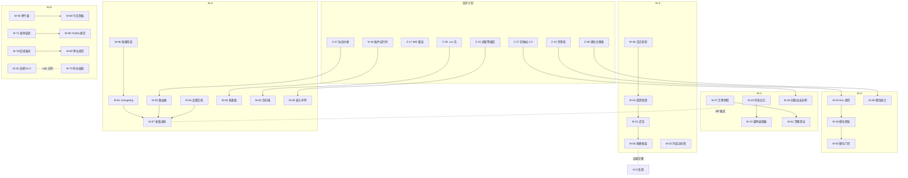

# SUMMIT-90 — 「极顶计划」AI 分工图

> 系列：NEXT-40 → ASCENT-60 → APEX-70 → **SUMMIT-90**
> 配套文档：《SUMMIT-90-功能全景.md》（功能定义与验收）、《SUMMIT-90-实施步骤.md》（逐项施工步骤）
> 分工原则：**五路既有建制不变**（AI-1 容器/环境路、AI-2 窗口/键位路、AI-3 系统/兼容路、AI-4 开放/智能路、AI-5 体验/测试路），90 项按「域归口 + 文件归属 + 依赖方向」静态切分，跨路依赖只允许「上游交付物 → 下游消费」，禁止跨路改文件。

---

## 0. 总览

### 0.1 五路职责与项目数

| 路 | 名称 | 域归口 | 项目数 | 一句话职责 |
|---|---|---|---|---|
| AI-1 | 环境与数据路 | 域 F（文件）主体、域 S 数据子集、域 C 便携项 | 14 | 文件操作、设置迁移、数据库、便携自愈 |
| AI-2 | 窗口与键位路 | 域 W 全部、域 T 主体、域 K 全部、域 C 窗口项 | 24 | VWM 手感、任务栏干活、键位纪律 |
| AI-3 | 系统与长跑路 | 域 C 主体、域 S 主体、域 Q 工程子集 | 22 | 兼容纵深、长跑稳定、性能基建 |
| AI-4 | 开放生态路 | 域 O 全部、域 Q 工具子集 | 12 | 生态开放、文档自动化、贡献工作流 |
| AI-5 | 体验与质量路 | 域 A、域 U、域 X 全部、域 T/S/Q 收尾 | 18 | 氛围克制版、无障碍、细节最后一毫米 |

> 合计 90。每项的唯一直接责任路以《SUMMIT-90-功能全景.md》附 A 速查表为准；本文件给出施工顺序与文件边界。

### 0.2 全局禁区（五路共同遵守）

1. **四大内置应用零修改**：`src/apps/write|mind|code|fate/**`、`src/features/editor|mindmap|project|fate*/**`、`src-tauri/src/library|mindmap|project_scan/**` 中与本轮无关的任何文件
2. **共享文件最小化编辑**：`src/i18n/dictionaries.ts`、`src/lib/ipc.ts`、`src-tauri/src/lib.rs`、`vwm.ts`、`StartMenu.tsx`、`desktop.css`、`tools.css` —— 改前 `rg` 核对现状，只增不改他人段落，改后跑 audit
3. **不做极端化隐私功能**（焚毁/覆写/诱饵一律禁止）
4. **不新增在线依赖**（零出站红线，M-57 是唯一出站且逐次确认）
5. **不越权杀进程/动系统设置**（只有用户显式确认的「结束进程」例外）

---

## 1. AI-1 环境与数据路（14 项）

### 1.1 项目清单

| 编号 | 名称 | 前置 |
|---|---|---|
| M-19 | 右键菜单自定义编辑器 | — |
| M-20 | 同名操作选择记忆 | — |
| M-21 | 校验和工具 | — |
| M-22 | 空格快速预览 | Z-29（预览格式）软依赖，可先做白名单交集 |
| M-23 | 压缩包目录浏览 | — |
| M-24 | 目录置顶书签条 | — |
| M-26 | 环境回收站安全网 | Z-27（回收站 2.0）|
| M-43 | 便携路径漂移自愈 | 卷 GUID 基础设施 |
| M-47 | 设置迁移预检 | — |
| M-48 | 数据库紧凑会话 | sysmaint 计划任务框架 |
| M-81 | 设置漂移测试基建 | M-47 |
| M-25 | 文件锁定侦探 | 与 AI-3 共建后端 command（见 1.3）|
| M-27 | 目录监控哨兵 | 与 AI-3 共建后端（哨兵线程模型属系统路）|
| M-15 | 任务栏空区菜单定制 | UI 归 AI-5 协作（见 1.3）|

### 1.2 文件领地

- 独占：`src/system/explorer/**`（文件管理器增量）、`src-tauri/src/settings_cmd.rs`、`src-tauri/src/backup.rs` 增量、`src-tauri/src/shell/sentinel.rs`（新）、`src-tauri/src/shell/who_locks.rs`（新）
- 共享进入：ipc.ts（新 command 登记）、dictionaries.ts（新 i18n 键）、lib.rs（新模块声明）

### 1.3 跨路协作点

- **M-25/M-27 后端**：Restart Manager 与 ReadDirectoryChangesW 属 Win32 系统能力，实现由 AI-3 审阅合入；前端消费归 AI-1
- **M-15**：任务栏菜单注册表机制归 AI-1（与 M-19 右键菜单编辑器同构），设置页编辑器 UI 归 AI-5
- **M-47 ↔ M-87**：迁移预检产物（diff 报告格式）被 AI-4 的发版演练消费，格式先行约定

### 1.4 施工顺序（建议）

1. M-20 → M-24 → M-19（文件操作三连，同触点 explorer，一批做完减冲突）
2. M-21 → M-23（后端 command 两个，一批过 audit）
3. M-22（依赖预览组件盘点）
4. M-47 → M-81（预检与测试基建同 PR 节奏）
5. M-26（等 Z-27 交付）
6. M-43（便携专项，等卷 GUID 基础）
7. M-48（sysmaint 集成，最后做，需回归备份链）

---

## 2. AI-2 窗口与键位路（24 项）

### 2.1 项目清单

| 编号 | 名称 | 前置 |
|---|---|---|
| M-01 | 摇一摇最小化 | — |
| M-02 | 窗口卷帘 | — |
| M-03 | 最小化抽屉 | — |
| M-04 | 窗口体检 | — |
| M-05 | 跨屏摆渡 | Z-19 混合 DPI |
| M-06 | 窗口挂起 | — |
| M-07 | 对齐参考线 | — |
| M-08 | 精炼 Alt+Tab | — |
| M-09 | 悬停聚焦 | — |
| M-10 | 跳转列表 | — |
| M-11 | 托盘收纳抽屉 | — |
| M-13 | 等待态规范 | — |
| M-14 | IM 未读聚合 | — |
| M-42 | 实例角标 | — |
| M-44 | 嵌入崩溃善后 | — |
| M-28 | 键位使用统计 | Z-08 注册表 |
| M-29 | 长按加速曲线 | — |
| M-30 | 侧键可编程 | Z-09 让位协议 |
| M-31 | 启动槽可视化 | — |
| M-32 | 每窗口 IME 状态 | Z-17 IME 兼容 |
| M-34 | Esc 层级规范 | Z-10 作用域 |
| M-35 | 滚轮语义规范 | — |
| M-36 | 键位变更预览 | Z-08 |
| M-83 | 键位 CI 门禁 | Z-08 |

### 2.2 文件领地

- 独占：`src/system/windows/VirtualWindowFrame.tsx`、`vwm.ts`、`snap.tsx`、`src/system/desktop/WintabSwitcher.tsx`、`src/lib/shortcuts.ts`、`src-tauri/src/shell/winman.rs`、`kbdhook.rs`、`embed.rs` 增量、`src/system/taskbar/**`（任务栏主体）、`src/lib/keymap/**`（Z-08 交付后）
- 共享进入：dictionaries.ts、ipc.ts、lib.rs、desktop.css（徽标/抽屉样式段落）

### 2.3 施工顺序（建议）

1. **键位纪律先行**：M-34 → M-35 → M-36（作用域与预览是后面所有新键位的安全网）
2. 窗口手感批：M-02 → M-03 → M-07 → M-01（同一拖拽路径触点，一批减少 vwm.ts 回滚冲突）
3. 健康批：M-04 → M-44 → M-06（winman/embed 事件态扩展）
4. 任务栏批：M-13 → M-42 → M-14 → M-10 → M-11
5. 键位进阶批：M-28 → M-29 → M-30 → M-31 → M-32（等 Z-08/Z-17 交付）
6. M-08 → M-09（切换器改造，回归面大，靠后）
7. M-83 收官（全库键位收编完成后上门禁才有意义）

### 2.4 特别纪律

- **vwm.ts 是回滚冲突重灾区**（项目教训）：每个窗口批次的 diff 必须最小化，批次间 `rg` 复核
- **双击 Esc 语义**（kbdhook）是既有全局契约：M-34 改造必须带「双击 Esc 切环境」专项回归验收
- M-06 挂起：**环境退出前自动恢复**是红线测试，放在 cargo test 显著位置

---

## 3. AI-3 系统与长跑路（22 项）

### 3.1 项目清单

| 编号 | 名称 | 前置 |
|---|---|---|
| M-18 | 音量滚轮规范 | Z-43 逐应用音量 |
| M-25 | 文件锁定侦探（后端）| — |
| M-27 | 目录监控哨兵（后端）| — |
| M-37 | 图标缓存自愈 | — |
| M-38 | UWP 识别 | — |
| M-39 | 提权提示 | PE 解析（已有）|
| M-40 | 高刷自适应 | 令牌化（已落地）|
| M-41 | 驱动共存协议 | — |
| M-45 | 热插拔稳定 | — |
| M-46 | 日志轮转 | — |
| M-49 | 图标缓存 LRU | — |
| M-50 | 事件削峰（框架）| 与 AI-5 五源迁移协作 |
| M-51 | 浸泡测试 | bench 工具链 |
| M-52 | 冷启动对照 | boot 事件流（已有）|
| M-53 | 崩溃转储管线 | — |
| M-54 | 资源公平调度 | — |
| M-66 | 音量淡变 | — |
| M-84 | 性能影响声明 | PR 模板 |
| M-85 | 依赖审计自动化 | — |
| M-05 | 跨屏摆渡（DPI 换算后端）| 与 AI-2 共建 |
| M-43 | 便携自愈（卷 GUID 后端）| 与 AI-1 共建 |
| M-82 | 视觉回归矩阵（基础设施）| visual-audit.cjs |

### 3.2 文件领地

- 独占：`src-tauri/src/shell/hardware.rs`、`launcher.rs`（缓存/识别段）、`tray.rs` 增量、`log.rs`/日志设施、`tools/bench/**`、`tools/dep-audit.cjs`（新）、崩溃转储设施、Job Object 配额（embed.rs 协作段）
- 共享进入：lib.rs、ipc.ts、dictionaries.ts、`.github/`、`tools/`

### 3.3 施工顺序（建议）

1. 长跑四连：M-46 → M-53 → M-49 → M-52（先有观测，再谈治理）
2. 兼容批：M-37 → M-38 → M-39 → M-41 → M-45（launcher/winman 周边一批）
3. 稳定批：M-51 → M-50 框架 → M-54（浸泡为削峰与配额提供证据基线）
4. 音频双项：M-66 → M-18（淡变在前，浮标在后）
5. M-40（令牌乘法，与 AI-5 的 M-75 对齐 calc 公式后一次落地）
6. 工程收尾：M-84 → M-85 → M-82 基础设施

### 3.4 特别纪律

- M-50 削峰：框架归 AI-3，五源迁移归 AI-5（各源在自己领地）；框架先出 API 与单测夹具
- M-82 视觉矩阵：基础设施（跑批/基线结构）归 AI-3，基线内容补充（HC 主题标定）归 AI-5
- bench 目录当日归档检查纪律（防覆盖，项目既有教训）

---

## 4. AI-4 开放生态路（12 项）

### 4.1 项目清单

| 编号 | 名称 | 前置 |
|---|---|---|
| M-55 | 路由注册公开表 | Z-37 协议中枢 |
| M-56 | 设置自动文档 | — |
| M-57 | 本地出站桥 | O-52 事件流、netconsent |
| M-58 | 插件热重载 | N-26 插件运行时 |
| M-59 | 嵌入声明协议 | Z-15 适配等级库 |
| M-60 | 测试钩子规范 | — |
| M-61 | 变更日志自动化 | — |
| M-62 | 社区翻译格式 | U-41（软依赖，CSV 通道可先行）|
| M-63 | 资源包安全扫描 | Z-39 .vxs 包 |
| M-80 | IPC 追踪 | ipc.ts 协作 |
| M-86 | 文档链接检查 | — |
| M-87 | 发版演练 | M-61/M-55/M-56 |

### 4.2 文件领地

- 独占：`tools/gen-*.cjs`（生成器家族）、`tools/link-check.cjs`、`tools/release.ps1`、`tools/i18n-csv.cjs`、`docs/ROUTES.md`/`SETTINGS.md`/`EMBED-MANIFEST.md`/`TEST-HOOKS.md`（生成产物与规范文档）、webhook 桥后端模块
- 共享进入：ipc.ts（仅 M-80 埋点，DEV 条件编译）、dictionaries.ts（少量）

### 4.3 施工顺序（建议）

1. 独立工具先行：M-86 → M-61 → M-60（零前置，先把工程环改善）
2. 文档自动化：M-56 → M-55（生成器同构，一批）
3. 生态安全：M-63 → M-59 → M-57（扫描 → 声明 → 出站，风险递增，逐项验收）
4. M-62（CSV 通道独立可先）、M-58（等 N-26）
5. M-80（与 AI-5 协作埋点点位清单）
6. M-87 收官（聚合前面所有生成器）

### 4.4 特别纪律

- M-57 出站桥是全计划唯一出站功能：**逐次 netconsent 或会话白名单 + 内网优先 + 公网二次确认 + 抓包验收零未确认出站**，四道闸缺一不可
- 生成器产物必须可再生成（`rg` 校验与代码同步）——生成物过期即 CI 红

---

## 5. AI-5 体验与质量路（18 项）

### 5.1 项目清单

| 编号 | 名称 | 前置 |
|---|---|---|
| M-12 | 时钟多时区 | — |
| M-15 | 空区菜单定制（UI）| AI-1 注册表机制 |
| M-16 | 媒体呼吸 | — |
| M-17 | 便签速贴 | 键位仲裁 |
| M-31 | 启动槽可视化（UI 协作）| AI-2 数据层 |
| M-33 | 按键回显 | — |
| M-50 | 事件削峰（五源迁移）| AI-3 框架 |
| M-64 | 壁纸主色采样 | 令牌 2.0（已落地）|
| M-65 | 昼夜壁纸组 | — |
| M-67 | 桌面纯净模式 | 键位仲裁 |
| M-68 | 屏保时钟 | — |
| M-69 | 今日简报卡 | Z-62（软依赖，可降级）、M-90 |
| M-70 | 壁纸快捷操作 | — |
| M-71 | 悬停延迟面板 | — |
| M-72 | 氛围会话恢复 | Z-40 互补 |
| M-73 | 辅助功能桥 | — |
| M-74 | HC 系统跟随 | F-7 HC 主题（已落地）|
| M-75 | 动效时长缩放 | 令牌化（已落地）|
| M-76 | ARIA 审计 | — |
| M-77 | 简繁用户词表 | s2t.ts（已落地）|
| M-78 | 区域格式跟随 | — |
| M-79 | 错误聚合看板 | Z-42 诊断（软依赖）|
| M-82 | 视觉矩阵基线（HC 标定）| AI-3 基础设施 |
| M-88 | Tooltip 规范 | M-71 |
| M-89 | 单位数字规范 | M-78 |
| M-90 | 跨午夜正确性 | — |

> 注：M-31/M-15/M-50/M-82 为协作项，主责在对应路，AI-5 承担 UI/迁移/标定部分；AI-5 独立主责 22 项，协作 4 项。

### 5.2 文件领地

- 独占：`src/system/taskbar/**`（时钟/便签段）、`src/system/wallpaper/**` 增量、`src/system/welcome/**`、`src/features/settings/**`（体验设置区）、`src/lib/s2t.ts` 增量、`src/lib/format.ts`（新）、`src/design/tokens.css`（--hover-delay/--motion-scale 段）、`desktop.css`/`tools.css`（体验段落）
- 共享进入：dictionaries.ts（本轮新增键最多的一路，改前改后双侧 `rg` 复核）、uiStore（浮层栈/日界事件）

### 5.3 施工顺序（建议）

1. **地基三针先收**：M-90 → M-88 → M-89（跨午夜是 M-69 前置；规范类先做后面全受益）
2. 时段氛围批：M-65 → M-68 → M-64 → M-70（壁纸/空闲周边）
3. 交互体验批：M-71 → M-67 → M-17 → M-12 → M-16（默认全关/默认=现状）
4. 无障碍批：M-74 → M-73 → M-76 → M-77 → M-78（HC 已有，联动先行）
5. M-75（与 M-40 calc 公式对齐后落地）
6. M-72 → M-69（氛围恢复与简报，依赖日界与统计）
7. M-79 + M-82 标定 + M-33 + M-50 迁移（质量收尾）

### 5.4 特别纪律

- 本路是「不弄巧成拙」的第一责任路：每个氛围项的默认值评审 = 「一年后还会喜欢吗」
- M-16 媒体呼吸是全计划唯一新动效：reduce-motion 降级 + 默认关 + 幅度周期写死三重闸
- zh i18n 块回滚重灾区：本路新增键最多，每批次提交前 `rg` 双语复核（项目既有教训）

---

## 6. 依赖与协作总图

### 6.1 六个关键交接点（跨路协议）

| # | 交接 | 上游 → 下游 | 交付物契约 |
|---|---|---|---|
| 1 | 键位注册表 | Z-08（前序）→ AI-2 全部新键位 | `keymap/register()` API + 冲突审计脚本 |
| 2 | 削峰框架 | AI-3（框架）→ AI-5（五源迁移） | `eventShed.ts` 三档策略 API + 合成风暴夹具 |
| 3 | 迁移预检报告 | AI-1（M-47）→ AI-4（M-87 发版演练） | diff 报告 JSON schema（阻断/建议两态）|
| 4 | 菜单注册表机制 | AI-1（M-19/M-15 机制）→ AI-5（编辑器 UI） | 注册表项类型 + 持久化格式 |
| 5 | calc 时长公式 | AI-3（M-40 高刷）× AI-5（M-75 缩放） | `--dur-* × --dur-scale × --motion-scale` 统一公式，一次合入 |
| 6 | 卷 GUID 基础 | AI-3（枚举）→ AI-1（M-43 改写） | `volume_guid(path)` 工具函数 + 单测 |

### 6.2 共享文件写锁轮值（软协议）

高频冲突文件按波次设「主笔路」，其余路提交涉该文件的改动需走 rebase 后最小 diff：

| 文件 | 第一波主笔 | 第二波主笔 | 第三波主笔 |
|---|---|---|---|
| dictionaries.ts | AI-5（规范键少）| 轮值（每批前认领）| AI-4（翻译格式）|
| ipc.ts | AI-3（command 多）| AI-1 | AI-4 |
| lib.rs | AI-3 | AI-2 | AI-4 |
| vwm.ts | AI-2 | AI-2 | AI-2（独占）|
| desktop.css / tools.css | AI-5 | 轮值 | AI-5 |

---

## 7. 时间线与波次编排

### 7.1 三波次 × 五路矩阵（✓=该路在本波的主体工作）

| 波次 | AI-1 | AI-2 | AI-3 | AI-4 | AI-5 |
|---|---|---|---|---|---|
| **P0**（12 项）| M-20/21/47 | M-04/34/36/44 | M-46/48/52/53 | M-86/61 | M-88/89/90 |
| **P1**（36 项）| M-19/22/23/24/26/43 | M-01/02/03/07/08/10/11/13/14/42/29/31/35 | M-37/38/39/41/45/49/50F/54/40/18/66 | M-60/55/56/62/63/59 | M-12/15/16/17/33/64/65/67/68/70/71/72/74/75/77 |
| **P2**（42 项）| M-25F/27F/81 | M-05/06/09/28/30/32/83 | M-51/84/85/82F | M-57/58/80/87 | M-69/73/76/78/79/82HC/50M |

> F=后端主体、M=迁移部分、HC=标定部分；协作项拆开计入。

### 7.2 波次门禁（全路同步）

- 进 P1 前：P0 12 项全绿 + 视觉基线零退化 + 键位零冲突脚本证明
- 进 P2 前：P1 36 项全绿 + soak 首周 ≥6/7 + 三语 audit 全绿
- 收口：90 项全绿 + 四份报告（键位/i18n/视觉矩阵/soak）归档 + 发版演练跑通

### 7.3 每周节奏（建议）

- 周一：各路认领本周批次 + 共享文件主笔认领
- 周中：施工 + 每批 `typecheck/audit/cargo check` 三绿后才提交
- 周五：五路进度总览快照（`docs/五路进度总览.md` 同步）+ 冲突复盘

---

## 8. 验收责任矩阵

| 验收域 | 责任路 | 佐证 |
|---|---|---|
| 键位零冲突（全库）| AI-2 | keymap-audit 输出 + CI 记录 |
| 视觉零退化 | AI-5（标定）+ AI-3（跑批）| 视觉矩阵 diff 报告 |
| 四大内置应用零修改 | 全路自证 + AI-5 抽查 | git diff 范围审查记录 |
| 长跑稳定 | AI-3 | soak 周报（≥6/7）|
| 出站零未确认 | AI-4 | 抓包记录（M-57 专项）|
| i18n 三语完整 | 各路自证 + audit.cjs | AUDIT PASSED 记录 |
| 默认行为=现状 | 各路自证 + AI-5 抽查 | 每项验收清单「默认态」栏 |
| 诚实降级（无假功能）| 各路自证 | 失败路径测试用例 |

---

## 9. 冲突处理与红线升级路径

1. **共享文件冲突**：以 git 最近有效版本为基，`rg` 复核双方意图后最小重放；无法合并时责任回到「主笔路」统筹
2. **依赖倒挂**（下游等不到上游）：允许下游以「接口桩 + 诚实降级」先行（如 M-22 先做格式白名单交集），验收标注依赖状态
3. **红线争议**（如某实现疑似极端化/弄巧成拙）：任一路可提「红线评审」，五路各一句表态 + 用户裁决，过程记录进验收文档
4. **BOM/.ps1、cargo test --no-run、bench 归档覆盖** 等既有教训全部沿用项目 project_memory 纪律，不再重复踩

---

## 10. 附：90 项 → 五路完整索引

- **AI-1（14）**：M-19 M-20 M-21 M-22 M-23 M-24 M-26 M-43 M-47 M-48 M-81 + 协作 M-25F M-27F M-15机制
- **AI-2（24）**：M-01 M-02 M-03 M-04 M-05 M-06 M-07 M-08 M-09 M-10 M-11 M-13 M-14 M-42 M-44 M-28 M-29 M-30 M-31 M-32 M-34 M-35 M-36 M-83
- **AI-3（22）**：M-18 M-25 M-27 M-37 M-38 M-39 M-40 M-41 M-45 M-46 M-49 M-50 M-51 M-52 M-53 M-54 M-66 M-84 M-85 + 协作 M-05F M-43F M-82F
- **AI-4（12）**：M-55 M-56 M-57 M-58 M-59 M-60 M-61 M-62 M-63 M-80 M-86 M-87
- **AI-5（22+4 协作）**：M-12 M-15 M-16 M-17 M-33 M-64 M-65 M-67 M-68 M-69 M-70 M-71 M-72 M-73 M-74 M-75 M-76 M-77 M-78 M-79 M-88 M-89 M-90 + 协作 M-31UI M-50M M-82HC M-33↔AI-2
