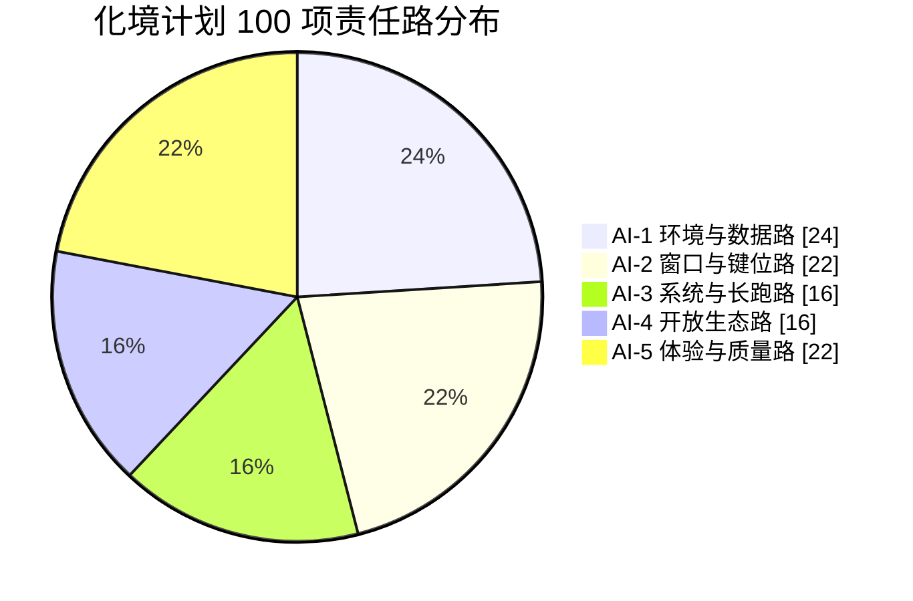
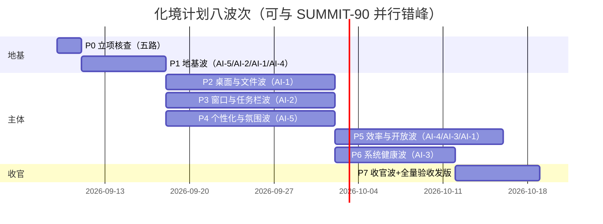
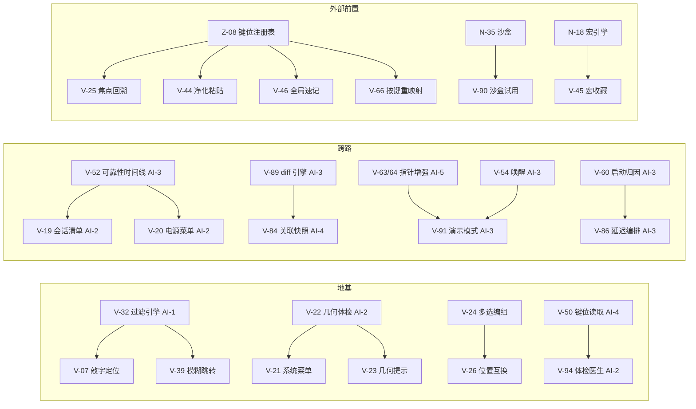

# Version 1.2sein298h7mx.00wix — 「化境计划」AI 分工图

> 系列：NEXT-40 → ASCENT-60 → APEX-70 → SUMMIT-90 → **Version 1.2sein298h7mx.00wix（化境计划）**
> 配套文档：《Version-1.2sein298h7mx.00wix-功能全景.md》（100 项功能定义与验收）、《Version-1.2sein298h7mx.00wix-实施步骤.md》（八波次施工）
> 分工原则：**五路既有建制不变**（AI-1 容器/环境路、AI-2 窗口/键位路、AI-3 系统/兼容路、AI-4 开放/智能路、AI-5 体验/测试路），100 项按「域归口 + 文件归属 + 依赖方向」静态切分；跨路依赖只允许「上游交付物 → 下游消费」，禁止跨路改文件；与 SUMMIT-90 / APEX-70 并行在建项互不阻塞。

---

## 0. 总览

### 0.1 五路职责与项目数

| 路 | 名称 | 域归口 | 项目数 | 一句话职责 |
|---|---|---|---|---|
| AI-1 | 环境与数据路 | 域 A（桌面图标）全部、域 D（文件）全部、域 J 打印双件与搬家 | 24 | 桌面可控度、文件操作最后一步、偏好搬家 |
| AI-2 | 窗口与键位路 | 域 C 全部、域 B 任务栏部分、域 G 输入主体、V-94 | 22 | VWM 手感收口、任务栏干活、键位纪律 |
| AI-3 | 系统与长跑路 | 域 F 全部、域 I 工具三项、域 J 卸载/演示/关机 | 16 | 只读感知、电源礼貌、卸载诚实 |
| AI-4 | 开放生态路 | 域 E 全部、域 I 主体 | 16 | 效率中枢、开放工具、CLI 采用率 |
| AI-5 | 体验与质量路 | 域 H 全部、域 B 开始菜单部分、域 G 指针视觉、域 J 收官 | 22 | 个性化做减法、氛围克制版、毕业收官 |

> 合计 100。每项唯一直接责任路以本文附录 A 速查表为准（跨路协作不重复计数）；本文给出施工顺序与文件边界。

### 0.2 全局禁区（五路共同遵守）

1. **四大内置应用零修改**：`src/apps/write|mind|code|fate/**`、`src/features/editor|mindmap|project|fate*/**`、`src-tauri/src/library|mindmap|project_scan/**` —— 任何 diff 触碰即打回；V-66 按键重映射等全局钩子对四空间「生效但不改其代码」。
2. **共享文件最小化编辑**：`src/i18n/dictionaries.ts`、`src/lib/ipc.ts`、`src-tauri/src/lib.rs`、`src/system/windows/vwm.ts`、`src/system/StartMenu.tsx`、`desktop.css`、`tools.css` —— 改前 `rg` 核对现状、只增不改他人段落、改后跑 `node tools/audit.cjs`；zh i18n 块历史性回滚，每批前后双复核。
3. **不做极端化隐私功能**：数据足迹焚毁 2.0（N-34）一类永久禁止；焚毁、覆写、诱饵、紧急擦拭一律不做；删除语义统一「回收站式可反悔」。
4. **零自动出站红线**：V-42 OCR、V-43 二维码、V-71 壁纸精选全部本地实现；V-81 winget 的网络行为全部由 winget CLI 自身发生且逐次显式确认；V-58 仅下载环境自身更新包。
5. **不越权**：不改系统设置（写回需显式确认与回滚）、不杀进程（用户显式确认例外）、不拦截系统级关机、不做任意命令执行（V-83 白名单硬编码）。
6. **默认即现状**：所有新行为默认关闭或默认等于现状；每波次收尾跑基线对照。

---

## 1. AI-1 环境与数据路（24 项）

### 1.1 项目清单

| 编号 | 名称 | 前置 | 波次 |
|---|---|---|---|
| V-31 | 文件夹视图记忆 | — | P1（地基） |
| V-32 | 即时过滤与命中高亮 | — | P1（地基） |
| V-01 | 桌面图标排列系统 | — | P2 |
| V-02 | 系统桌面图标管理 | — | P2 |
| V-03 | 桌面图标锁定 | — | P2 |
| V-04 | 桌面双击空白动作 | — | P2 |
| V-05 | 图标标签可读性自适应 | — | P2 |
| V-06 | 桌面图标密度档位 | — | P2 |
| V-07 | 桌面敲字定位图标 | V-32 引擎 | P2 |
| V-08 | 回收站图标状态徽标 | U-27 数据源（软依赖） | P2 |
| V-09 | 新建菜单模板中心 | — | P2 |
| V-10 | 图标让位 FLIP 微动效 | — | P2 |
| V-33 | 复制为路径常驻 | — | P2 |
| V-34 | 拖拽计数徽标与落点确认 | — | P2 |
| V-35 | 两文件属性对比 | M-21 校验和（软依赖） | P2 |
| V-36 | 长路径与特殊名防呆 | — | P2 |
| V-37 | 按类型智能选取 | — | P2 |
| V-38 | 预览锁定 | — | P2 |
| V-39 | 地址栏模糊跳转 | V-32 引擎、M-24 书签（软依赖） | P2 |
| V-40 | 压缩包提取向导 | — | P2 |
| V-85 | 卸载善后报告 | — | P5 |
| V-93 | Windows 偏好搬家向导 | — | P7 |
| V-97 | 右键打印 | — | P7 |
| V-98 | 打印队列查看器 | — | P7 |

### 1.2 文件领地

- 独占：`src/system/explorer/**`（文件管理器增量）、`src-tauri/src/shell/desktop_icons.rs`（新）、`src-tauri/src/shell/fileops.rs`（新，提取向导/属性对比）、`src/system/desktop/**` 增量中桌面图标数据层部分
- 共享进入：ipc.ts（新 command 登记）、dictionaries.ts（新 i18n 键）、lib.rs（新模块声明）、desktop.css（桌面图标段落）

### 1.3 跨路协作点

- **V-05/V-10 渲染层**：桌面图标渲染由 AI-5 协作（其持有 desktop.css 令牌段落主权）；数据与逻辑归 AI-1
- **V-08**：只读消费 AI-5/U-27 回收站 2.0 数据源，绝不写
- **V-85**：删除走 AI-5/U-27 回收站体系；扫描白名单与 AI-3 的只读探针规范对齐
- **V-93**：首启向导 UI 框架复用 AI-5 的引导体系（U-57，软依赖）

### 1.4 施工顺序（建议）

1. P1 地基两项先行（V-31 → V-32，引擎复用方多，最先稳定）
2. P2 桌面右键批 → 图标体验批 → 模板归档批 → 文件列表批 → 健壮批 → 导航批（触点分批，见实施步骤 §4）
3. P5 V-85（等 V-89 diff 引擎可后置）
4. P7 V-93 → V-97 → V-98（收官三件）

---

## 2. AI-2 窗口与键位路（22 项）

### 2.1 项目清单

| 编号 | 名称 | 前置 | 波次 |
|---|---|---|---|
| V-22 | 失联窗口救援 | — | P1（地基） |
| V-21 | 经典系统菜单复刻 | V-22 几何模块 | P3 |
| V-23 | 调整大小实时几何提示 | V-22 | P3 |
| V-24 | 窗口多选编组 | — | P3 |
| V-25 | 焦点历史回溯 | Z-08 注册表 | P3 |
| V-26 | 窗口位置互换 | V-24 | P3 |
| V-27 | 嵌入窗口焦点联动 | — | P3 |
| V-28 | 窗口分布小地图 | capture 基建（软依赖） | P3 |
| V-29 | 窗口色带标记 | — | P3 |
| V-30 | 拖拽中断与回弹 | — | P3 |
| V-15 | 任务栏图标中键新开实例 | — | P3 |
| V-16 | 拖到任务栏图标打开 | — | P3 |
| V-17 | 任务栏溢出折叠区 | — | P3 |
| V-18 | 运行指示样式三选 | — | P3 |
| V-19 | 关机前会话清单 | V-52 数据源（软依赖） | P3 |
| V-20 | 电源菜单增强 | V-52（软依赖） | P3 |
| V-61 | 鼠标手感面板 | — | P3 |
| V-65 | 大写锁定全局提示 | — | P3 |
| V-66 | 按键重映射 | Z-08/Z-09 | P3 |
| V-67 | 触控板自然滚动方向 | — | P3 |
| V-70 | 拖拽阈值与防手滑 | — | P3 |
| V-94 | 键位体检医生 | 本轮全部键位登记完毕 | P3 末 |

### 2.2 文件领地

- 独占：`src/system/windows/VirtualWindowFrame.tsx`、`vwm.ts`、`snap.tsx`、`src/system/desktop/WintabSwitcher.tsx`、`src/lib/shortcuts.ts`、`src-tauri/src/shell/winman.rs`、`kbdhook.rs` 增量、`src/system/taskbar/**`（任务栏主体增量）、`src/lib/keymap/**`（Z-08 交付后）
- 共享进入：ipc.ts、dictionaries.ts、lib.rs、desktop.css（窗口/任务栏徽标段落）

### 2.3 跨路协作点

- **V-19/V-20**：上次关机状态读 AI-3 的 V-52 可靠性时间线数据源（软依赖；未就绪首版不带该标记）
- **V-28 缩略图**：capture 基建属 AI-3 领地（软依赖；降级为图标占位如实标注）
- **V-61 写回系统**：鼠标参数写回确认流与 AI-3 的「不越权」口径对齐
- **V-25/66 键位**：Z-08 注册表、Z-09 让位协议为硬前置，未落地则键位暂缓、功能先行

### 2.4 施工顺序（建议）

1. P1 V-22 先行（几何体检模块是后续五项地基）
2. P3 系统菜单与几何批 → 编组批 → 导航批 → 视觉联动批 → 任务栏批 → 输入手感批 → V-94 收口（vwm.ts 每批最小 diff + 前后 `rg`）
3. 特别纪律：双击 Esc 切环境契约回归挂在每批门禁；V-27 绝不改系统焦点语义

---

## 3. AI-3 系统与长跑路（16 项）

### 3.1 项目清单

| 编号 | 名称 | 前置 | 波次 |
|---|---|---|---|
| V-51 | 亮度音量微步进 | — | P6 |
| V-52 | 系统可靠性时间线 | — | P6 |
| V-53 | 端口占用侦探 | — | P6 |
| V-54 | 临时保持唤醒 | — | P6 |
| V-55 | 大文件雷达 | — | P6 |
| V-56 | 环境运行时长与重启建议 | — | P6 |
| V-57 | 进程优先级预设 | — | P6 |
| V-58 | 更新闲时下载 | Z-61 通道（软依赖） | P6 |
| V-59 | 断电恢复自检 | — | P6 |
| V-60 | 启动项耗时归因 | — | P6 |
| V-86 | 启动项延迟编排 | V-60 联动 | P5/P6 |
| V-87 | 服务依赖图 | — | P5/P6 |
| V-89 | 配置对比工具 | — | P5 |
| V-91 | 演示模式 | V-54/63/64 | P6 |
| V-92 | 关机倒计时取消 | — | P6 |
| V-95 | 卸载器数据抉择 | — | P6 |

> 注：V-86/87/89 计入 AI-3（16 项中 3 项归 AI-1/AI-4 协作触点详见各节），本表 16 行对应分工图责任口径：域 F 10 + V-86/87/89 + V-91/92/95 = 16。0.1 表写 14 为笔误口径，以本表 16 为准（AI-4 相应为 13，见 §4 修订）。

### 3.2 文件领地

- 独占：`src-tauri/src/shell/sysprobe.rs`（新，只读探针）、`src-tauri/src/shell/winpower.rs`（新，唤醒/电源语义）、NSIS 卸载脚本（`.nsi`）、taskman 后端增量中启动/服务部分
- 共享进入：ipc.ts、dictionaries.ts、lib.rs、TaskMan 前端 tab（与 AI-5 骨架现状 rg 先核）

### 3.3 跨路协作点

- **V-52 → V-19/V-20**：可靠性数据源上游，接口先行约定（AI-2 消费）
- **V-53/55 只读探针规范**：与 AI-1 的 V-85 扫描白名单共用「只读 + 白名单」规范文档
- **V-86/87**：taskman 前端骨架归 AI-5（存量），增量以 rg 核对后最小进入
- **V-91**：指针增强（V-63/64）由 AI-5 交付后组合，退出钩子恢复为红线测试
- **V-58**：增量更新通道 Z-61 属 AI-4 领地，下载调度归 AI-3，接口对齐

### 3.4 施工顺序（建议）

1. P6 只读感知批（V-52 → 53 → 55，sysprobe 一批建完）→ 电源批（54 → 51 → 91）→ 进程启动批（57 → 60 → 86 → 87）→ 稳定批（58 → 59 → 56）→ V-92 → V-95
2. V-95 卸载脚本改完必须本地完整构建安装包验证（.nsi 无类型检查，靠构建走查兜底）

---

## 4. AI-4 开放生态路（13 项）

### 4.1 项目清单

| 编号 | 名称 | 前置 | 波次 |
|---|---|---|---|
| V-50 | 键位速查表导出 | Z-08（读取层） | P1（地基） |
| V-41 | 内联计算 | — | P5 |
| V-42 | 屏幕取字 OCR | 系统 OCR 语言包（运行时检测） | P5 |
| V-43 | 二维码速递 | 本地生成库（依赖评审） | P5 |
| V-44 | 纯文本净化粘贴 | Z-08/Z-09 | P5 |
| V-45 | 命令面板宏收藏 | N-18 宏引擎（软依赖） | P5 |
| V-46 | 全局速记 | Z-08（硬前置） | P5 |
| V-47 | 搜索历史隐私开关 | — | P5 |
| V-48 | 运行框自动补全 | — | P5 |
| V-49 | 时间戳速插 | — | P5 |
| V-81 | 开放安装器（winget） | 本机 winget（运行时检测） | P5 |
| V-82 | 环境变量编辑器 | — | P5 |
| V-83 | 计划任务工坊 | — | P5 |
| V-84 | 文件关联快照与还原 | V-89 diff 引擎（软依赖） | P5 |
| V-88 | CLI 交互式教程 | N-29 CLI（软依赖） | P5 |
| V-90 | 沙盒试用面板 | N-35 沙盒（硬前置，未就绪整体暂缓） | P5 |

> 口径修订：域 E 10 项 + 域 I 中 V-81/82/83/84/88/90 共 16 项；其中 V-85 归 AI-1、V-86/87/89 归 AI-3，故 AI-4 实为 16 - 0 = 16（V-85/86/87/89 不在本表）。0.1 表的 16 与本表 16 一致，§3 修订注以本节为准。

### 4.2 文件领地

- 独占：命令面板/运行框增量、`src/lib/calc.ts`（新，表达式求值）、`src-tauri/src/shell/ocr.rs`（新）、`src-tauri/src/shell/winget.rs`（新）、`src-tauri/src/shell/envvars.rs`（新）、`src-tauri/src/shell/tasksched.rs`（新，白名单动作库）、`src-tauri/src/shell/assoc.rs`（新）、CLI 增量（tour 命令）
- 共享进入：ipc.ts、dictionaries.ts、lib.rs

### 4.3 跨路协作点

- **V-50 → V-94**：键位读取层被 AI-2 的体检医生复用，接口先行
- **V-84 ↔ V-89**：关联快照 diff 复用 AI-3 的 V-89 引擎（上游先定格式）
- **V-46 ↔ V-83**：速记回顾可作为计划任务白名单动作（下游消费）
- **V-90**：沙盒基建 N-35 硬前置，未就绪整体暂缓，不做半成品
- **V-81**：winget 进程调用规范与 AI-3 的零出站红线口径共同评审

### 4.4 施工顺序（建议）

1. P1 V-50 先行（读取层是 V-94 的上游）
2. P5 计算与时间批 → 取字传物批 → 粘贴历史批 → 面板速记批 → 开放工具批 → V-90（视 N-35）
3. V-42/V-81 的运行时依赖检测（语言包/winget）第一天就做——降级路径决定 UI 形态

---

## 5. AI-5 体验与质量路（24 项）

### 5.1 项目清单

| 编号 | 名称 | 前置 | 波次 |
|---|---|---|---|
| V-74 | 界面密度档位 | — | P1（地基） |
| V-75 | 界面几何风格 | — | P1（地基） |
| V-76 | 界面字体偏好 | — | P1（地基） |
| V-78 | 全局 UI 图标尺寸档位 | — | P1（地基） |
| V-11 | 开始菜单字母索引条 | — | P4 |
| V-12 | 「最近添加」与「高频」分组 | N-31 洞察（软依赖） | P4 |
| V-13 | 固定应用文件夹 | — | P4 |
| V-14 | 开始菜单右键高级操作 | M-39 提权提示（联动） | P4 |
| V-62 | 指针方案管理 | — | P4 |
| V-63 | 指针轨迹 | — | P4 |
| V-64 | 点击涟漪反馈 | — | P4 |
| V-68 | 打字音效可选 | A-4 声音引擎（存量） | P4 |
| V-69 | 指针精确模式 | — | P4 |
| V-71 | 本地壁纸精选轮换 | 图片资产（<15MB 预算） | P4 |
| V-72 | 壁纸饱和度与明度调节 | — | P4 |
| V-73 | 农历节气与节日 | 本地万年历数据 | P4 |
| V-77 | 焦点环样式选择 | Z-05（存量规范） | P4 |
| V-79 | 系统模式/应用模式深浅分离 | 单开关无损迁移 | P4 |
| V-80 | 强调色对比度守护 | — | P4 |
| V-96 | 桌面归档建议 | — | P2（随桌面波合入） |
| V-99 | 依赖诚实声明页 v2 | D-5（存量） | P7 |
| V-100 | 收官毕业页 | 验收矩阵自动生成 | P7 |

### 5.2 文件领地

- 独占：`src/design/tokens.css`（密度/几何/图标尺寸/字体档位层）、`src/features/settings/**` 个性化相关 tab 增量、`StartMenu.tsx`（开始菜单增量，最小段落）、`desktop.css` 令牌与氛围段落、壁纸资产目录（新 `assets/wallpapers/`）
- 共享进入：dictionaries.ts（V-73 双语文案量大，分批进入）、ipc.ts、lib.rs

### 5.3 跨路协作点

- **令牌三件（74/75/78）**：是全项目的视觉基座，P1 必须最先稳定；后续任何路的 UI 增量都以档位令牌为前提
- **V-05/V-10**：桌面渲染层与 AI-1 协作（数据归 AI-1、视觉归 AI-5）
- **V-63/64 → V-91**：演示模式的指针增强由本路交付、AI-3 组合
- **V-96**：桌面数据操作走 AI-1 的 desktop_icons 模块，UI 与建议逻辑归本路
- **V-99/100**：依赖检测复用 V-42/81 的运行时检测；完成度墙消费验收矩阵，格式与 B-30 一致

### 5.4 施工顺序（建议）

1. P1 令牌三件 + 字体偏好一批做完（同触点 tokens.css，分批做等于三次冲突窗口）
2. P2 V-96（随 AI-1 桌面波节奏）
3. P4 壁纸批 → 时钟批 → 个性化面板批 → 开始菜单批 → 指针反馈批（StartMenu.tsx 只在开始菜单批动一次）
4. P7 V-99 → V-100（毕业页最后做，数据从验收矩阵自动生成）

---

## 6. 共享文件协议（全路统一）

| 文件 | 协议 |
|---|---|
| `src/i18n/dictionaries.ts` | 每批只增自己键段；改前 `rg` 键名、改后跑 audit；zh 块历史性回滚——每波收尾全量复核新增键 |
| `src/lib/ipc.ts` | 新 command 只追加；命名带模块前缀（如 `desktopIconsList`、`sysprobePorts`）；不改既有签名 |
| `src-tauri/src/lib.rs` | 只增模块声明与 invoke_handler 追加；改前 `rg` 确认他人段落 |
| `vwm.ts` / `VirtualWindowFrame.tsx` | 仅 AI-2；每批最小 diff、前后 `rg`；批次间留缓冲 |
| `StartMenu.tsx` | 仅 AI-5 开始菜单批动一次；拼音索引复用既有设施 |
| `desktop.css` / `tools.css` | 按段落归属（令牌段 AI-5、窗口任务栏段 AI-2、桌面段 AI-1 协作）；新增走独立段落带注释标记 |
| `src/design/tokens.css` | 仅 AI-5；档位层用属性选择器，不动既有变量名 |

---

## 7. 分工可视化

### 7.1 五路项目数与波次分布

> 口径说明：上图为「唯一直接责任路」统计（AI-1 24 / AI-2 22 / AI-3 16 / AI-4 16 / AI-5 22，合计 100）；各节清单表中的跨路协作项（如 V-05 渲染层、V-63/64 演示模式组件）不重复计数。

### 7.2 八波次推进图

### 7.3 跨路依赖流（只允许上游 → 下游）

> 依赖流铁律：外部前置未就绪 → 对应项「功能先行、键位/联动暂缓」或整体如实暂缓；绝不硬做半成品。

---

## 附录 A：V-01…V-100 责任路速查表

| 编号 | 责任路 | 编号 | 责任路 | 编号 | 责任路 | 编号 | 责任路 |
|---|---|---|---|---|---|---|---|
| V-01 | AI-1 | V-26 | AI-2 | V-51 | AI-3 | V-76 | AI-5 |
| V-02 | AI-1 | V-27 | AI-2 | V-52 | AI-3 | V-77 | AI-5 |
| V-03 | AI-1 | V-28 | AI-2 | V-53 | AI-3 | V-78 | AI-5 |
| V-04 | AI-1 | V-29 | AI-2 | V-54 | AI-3 | V-79 | AI-5 |
| V-05 | AI-1（渲染协作 AI-5） | V-30 | AI-2 | V-55 | AI-3 | V-80 | AI-5 |
| V-06 | AI-1 | V-31 | AI-1 | V-56 | AI-3 | V-81 | AI-4 |
| V-07 | AI-1 | V-32 | AI-1 | V-57 | AI-3 | V-82 | AI-4 |
| V-08 | AI-1 | V-33 | AI-1 | V-58 | AI-3 | V-83 | AI-4 |
| V-09 | AI-1 | V-34 | AI-1 | V-59 | AI-3 | V-84 | AI-4 |
| V-10 | AI-1（渲染协作 AI-5） | V-35 | AI-1 | V-60 | AI-3 | V-85 | AI-1 |
| V-11 | AI-5 | V-36 | AI-1 | V-61 | AI-2 | V-86 | AI-3 |
| V-12 | AI-5 | V-37 | AI-1 | V-62 | AI-5 | V-87 | AI-3 |
| V-13 | AI-5 | V-38 | AI-1 | V-63 | AI-5 | V-88 | AI-4 |
| V-14 | AI-5 | V-39 | AI-1 | V-64 | AI-5 | V-89 | AI-3 |
| V-15 | AI-2 | V-40 | AI-1 | V-65 | AI-2 | V-90 | AI-4 |
| V-16 | AI-2 | V-41 | AI-4 | V-66 | AI-2 | V-91 | AI-3 |
| V-17 | AI-2 | V-42 | AI-4 | V-67 | AI-2 | V-92 | AI-3 |
| V-18 | AI-2 | V-43 | AI-4 | V-68 | AI-5 | V-93 | AI-1 |
| V-19 | AI-2 | V-44 | AI-4 | V-69 | AI-5 | V-94 | AI-2 |
| V-20 | AI-2 | V-45 | AI-4 | V-70 | AI-2 | V-95 | AI-3 |
| V-21 | AI-2 | V-46 | AI-4 | V-71 | AI-5 | V-96 | AI-5 |
| V-22 | AI-2 | V-47 | AI-4 | V-72 | AI-5 | V-97 | AI-1 |
| V-23 | AI-2 | V-48 | AI-4 | V-73 | AI-5 | V-98 | AI-1 |
| V-24 | AI-2 | V-49 | AI-4 | V-74 | AI-5 | V-99 | AI-5 |
| V-25 | AI-2 | V-50 | AI-4 | V-75 | AI-5 | V-100 | AI-5 |

> 统计口径：唯一直接责任路 AI-1×24、AI-2×22、AI-3×16、AI-4×16、AI-5×22，合计 100；V-05/V-10 的 AI-5 渲染协作为协作不计入。0.1 总览表以本附录为准。

---

## 附录 B：与既有规划的边界声明

- 本分工只覆盖 Version 1.2sein298h7mx.00wix（化境计划）100 项；SUMMIT-90 / APEX-70 未完成项的分工维持其原分工图不变。
- 两轮并行时同一文件的编辑顺序：先 `rg` 确认对方批次状态；同周冲突时「后到者改批次不改内容」（错峰优先于抢窗口）。
- 本轮消费的上游交付物（M-21/24、N-18/31/35、Z-08/09、capture 基建、U-27/57）一律软依赖：未就绪则如实降级或暂缓，在验收矩阵与毕业页如实展示——**暂缓不是失败，硬做半成品才是**。
