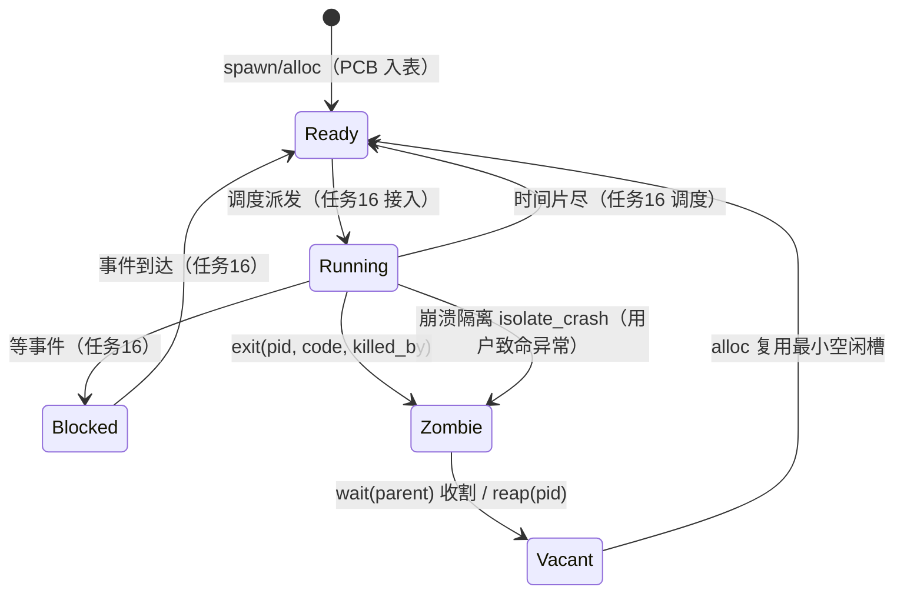

# 进程生命周期状态图（任务15 · AI-K · 2026-09-17）

> 总案任务15 完善性验收项：进程生命周期状态图入档。本文只写状态机事实：
> 状态集合、合法迁移与触发函数、代码锚点。不写背景散文。

## 状态机

## 迁移触发表（全部经核内 API，无裸字段跨模块改）

| 迁移 | 触发 API | 锚点 | 语义要点 |
|---|---|---|---|
| Vacant→Ready | `ProcTable::alloc / spawn / bootstrap_init` | `proc/uspace.rs` | 耗尽→`SpawnError::TableFull`+`exhausted` 计数，优雅拒绝；spawn 要求父存活+CAP_PROC+空间建成，失败不留半成品 |
| Ready↔Running↔Blocked | 调度器（任务16 接入） | — | 演示期单用户进程，spawn 后直接进入用户态 |
| Running→Zombie | `ProcTable::exit` | `proc/uspace.rs` | 句柄全关；`killed_by=0` 正常退出；孤儿全部过继 init |
| Running→Zombie | `ProcTable::isolate_crash` | `proc/uspace.rs` | 崩溃只隔离该进程，内核与其余进程零影响 |
| Zombie→Vacant | `ProcTable::wait(parent)` / `reap(pid)` | `proc/uspace.rs` | wait 顺带收养孙辈孤儿给 init；收割后地址空间账本由监护者释放 |
| 地址空间消亡 | `ProcTable::release_space` / `loader::release_pages` | `proc/uspace.rs` `proc/loader.rs` | SpaceArena 槽位+表帧归还（`free_user_tree`），逐页账本摘叶归还帧——一页不留 |

## 不变量（实机/宿主双验证）

1. **回收即复用**：Zombie→Vacant 后 `alloc` 拿回最小空闲槽（实机两轮 pid 同为 2）。
2. **空间随进程消亡**：exit 只置 Zombie；wait 收割时页账本 18/18 归还（实机串口）。
3. **表满优雅拒绝**：64 槽打满后第 65 个 alloc 报 `TableFull`，既有进程零影响（实机 +64 rejected）。
4. **孤儿有终点**：父先死，子/孙全部过继 init（宿主 f010）；init 永不被回收。
5. **1000 次循环零泄漏**：spawn→exit→release_space→wait ×1000，表/空间/僵尸三清（宿主 f027）。
